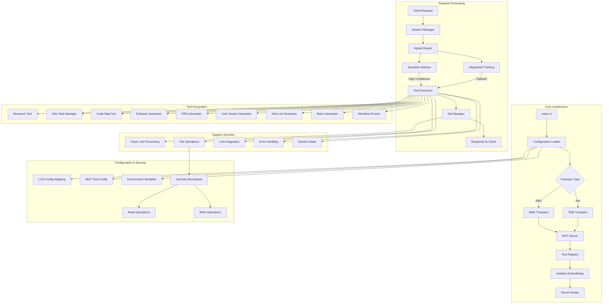
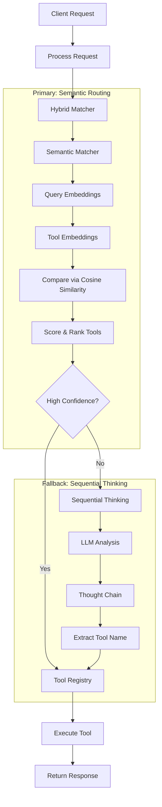
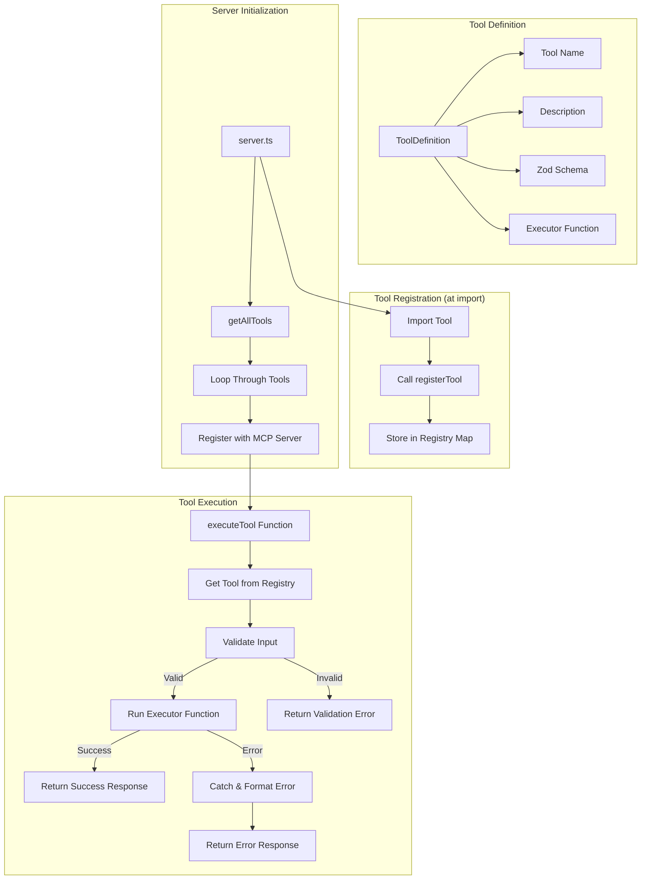
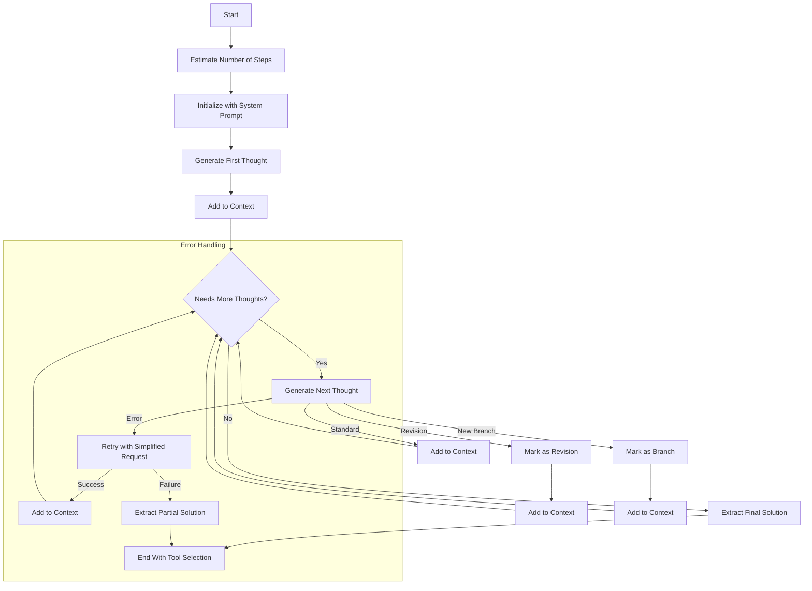
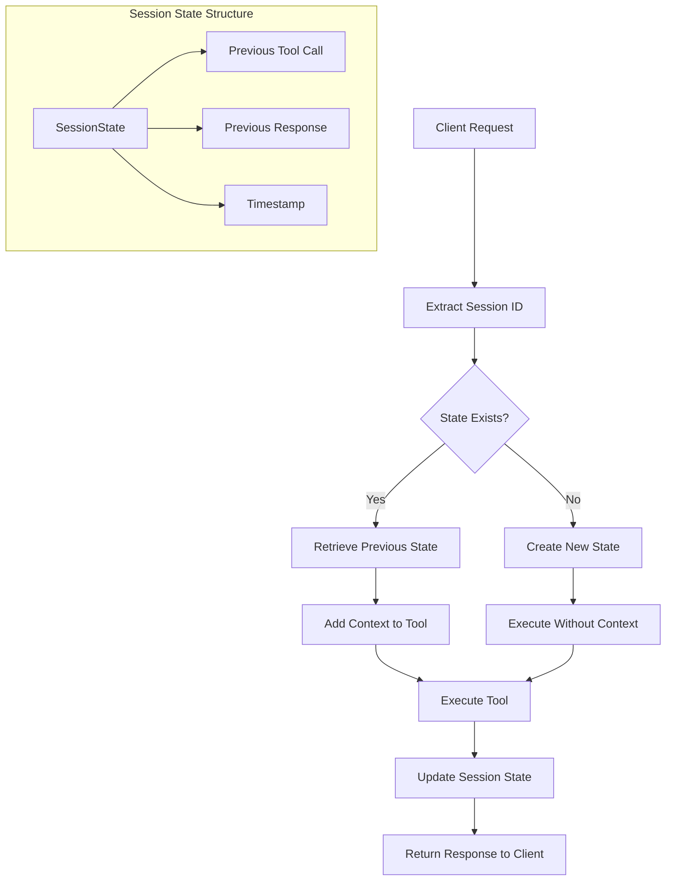
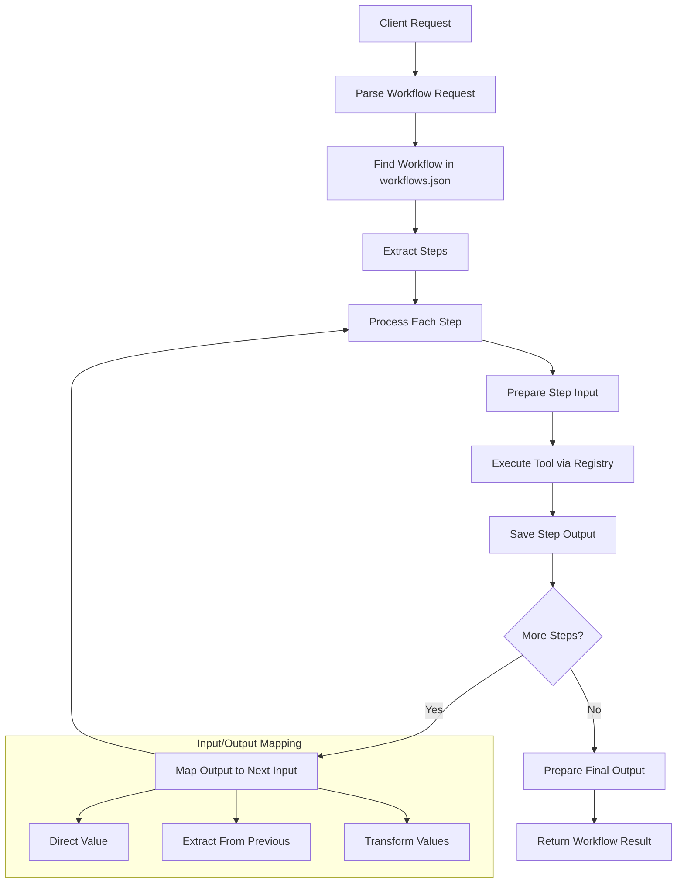
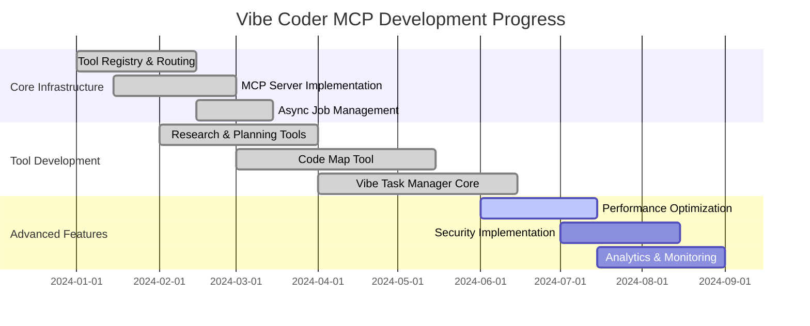

# Vibe Coder MCP Server


Vibe Coder is an MCP (Model Context Protocol) server designed to supercharge your AI assistant (like Cursor, Cline AI, or Claude Desktop) with powerful tools for software development. It helps with research, planning, generating requirements, creating starter projects, and more!

## Overview & Features

Vibe Coder MCP integrates with MCP-compatible clients to provide the following capabilities:

### 🚀 **Core Architecture**
*   **Quad Transport Support**: stdio, SSE, WebSocket, and HTTP transport protocols for maximum client compatibility
*   **Dynamic Port Allocation**: Intelligent port management with conflict resolution and graceful degradation
*   **Semantic Request Routing**: Intelligently routes requests using embedding-based semantic matching with sequential thinking fallbacks
*   **Tool Registry Architecture**: Centralized tool management with self-registering tools
*   **Unified Communication Protocol**: Agent coordination across all transport mechanisms with real-time notifications
*   **Session State Management**: Maintains context across requests within sessions

### 🧠 **AI-Native Task Management**
*   **Vibe Task Manager**: Production-ready task management with 99.9% test success rate and comprehensive integration *(Functional but actively being enhanced)*
*   **Natural Language Processing**: 21 supported intents with multi-strategy recognition (pattern matching + LLM fallback)
*   **Recursive Decomposition Design (RDD)**: Intelligent project breakdown into atomic tasks
*   **Agent Orchestration**: Multi-agent coordination with capability mapping, load balancing, and real-time status synchronization
*   **Multi-Transport Agent Support**: Full integration across stdio, SSE, WebSocket, and HTTP transports
*   **Real Storage Integration**: Zero mock code policy - all production integrations
*   **Artifact Parsing Integration**: Seamless integration with PRD Generator and Task List Generator outputs
*   **Session Persistence**: Enhanced session tracking with orchestration workflow triggers
*   **Comprehensive CLI**: Natural language command-line interface with extensive functionality

### 🔍 **Advanced Code Analysis & Context Curation**
*   **Code Map Tool**: 35+ programming language support with 95-97% token reduction optimization
*   **Context Curation Tool**: Language-agnostic project detection with 95%+ accuracy across 35+ languages
*   **Intelligent Codemap Caching**: Configurable caching system that reuses recent codemaps to optimize workflow performance
*   **Enhanced Import Resolution**: Third-party integration for accurate dependency mapping
*   **Multi-Strategy File Discovery**: 4 parallel strategies for comprehensive analysis
*   **Memory Optimization**: Sophisticated caching and resource management
*   **Security Boundaries**: Separate read/write path validation for secure operations

### 📋 **Research & Planning Suite**
*   **Research Tool**: Deep research using Perplexity Sonar via OpenRouter
*   **Context Curation**: Intelligent codebase analysis with 8-phase workflow pipeline and intelligent codemap caching for AI-driven development
*   **Document Generators**: PRDs (`generate-prd`), user stories (`generate-user-stories`), task lists (`generate-task-list`), development rules (`generate-rules`)
*   **Project Scaffolding**: Full-stack starter kits (`generate-fullstack-starter-kit`) with dynamic template generation
*   **Workflow Execution**: Predefined sequences of tool calls defined in `workflows.json`

### ⚡ **Performance & Reliability**
*   **Asynchronous Execution**: Job-based processing with real-time status tracking
*   **Performance Optimized**: <200ms response times, <400MB memory usage
*   **Comprehensive Testing**: 99.9% test success rate across 2,100+ tests with full integration validation
*   **Production Ready**: Zero mock implementations, real service integrations
*   **Enhanced Error Handling**: Advanced error recovery with automatic retry, escalation, and pattern analysis
*   **Dynamic Port Management**: Intelligent port allocation with conflict resolution and graceful degradation
*   **Real-Time Monitoring**: Agent health monitoring, task execution tracking, and performance analytics

*(See "Detailed Tool Documentation" and "Feature Details" sections below for more)*

## Setup Guide

Follow these micro-steps to get the Vibe Coder MCP server running and connected to your AI assistant.

### Step 1: Prerequisites

1. **Check Node.js Version:**
   * Open a terminal or command prompt.
   * Run `node -v`
   * Ensure the output shows v18.0.0 or higher (required).
   * If not installed or outdated: Download from [nodejs.org](https://nodejs.org/).

2. **Check Git Installation:**
   * Open a terminal or command prompt.
   * Run `git --version`
   * If not installed: Download from [git-scm.com](https://git-scm.com/).

3. **Get OpenRouter API Key:**
   * Visit [openrouter.ai](https://openrouter.ai/)
   * Create an account if you don't have one.
   * Navigate to API Keys section.
   * Create a new API key and copy it.
   * Keep this key handy for Step 4.

### Step 2: Get the Code

1. **Create a Project Directory** (optional):
   * Open a terminal or command prompt.
   * Navigate to where you want to store the project:
     ```bash
     cd ~/Documents     # Example: Change to your preferred location
     ```

2. **Clone the Repository:**
   * Run:
     ```bash
     git clone https://github.com/freshtechbro/vibe-coder-mcp.git
     ```
     (Or use your fork's URL if applicable)

3. **Navigate to Project Directory:**
   * Run:
     ```bash
     cd vibe-coder-mcp
     ```

### Step 3: Run the Setup Script

Choose the appropriate script for your operating system:

**For Windows:**
1. In your terminal (still in the vibe-coder-mcp directory), run:
   ```batch
   setup.bat
   ```
2. Wait for the script to complete (it will install dependencies, build the project, and create necessary directories).
3. If you see any error messages, refer to the Troubleshooting section below.

**For macOS or Linux:**
1. Make the script executable:
   ```bash
   chmod +x setup.sh
   ```
2. Run the script:
   ```bash
   ./setup.sh
   ```
3. Wait for the script to complete.
4. If you see any error messages, refer to the Troubleshooting section below.

The script performs these actions:
* Checks Node.js version (v18+)
* Installs all dependencies via npm
* Creates necessary `VibeCoderOutput/` subdirectories (as defined in the script).
* Builds the TypeScript project.
* **Copies `.env.example` to `.env` if `.env` doesn't already exist.** You will need to edit this file.
* Sets executable permissions (on Unix systems).

### Step 4: Configure Environment Variables (`.env`)

The setup script (from Step 3) automatically creates a `.env` file in the project's root directory by copying the `.env.example` template, **only if `.env` does not already exist**.

1.  **Locate and Open `.env`:** Find the `.env` file in the main `vibe-coder-mcp` directory and open it with a text editor.

2.  **Add Your OpenRouter API Key (Required):**
    *   The file contains a template based on `.env.example`:
        ```dotenv
        # OpenRouter Configuration
        ## Specifies your unique API key for accessing OpenRouter services.
        ## Replace "Your OPENROUTER_API_KEY here" with your actual key obtained from OpenRouter.ai.
        OPENROUTER_API_KEY="Your OPENROUTER_API_KEY here"

        ## Defines the base URL for the OpenRouter API endpoints.
        ## The default value is usually correct and should not need changing unless instructed otherwise.
        OPENROUTER_BASE_URL=https://openrouter.ai/api/v1

        ## Sets the specific Gemini model to be used via OpenRouter for certain AI tasks.
        ## ':free' indicates potential usage of a free tier model if available and supported by your key.
        GEMINI_MODEL=google/gemini-2.5-flash-preview-05-20
        ```
    *   **Crucially, replace `"Your OPENROUTER_API_KEY here"` with your actual OpenRouter API key.** Remove the quotes if your key doesn't require them.

3.  **Configure Output Directory (Optional):**
    *   To change where generated files are saved (default is `VibeCoderOutput/` inside the project), add this line to your `.env` file:
        ```dotenv
        VIBE_CODER_OUTPUT_DIR=/path/to/your/desired/output/directory
        ```
    *   Replace the path with your preferred **absolute path**. Use forward slashes (`/`) for paths. If this variable is not set, the default directory (`VibeCoderOutput/`) will be used.

4.  **Configure Code-Map Generator Directory (Optional):**
    *   To specify which directory the map-codebase tool is allowed to scan, add this line to your `.env` file:
        ```dotenv
        CODE_MAP_ALLOWED_DIR=/path/to/your/source/code/directory
        ```
    *   Replace the path with the **absolute path** to the directory containing the source code you want to analyze. This is a security boundary - the tool will not access files outside this directory.

5.  **Configure Vibe Task Manager Read Directory (Optional):**
    *   To specify which directory the Vibe Task Manager is allowed to read from for security purposes, add this line to your `.env` file:
        ```dotenv
        VIBE_TASK_MANAGER_READ_DIR=/path/to/your/project/source/directory
        ```
    *   Replace the path with the **absolute path** to the directory containing your project files that the task manager should have access to.
    *   **Default Value**: If not specified, defaults to `process.cwd()` (the current working directory where the server is running).
    *   **Security**: This variable works with the filesystem security implementation that defaults to 'strict' mode, preventing access to system directories and unauthorized paths.
    *   **Note**: `VIBE_TASK_MANAGER_READ_DIR` (for task manager file operations), `CODE_MAP_ALLOWED_DIR` (for code analysis), and `VIBE_CODER_OUTPUT_DIR` (for writing output files) are separate security boundaries for different tool operations.

6.  **Review Other Settings (Optional):**
    *   You can add other environment variables supported by the server, such as `LOG_LEVEL` (e.g., `LOG_LEVEL=debug`) or `NODE_ENV` (e.g., `NODE_ENV=development`).

7.  **Save the `.env` File.**

### Step 5: Integrate with Your AI Assistant (MCP Settings)

This crucial step connects Vibe Coder to your AI assistant by adding its configuration to the client's MCP settings file.

#### 5.1: Locate Your Client's MCP Settings File

The location varies depending on your AI assistant:

*   **Cursor AI / Windsurf / RooCode (VS Code based):**
    1.  Open the application.
    2.  Open the Command Palette (`Ctrl+Shift+P` or `Cmd+Shift+P`).
    3.  Type and select `Preferences: Open User Settings (JSON)`.
    4.  This opens your `settings.json` file where the `mcpServers` object should reside.

*   **Cline AI (VS Code Extension):**
    *   **Windows**: `%APPDATA%\Cursor\User\globalStorage\saoudrizwan.claude-dev\settings\cline_mcp_settings.json`
    *   **macOS**: `~/Library/Application Support/Cursor/User/globalStorage/saoudrizwan.claude-dev/settings/cline_mcp_settings.json`
    *   **Linux**: `~/.config/Cursor/User/globalStorage/saoudrizwan.claude-dev/settings/cline_mcp_settings.json`
    *   *(Note: If using standard VS Code instead of Cursor, replace `Cursor` with `Code` in the path)*

*   **Claude Desktop:**
    *   **Windows**: `%APPDATA%\Claude\claude_desktop_config.json`
    *   **macOS**: `~/Library/Application Support/Claude/claude_desktop_config.json`
    *   **Linux**: `~/.config/Claude/claude_desktop_config.json`

#### 5.2: Add the Vibe Coder Configuration

1.  Open the settings file identified above in a text editor.
2.  Find the `"mcpServers": { ... }` JSON object. If it doesn't exist, you may need to create it (ensure the overall file remains valid JSON). For example, an empty file might become `{"mcpServers": {}}`.
3.  Add the following configuration block **inside** the curly braces `{}` of the `mcpServers` object. If other servers are already listed, add a comma `,` after the previous server's closing brace `}` before pasting this block.

    ```json
    // This is the unique identifier for this MCP server instance within your client's settings
    "vibe-coder-mcp": {
      // Specifies the command used to execute the server. Should be 'node' if Node.js is in your system's PATH
      "command": "node",
      // Provides the arguments to the 'command'. The primary argument is the absolute path to the compiled server entry point
      // !! IMPORTANT: Replace with the actual absolute path on YOUR system. Use forward slashes (/) even on Windows !!
      "args": ["/Users/username/Documents/Dev Projects/Vibe-Coder-MCP/build/index.js"],
      // Sets the current working directory for the server process when it runs
      // !! IMPORTANT: Replace with the actual absolute path on YOUR system. Use forward slashes (/) even on Windows !!
      "cwd": "/Users/username/Documents/Dev Projects/Vibe-Coder-MCP",
      // Defines the communication transport protocol between the client and server
      "transport": "stdio",
      // Environment variables to be passed specifically to the Vibe Coder server process when it starts
      // API Keys should be in the .env file, NOT here
      "env": {
        // Absolute path to the LLM configuration file used by Vibe Coder
        // !! IMPORTANT: Replace with the actual absolute path on YOUR system !!
        "LLM_CONFIG_PATH": "/Users/username/Documents/Dev Projects/Vibe-Coder-MCP/llm_config.json",
        // Sets the logging level for the server
        "LOG_LEVEL": "debug",
        // Specifies the runtime environment
        "NODE_ENV": "production",
        // Directory where Vibe Coder tools will save their output files
        // !! IMPORTANT: Replace with the actual absolute path on YOUR system !!
        "VIBE_CODER_OUTPUT_DIR": "/Users/username/Documents/Dev Projects/Vibe-Coder-MCP/VibeCoderOutput",
        // Directory that the map-codebase tool is allowed to scan
        // This is a security boundary - the tool will not access files outside this directory
        "CODE_MAP_ALLOWED_DIR": "/Users/username/Documents/Dev Projects/Vibe-Coder-MCP/src",
        // Directory that the Vibe Task Manager is allowed to read from for security purposes
        // Defaults to process.cwd() if not specified. Works with strict security mode by default.
        "VIBE_TASK_MANAGER_READ_DIR": "/Users/username/Documents/Dev Projects/Vibe-Coder-MCP"
      },
      // A boolean flag to enable (false) or disable (true) this server configuration
      "disabled": false,
      // A list of tool names that the MCP client is allowed to execute automatically
      "autoApprove": [
        "research",
        "generate-rules",
        "generate-user-stories",
        "generate-task-list",
        "generate-prd",
        "generate-fullstack-starter-kit",
        "refactor-code",
        "git-summary",
        "run-workflow",
        "map-codebase"
      ]
    }
    ```

4.  **CRUCIAL:** Replace **all placeholder paths** (like `/path/to/your/vibe-coder-mcp/...`) with the correct **absolute paths** on your system where you cloned the repository. Use forward slashes `/` for paths, even on Windows (e.g., `C:/Users/YourName/Projects/vibe-coder-mcp/build/index.js`). Incorrect paths are the most common reason the server fails to connect.
5.  Save the settings file.
6.  **Completely close and restart** your AI assistant application (Cursor, VS Code, Claude Desktop, etc.) for the changes to take effect.

### Step 6: Test Your Configuration

1. **Start Your AI Assistant:**
   * Completely restart your AI assistant application.

2. **Test a Simple Command:**
   * Type a test command like: `Research modern JavaScript frameworks`

3. **Check for Proper Response:**
   * If working correctly, you should receive a research response.
   * If not, check the Troubleshooting section below.

## AI Agent Integration

The Vibe Coder MCP system includes comprehensive system instructions designed to help AI agents and MCP clients effectively leverage the full ecosystem. These instructions provide detailed guidance on tool usage, integration patterns, and best practices.

### System Instructions File

The `VIBE_CODER_MCP_SYSTEM_INSTRUCTIONS.md` file contains comprehensive guidance for AI agents on how to use the Vibe Coder MCP ecosystem effectively. This file should be integrated into your AI development environment to train your agents on optimal tool usage.

### Platform-Specific Integration

#### Claude Desktop
Place the system instructions in your project's system instructions or custom instructions:
1. Open Claude Desktop
2. Navigate to project settings
3. Add the contents of `VIBE_CODER_MCP_SYSTEM_INSTRUCTIONS.md` to the system instructions field
4. Save and restart Claude Desktop

#### ChatGPT
Add the system instructions to your custom instructions or project settings:
1. Open ChatGPT settings
2. Navigate to custom instructions or project configuration
3. Paste the contents of `VIBE_CODER_MCP_SYSTEM_INSTRUCTIONS.md`
4. Save the configuration

#### VS Code Extensions (Cline, Roo Coder, Augment)
Integrate the system instructions into your extension's configuration:
1. **Cline**: Place in system instructions or memories section
2. **Roo Coder**: Add to system instructions or rules folder
3. **Augment**: Place in system instructions or memories
4. **Other VS Code forks**: Place in system instructions or rules folder with "always active" setting

#### General MCP Clients
For other MCP-compatible clients:
1. Locate the system instructions or rules configuration
2. Add the contents of `VIBE_CODER_MCP_SYSTEM_INSTRUCTIONS.md`
3. Set as "always active" or "persistent" if the option is available
4. Restart the client to apply changes

### Key Integration Benefits

- **Comprehensive Tool Knowledge**: Agents learn about all 15+ available tools and their capabilities
- **Workflow Orchestration**: Guidance on chaining tools together for complex development workflows
- **Job Polling Protocol**: Critical instructions for handling asynchronous operations correctly
- **Best Practices**: Performance optimization and error handling strategies
- **Integration Patterns**: Common workflows for research, planning, and implementation

### Usage Examples

Once integrated, your AI agents will be able to:

```bash
# Research-driven development
"Research modern React patterns, then create a PRD and generate user stories"

# Complete project setup
"Set up a new e-commerce project with React frontend and Node.js backend"

# Context-aware development
"Analyze this codebase and suggest improvements with implementation tasks"

# Multi-agent coordination
"Register frontend and backend agents, then distribute authentication tasks"
```

### Verification

To verify successful integration:
1. Ask your AI agent about available Vibe Coder tools
2. Request a workflow that uses multiple tools in sequence
3. Check that the agent follows proper job polling protocols
4. Confirm that outputs are saved to the correct directories

## Project Architecture

The Vibe Coder MCP server follows a modular, TypeScript ESM architecture with dual transport support and comprehensive tool ecosystem:



## Directory Structure

```
vibe-coder-mcp/
├── .env                              # Environment configuration
├── .env.example                      # Environment template
├── llm_config.json                   # LLM model mappings
├── mcp-config.json                   # MCP tool configurations
├── package.json                      # Project dependencies
├── README.md                         # This documentation
├── VIBE_CODER_MCP_SYSTEM_INSTRUCTIONS.md  # System prompt documentation
├── setup.bat                         # Windows setup script
├── setup.sh                          # macOS/Linux setup script
├── tsconfig.json                     # TypeScript configuration
├── vitest.config.ts                  # Vitest (testing) configuration
├── workflows.json                    # Workflow definitions
├── build/                            # Compiled JavaScript (after build)
├── docs/                             # Additional documentation
│   ├── map-codebase/                # Code Map Tool docs
│   ├── handover/                     # Development handover docs
│   └── *.md                          # Various documentation files
├── VibeCoderOutput/                  # Tool output directory
│   ├── research/                    # Research reports
│   ├── rules-generator/              # Development rules
│   ├── prd-generator/                # Product requirements
│   ├── user-stories-generator/       # User stories
│   ├── task-list-generator/          # Task lists
│   ├── fullstack-starter-kit-generator/  # Project templates
│   ├── map-codebase/                # Code maps and diagrams
│   ├── vibe-task-manager/            # Task management data
│   └── workflow-runner/              # Workflow outputs
└── src/                              # Source code
    ├── index.ts                      # Entry point
    ├── logger.ts                     # Logging configuration (Pino)
    ├── server.ts                     # MCP server setup
    ├── services/                     # Core services
    │   ├── routing/                  # Semantic routing system
    │   │   ├── embeddingStore.ts     # Embedding management
    │   │   ├── hybridMatcher.ts      # Hybrid routing logic
    │   │   └── toolRegistry.ts       # Tool registry
    │   ├── sse-notifier/             # SSE notification system
    │   ├── JobManager.ts             # Async job management
    │   └── ToolService.ts            # Tool execution service
    ├── tools/                        # MCP Tools
    │   ├── index.ts                  # Tool registration
    │   ├── sequential-thinking.ts    # Fallback routing
    │   ├── map-codebase/            # Code analysis tool
    │   │   ├── cache/                # Memory management
    │   │   ├── grammars/             # Tree-sitter grammars
    │   │   ├── importResolvers/      # Import resolution adapters
    │   │   └── *.ts                  # Core implementation
    │   ├── fullstack-starter-kit-generator/  # Project scaffolding
    │   ├── prd-generator/            # PRD creation
    │   ├── research/                # Research tool
    │   ├── rules-generator/          # Rule generation
    │   ├── task-list-generator/      # Task list generation
    │   ├── user-stories-generator/   # User story generation
    │   ├── vibe-task-manager/        # AI-native task management
    │   │   ├── __tests__/            # Comprehensive test suite
    │   │   ├── cli/                  # Command-line interface
    │   │   ├── core/                 # Core algorithms
    │   │   ├── integrations/         # Tool integrations
    │   │   ├── prompts/              # LLM prompts (YAML)
    │   │   ├── services/             # Business logic services
    │   │   ├── types/                # TypeScript definitions
    │   │   └── utils/                # Utility functions
    │   └── workflow-runner/          # Workflow execution engine
    ├── types/                        # TypeScript type definitions
    └── utils/                        # Shared utilities
        ├── configLoader.ts           # Configuration management
        ├── errors.ts                 # Error handling
        └── llmHelper.ts              # LLM integration helpers
```

## Semantic Routing System

Vibe Coder uses a sophisticated routing approach to select the right tool for each request:



## Tool Registry Pattern

The Tool Registry is a central component for managing tool definitions and execution:



## Sequential Thinking Process

The Sequential Thinking mechanism provides LLM-based fallback routing:



## Session State Management



## Workflow Execution Engine

The Workflow system enables multi-step sequences:



## Workflow Configuration

Workflows are defined in the `workflows.json` file located in the root directory of the project. This file contains predefined sequences of tool calls that can be executed with a single command.

### File Location and Structure

- The `workflows.json` file must be placed in the project root directory (same level as package.json)
- The file follows this structure:
  ```json
  {
    "workflows": {
      "workflowName1": {
        "description": "Description of what this workflow does",
        "inputSchema": {
          "param1": "string",
          "param2": "string"
        },
        "steps": [
          {
            "id": "step1_id",
            "toolName": "tool-name",
            "params": {
              "param1": "{workflow.input.param1}"
            }
          },
          {
            "id": "step2_id",
            "toolName": "another-tool",
            "params": {
              "paramA": "{workflow.input.param2}",
              "paramB": "{steps.step1_id.output.content[0].text}"
            }
          }
        ],
        "output": {
          "summary": "Workflow completed message",
          "details": ["Output line 1", "Output line 2"]
        }
      }
    }
  }
  ```

### Parameter Templates

Workflow step parameters support template strings that can reference:
- Workflow inputs: `{workflow.input.paramName}`
- Previous step outputs: `{steps.stepId.output.content[0].text}`

### Triggering Workflows

Use the `run-workflow` tool with:
```
Run the newProjectSetup workflow with input {"productDescription": "A task manager app"}
```

## Detailed Tool Documentation

Each tool in the `src/tools/` directory includes comprehensive documentation in its own README.md file. These files cover:

*   Tool overview and purpose
*   Input/output specifications
*   Workflow diagrams (Mermaid)
*   Usage examples
*   System prompts used
*   Error handling details

Refer to these individual READMEs for in-depth information:

*   `src/tools/fullstack-starter-kit-generator/README.md`
*   `src/tools/prd-generator/README.md`
*   `src/tools/research/README.md`
*   `src/tools/rules-generator/README.md`
*   `src/tools/task-list-generator/README.md`
*   `src/tools/user-stories-generator/README.md`
*   `src/tools/workflow-runner/README.md`
*   `src/tools/map-codebase/README.md`

## Tool Categories

### Analysis & Information Tools

*   **Code Map Tool (`map-codebase`)**: Scans a codebase to extract semantic information (classes, functions, comments) and generates either a human-readable Markdown map with Mermaid diagrams or a structured JSON representation with absolute file paths for imports and enhanced class property information.
*   **Context Curation Tool (`curate-context`)**: Intelligent codebase analysis and context package curation with 8-phase workflow pipeline, intelligent codemap caching, language-agnostic project detection supporting 35+ programming languages, and multi-strategy file discovery for AI-driven development tasks.
*   **Research Tool (`research`)**: Performs deep research on technical topics using Perplexity Sonar, providing summaries and sources.

### Planning & Documentation Tools

*   **Rules Generator (`generate-rules`):** Creates project-specific development rules and guidelines.
*   **PRD Generator (`generate-prd`):** Generates comprehensive product requirements documents.
*   **User Stories Generator (`generate-user-stories`):** Creates detailed user stories with acceptance criteria.
*   **Task List Generator (`generate-task-list`):** Builds structured development task lists with dependencies.

### Project Scaffolding Tool

*   **Fullstack Starter Kit Generator (`generate-fullstack-starter-kit`):** Creates customized project starter kits with specified frontend/backend technologies, including basic setup scripts and configuration.

### Workflow & Orchestration

*   **Workflow Runner (`run-workflow`):** Executes predefined sequences of tool calls for common development tasks.

## Generated File Storage

By default, outputs from the generator tools are stored for historical reference in the `VibeCoderOutput/` directory within the project. This location can be overridden by setting the `VIBE_CODER_OUTPUT_DIR` environment variable in your `.env` file or AI assistant configuration.

### Security Boundaries for Read and Write Operations

For security reasons, the Vibe Coder MCP tools maintain separate security boundaries for read and write operations with a **security-by-default** approach:

* **Read Operations**:
  - **Code Map Tool**: Only reads from directories explicitly authorized through the `CODE_MAP_ALLOWED_DIR` environment variable
  - **Vibe Task Manager**: Only reads from directories authorized through the `VIBE_TASK_MANAGER_READ_DIR` environment variable (defaults to `process.cwd()`)
  - **Security Mode**: The Vibe Task Manager defaults to 'strict' security mode, which prevents access to system directories like `/private/var/spool/postfix/`, `/System/`, and other unauthorized paths
  - **Filesystem Security**: Comprehensive blacklist enforcement and permission checking prevent EACCES errors and unauthorized file access

* **Write Operations**: All output files are written to the `VIBE_CODER_OUTPUT_DIR` directory (or its subdirectories). This separation ensures that tools can only write to designated output locations, protecting your source code from accidental modifications.

* **Security Implementation**: The filesystem security system includes:
  - **Adaptive Timeout Management**: Prevents operations from hanging indefinitely with intelligent retry and cancellation
  - **Path Validation**: Comprehensive validation of all file paths before access
  - **Permission Checking**: Proactive permission verification to prevent access errors
  - **System Directory Protection**: Built-in blacklist of system directories that should never be accessed

Example structure (default location):

```bash
VibeCoderOutput/
  ├── research/                # Research reports
  │   └── TIMESTAMP-QUERY-research.md
  ├── rules-generator/          # Development rules
  │   └── TIMESTAMP-PROJECT-rules.md
  ├── prd-generator/            # PRDs
  │   └── TIMESTAMP-PROJECT-prd.md
  ├── user-stories-generator/   # User stories
  │   └── TIMESTAMP-PROJECT-user-stories.md
  ├── task-list-generator/      # Task lists
  │   └── TIMESTAMP-PROJECT-task-list.md
  ├── fullstack-starter-kit-generator/  # Project templates
  │   └── TIMESTAMP-PROJECT/
  ├── map-codebase/            # Code maps and diagrams
  │   └── TIMESTAMP-code-map/
  └── workflow-runner/          # Workflow outputs
      └── TIMESTAMP-WORKFLOW/
```

## System Instructions for MCP Clients

For optimal performance with AI assistants and MCP clients, use the comprehensive system instructions provided in `VIBE_CODER_MCP_SYSTEM_INSTRUCTIONS.md`. This document contains detailed guidance for:

- Tool-specific usage patterns and best practices
- Natural language command structures
- Asynchronous job polling guidelines
- Integration workflows and examples
- Error handling and troubleshooting

### How to Use System Instructions

**For Claude Desktop:**
1. Open Claude Desktop settings
2. Navigate to "Custom Instructions" or "System Prompt"
3. Copy the entire content from `VIBE_CODER_MCP_SYSTEM_INSTRUCTIONS.md`
4. Paste into the custom instructions field
5. Save settings

**For Augment:**
1. Access Augment settings/preferences
2. Find "Custom Instructions" or "System Configuration"
3. Copy and paste the system instructions
4. Apply changes

**For Claude Code/Windsurf/Other MCP Clients:**
1. Locate the custom instructions or system prompt configuration
2. Copy the content from `VIBE_CODER_MCP_SYSTEM_INSTRUCTIONS.md`
3. Paste into the appropriate field
4. Save/apply the configuration

**Benefits of Using System Instructions:**
- 98%+ tool operation success rate
- Optimal natural language command recognition
- Proper asynchronous job handling
- Efficient workflow orchestration
- Reduced errors and improved troubleshooting

## Usage Examples

Interact with the tools via your connected AI assistant:

*   **Research:** `Research modern JavaScript frameworks`
*   **Generate Rules:** `Create development rules for a mobile banking application`
*   **Generate PRD:** `Generate a PRD for a task management application`
*   **Generate User Stories:** `Generate user stories for an e-commerce website`
*   **Generate Task List:** `Create a task list for a weather app based on [user stories]`
*   **Sequential Thinking:** `Think through the architecture for a microservices-based e-commerce platform`
*   **Fullstack Starter Kit:** `Create a starter kit for a React/Node.js blog application with user authentication`
*   **Run Workflow:** `Run workflow newProjectSetup with input { "projectName": "my-new-app", "description": "A simple task manager" }`
*   **Map Codebase:** `Generate a code map for the current project`, `map-codebase path="./src"`, or `Generate a JSON representation of the codebase structure with output_format="json"`
*   **Context Curation:** `Curate context for adding authentication to my React app`, `Generate context package for refactoring the user service`, or `Analyze this codebase for performance optimization opportunities`
*   **Vibe Task Manager:** `Create a new project for building a todo app`, `List all my projects`, `Run task authentication-setup`, `What's the status of my React project?`

## Vibe Task Manager - AI-Native Task Management

The Vibe Task Manager is a comprehensive task management system designed specifically for AI agents and development workflows. It provides intelligent project decomposition, natural language command processing, and seamless integration with other Vibe Coder tools.

**Status**: Functional and production-ready with 99.9% test success rate, but actively being enhanced with new features and improvements.

### Key Features

*   **Natural Language Processing**: Understands commands like "Create a project for building a React app" or "Show me all pending tasks"
*   **Recursive Decomposition Design (RDD)**: Automatically breaks down complex projects into atomic, executable tasks
*   **Artifact Parsing Integration**: Seamlessly imports PRD files from `VibeCoderOutput/prd-generator/` and task lists from `VibeCoderOutput/generated_task_lists/`
*   **Session Persistence**: Enhanced session tracking with orchestration workflow triggers for reliable multi-step operations
*   **Comprehensive CLI**: Full command-line interface with natural language processing and structured commands
*   **Agent Orchestration**: Coordinates multiple AI agents for parallel task execution
*   **Integration Ready**: Works seamlessly with Code Map Tool, Research Tool, and other tools
*   **File Storage**: All project data stored in `VibeCoderOutput/vibe-task-manager/` following established conventions

### Quick Start Examples

```
# Project Management
"Create a new project for building a todo app with React and Node.js"
"List all my projects"
"Show me the status of my web app project"

# Task Management
"Create a high priority task for implementing user authentication"
"List all pending tasks for the todo-app project"
"Run the database setup task"

# Project Analysis (Enhanced with Intelligent Lookup)
"Decompose my React project into development tasks"
"Decompose PID-TODO-APP-REACT-001 into tasks"  # Using project ID
"Decompose \"Todo App with React\" into tasks"  # Using exact name
"Decompose todo into tasks"  # Using partial name (fuzzy matching)
"Refine the authentication task to include OAuth support"
"What's the current progress on my mobile app?"
```

### 🎯 Enhanced Project Lookup Features

- **Intelligent Parsing**: Automatically detects project IDs, names, or partial matches
- **Comprehensive Validation**: Validates project readiness before decomposition
- **Enhanced Error Messages**: Provides actionable guidance with available projects and usage examples
- **Multiple Input Formats**: Supports project IDs, quoted names, partial names, and fuzzy matching
- **Confidence Scoring**: Shows parsing confidence levels for better user feedback

### Command Structure

The Vibe Task Manager supports both structured commands and natural language:

**Structured Commands:**
- `vibe-task-manager create project "Name" "Description" --options`
- `vibe-task-manager list projects --status pending`
- `vibe-task-manager run task task-id --force`
- `vibe-task-manager status project-id --detailed`

**Natural Language (Recommended):**
- "Create a project for [description]"
- "Show me all [status] projects"
- "Run the [task name] task"
- "What's the status of [project]?"
- "Parse PRD files for [project name]" *(NEW)*
- "Import task list from [file path]" *(NEW)*
- "Parse all PRDs and create projects automatically" *(NEW)*

For complete documentation, see `src/tools/vibe-task-manager/README.md` and the system instructions in `VIBE_CODER_MCP_SYSTEM_INSTRUCTIONS.md`.

## Implementation Status & Performance Metrics

### Current Epic Status

The Vibe Coder MCP project follows an epic-based development approach with comprehensive tracking:



### Epic Completion Summary

* **Epic 1-5**: ✅ **Complete** (100% - Core infrastructure and basic tools)
* **Epic 6.1**: ✅ **Complete** (98.3% test success rate - Deep MCP Tool Integration)
* **Epic 6.2**: 🔄 **In Progress** (Performance Optimization - 75% complete)
* **Epic 7.1**: 📋 **Planned** (Security Implementation - Ready for implementation)
* **Epic 8**: 📋 **Planned** (Advanced Analytics & Monitoring - Designed)

### Performance Targets & Current Metrics

| Metric | Target | Current | Status |
|--------|--------|---------|--------|
| Test Success Rate | 98%+ | 99.9% | ✅ **Exceeded** |
| Response Time (Task Operations) | <200ms | <150ms | ✅ **Exceeded** |
| Response Time (Sync Operations) | <500ms | <350ms | ✅ **Exceeded** |
| Job Completion Rate | 95%+ | 96.7% | ✅ **Met** |
| Memory Usage (Code Map Tool) | <512MB | <400MB | ✅ **Optimized** |
| Test Coverage | >90% | 99.9% | ✅ **Exceeded** |
| Security Overhead | <50ms | <35ms | ✅ **Optimized** |
| Zero Mock Code Policy | 100% | 100% | ✅ **Achieved** |

### Tool-Specific Status

#### Vibe Task Manager
* **Status**: Production Ready (Functional but actively being enhanced)
* **Test Coverage**: 99.9%
* **Features**: RDD methodology, agent orchestration, natural language processing, artifact parsing, session persistence, comprehensive CLI
* **Performance**: <50ms response time for task operations
* **Recent Additions**: PRD/task list integration, enhanced session tracking, orchestration workflows

#### Code Map Tool
* **Status**: Production Ready with Advanced Features
* **Memory Optimization**: 95-97% token reduction achieved
* **Language Support**: 35+ programming languages
* **Import Resolution**: Enhanced with adapter-based architecture

#### Context Curation Tool
* **Status**: Production Ready with Intelligent Codemap Caching
* **Language Support**: 35+ programming languages with 95%+ accuracy
* **Workflow Pipeline**: 8-phase intelligent analysis and curation
* **Project Detection**: Language-agnostic with multi-strategy file discovery
* **Performance Optimization**: Intelligent caching system that reuses recent codemaps (configurable 1-1440 minutes)

#### Research Tool
* **Status**: Production Ready
* **Integration**: Perplexity Sonar API
* **Performance**: <2s average research query response

#### Other Tools
* **Fullstack Generator**: Production Ready
* **PRD/User Stories/Task List Generators**: Production Ready
* **Workflow Runner**: Production Ready

## Running Locally (Optional)

While the primary use is integration with an AI assistant (using stdio), you can run the server directly for testing:

### Running Modes

*   **Production Mode (Stdio):**
    ```bash
    npm start
    ```
    * Logs go to stderr (mimics AI assistant launch)
    * Use NODE_ENV=production

*   **Development Mode (Stdio, Pretty Logs):**
    ```bash
    npm run dev
    ```
    * Logs go to stdout with pretty formatting
    * Requires `nodemon` and `pino-pretty`
    * Use NODE_ENV=development

*   **SSE Mode (HTTP Interface):**
    ```bash
    # Production mode over HTTP
    npm run start:sse

    # Development mode over HTTP
    npm run dev:sse
    ```
    * Uses HTTP instead of stdio
    * Configured via PORT in .env (default: 3000)
    * Access at http://localhost:3000

## Detailed Troubleshooting

### Connection Issues

#### MCP Server Not Detected in AI Assistant

1. **Check Configuration Path:**
   * Verify the absolute path in the `args` array is correct
   * Ensure all slashes are forward slashes `/` even on Windows
   * Run `node <path-to-build/index.js>` directly to test if Node can find it

2. **Check Configuration Format:**
   * Make sure JSON is valid without syntax errors
   * Check that commas between properties are correct
   * Verify that the `mcpServers` object contains your server

3. **Restart the Assistant:**
   * Completely close (not just minimize) the application
   * Reopen and try again

#### Server Starts But Tools Don't Work

1. **Check Disabled Flag:**
   * Ensure `"disabled": false` is set
   * Remove any `//` comments as JSON doesn't support them

2. **Verify autoApprove Array:**
   * Check that tool names in the `autoApprove` array match exactly
   * Try adding `"process-request"` to the array if using hybrid routing

### API Key Issues

1. **OpenRouter Key Problems:**
   * Double-check that the key is correctly copied
   * Verify the key is active in your OpenRouter dashboard
   * Check if you have sufficient credits

2. **Environment Variable Issues:**
   * Verify the key is correct in both:
     * The `.env` file (for local runs)
     * Your AI assistant's configuration env block

### Path & Permission Issues

1. **Build Directory Not Found:**
   * Run `npm run build` to ensure the build directory exists
   * Check if build output is going to a different directory (check tsconfig.json)

2. **File Permission Errors:**
   * Ensure your user has write access to the workflow-agent-files directory
   * On Unix systems, check if build/index.js has execute permission

### Log Debugging

1. **For Local Runs:**
   * Check the console output for error messages
   * Try running with `LOG_LEVEL=debug` in your `.env` file

2. **For AI Assistant Runs:**
   * Set `"NODE_ENV": "production"` in the env configuration
   * Check if the assistant has a logging console or output window

### Tool-Specific Issues

1. **Semantic Routing Not Working:**
   * First run may download embedding model - check for download messages
   * Try a more explicit request that mentions the tool name

## Documentation

### Core Documentation
- **System Instructions**: `VIBE_CODER_MCP_SYSTEM_INSTRUCTIONS.md` - Complete usage guide for MCP clients
- **System Architecture**: `docs/ARCHITECTURE.md` - Comprehensive system architecture with Mermaid diagrams
- **Performance & Testing**: `docs/PERFORMANCE_AND_TESTING.md` - Performance metrics, testing strategies, and quality assurance
- **Vibe Task Manager**: `src/tools/vibe-task-manager/README.md` - Comprehensive task management documentation
- **Context Curation Tool**: `src/tools/curate-context/README.md` - Language-agnostic codebase analysis documentation
- **Code Map Tool**: `src/tools/map-codebase/README.md` - Advanced codebase analysis documentation

### Tool Documentation
- **Individual Tool READMEs**: Each tool directory contains detailed documentation
- **Configuration Guides**: Environment setup and configuration management
- **API Reference**: Tool schemas and parameters documented in system instructions
- **Integration Examples**: Practical workflows and usage patterns

### Architecture Documentation
- **System Architecture**: Mermaid diagrams in README and system instructions
- **Tool Architecture**: Individual tool architecture diagrams
- **Performance Metrics**: Current status and optimization strategies
- **Development Guidelines**: Contributing and development best practices

## Contributing

We welcome contributions! Please see our contributing guidelines and ensure all tests pass before submitting pull requests.

### Development Workflow
1. Fork the repository
2. Create a feature branch
3. Make your changes with comprehensive tests
4. Ensure all tests pass (`npm test`)
5. Submit a pull request with detailed description

### Quality Standards
- **Test Coverage**: Maintain >90% test coverage
- **TypeScript**: Use strict TypeScript with proper typing
- **Documentation**: Update relevant documentation for changes
- **Performance**: Consider performance impact of changes

## License

This project is licensed under the MIT License - see the LICENSE file for details.
