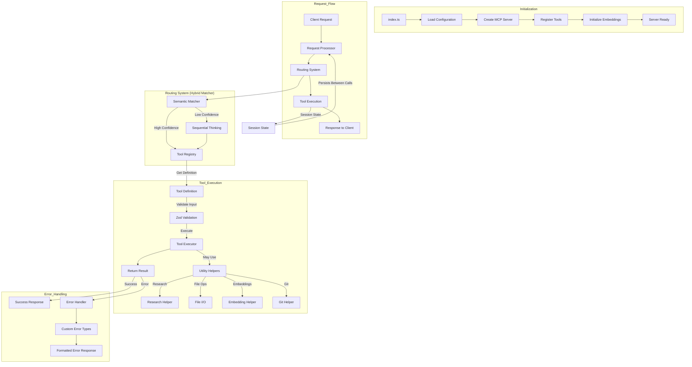
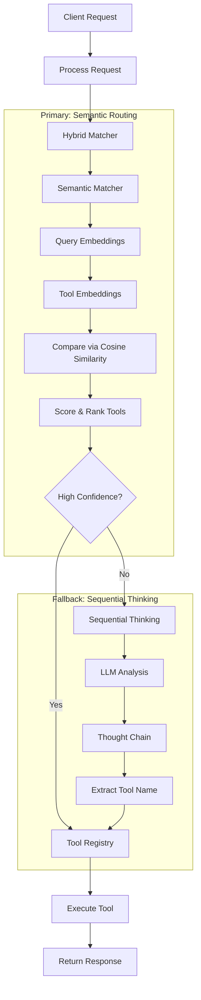
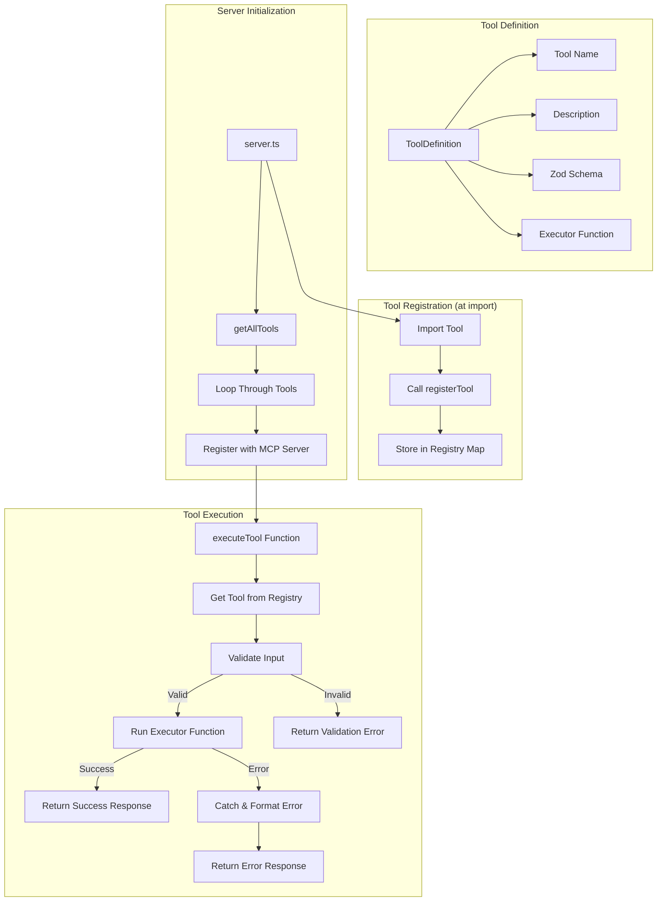
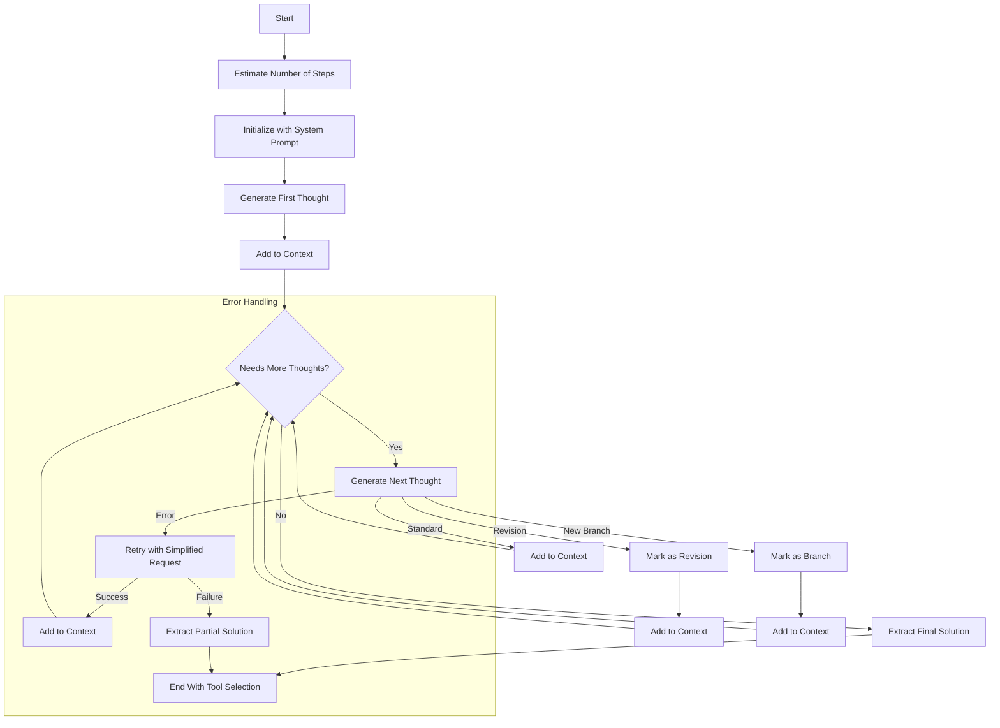
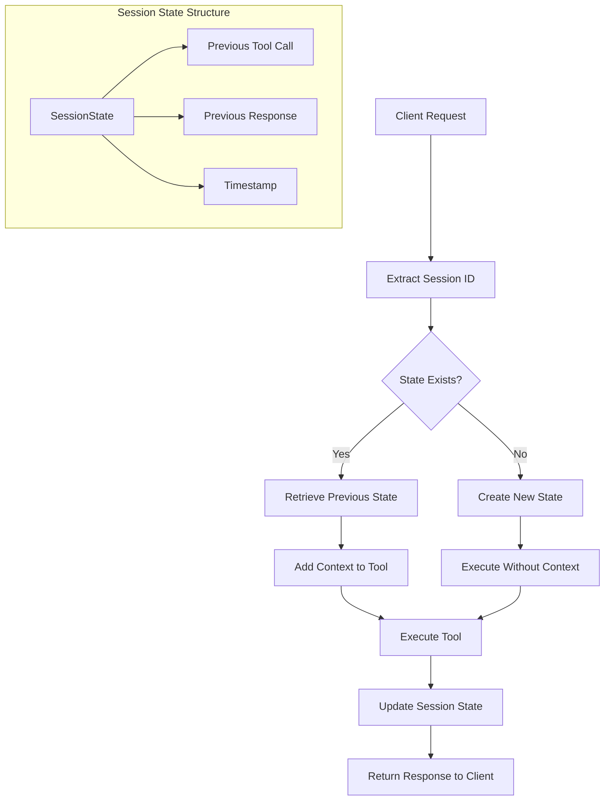
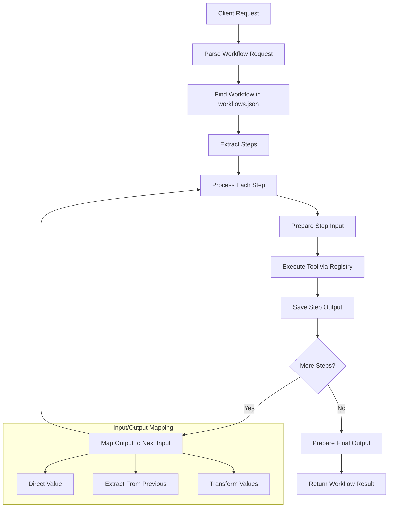

# Vibe Coder MCP Server

Vibe Coder is an MCP (Model Context Protocol) server designed to supercharge your AI assistant (like Cursor, Cline AI, or Claude Desktop) with powerful tools for software development. It helps with research, planning, generating requirements, creating starter projects, and more!

## Overview & Features

Vibe Coder MCP integrates with MCP-compatible clients to provide the following capabilities:

*   **Semantic Request Routing**: Intelligently routes requests using embedding-based semantic matching with sequential thinking fallbacks.
*   **Tool Registry Architecture**: Centralized tool management with self-registering tools.
*   **Direct LLM Calls**: Generator tools now use direct LLM calls for improved reliability and structured output control.
*   **Workflow Execution**: Runs predefined sequences of tool calls defined in `workflows.json`.
*   **Code Generation**: Creates code stubs and boilerplate (`generate-code-stub`).
*   **Code Refactoring**: Improves and modifies existing code snippets (`refactor-code`).
*   **Dependency Analysis**: Lists dependencies from manifest files (`analyze-dependencies`).
*   **Git Integration**: Summarizes current Git changes (`git-summary`).
*   **Research & Planning**: Performs deep research (`research-manager`) and generates planning documents like PRDs (`generate-prd`), user stories (`generate-user-stories`), task lists (`generate-task-list`), and development rules (`generate-rules`).
*   **Project Scaffolding**: Generates full-stack starter kits (`generate-fullstack-starter-kit`).
*   **Asynchronous Execution**: Many long-running tools (generators, research, workflows) now run asynchronously. They return a Job ID immediately, and the final result is retrieved using the `get-job-result` tool.
*   **Session State Management**: Maintains basic state across requests within a session (in-memory).
*   **Standardized Error Handling**: Consistent error patterns across all tools.

*(See "Detailed Tool Documentation" and "Feature Details" sections below for more)*

## Setup Guide

Follow these micro-steps to get the Vibe Coder MCP server running and connected to your AI assistant.

### Step 1: Prerequisites

1. **Check Node.js Version:**
   * Open a terminal or command prompt.
   * Run `node -v`
   * Ensure the output shows v18.0.0 or higher (required).
   * If not installed or outdated: Download from [nodejs.org](https://nodejs.org/).

2. **Check Git Installation:**
   * Open a terminal or command prompt.
   * Run `git --version`
   * If not installed: Download from [git-scm.com](https://git-scm.com/).

3. **Get OpenRouter API Key:**
   * Visit [openrouter.ai](https://openrouter.ai/)
   * Create an account if you don't have one.
   * Navigate to API Keys section.
   * Create a new API key and copy it.
   * Keep this key handy for Step 4.

### Step 2: Get the Code

1. **Create a Project Directory** (optional):
   * Open a terminal or command prompt.
   * Navigate to where you want to store the project:
     ```bash
     cd ~/Documents     # Example: Change to your preferred location
     ```

2. **Clone the Repository:**
   * Run:
     ```bash
     git clone https://github.com/freshtechbro/vibe-coder-mcp.git
     ```
     (Or use your fork's URL if applicable)

3. **Navigate to Project Directory:**
   * Run:
     ```bash
     cd vibe-coder-mcp
     ```

### Step 3: Run the Setup Script

Choose the appropriate script for your operating system:

**For Windows:**
1. In your terminal (still in the vibe-coder-mcp directory), run:
   ```batch
   setup.bat
   ```
2. Wait for the script to complete (it will install dependencies, build the project, and create necessary directories).
3. If you see any error messages, refer to the Troubleshooting section below.

**For macOS or Linux:**
1. Make the script executable:
   ```bash
   chmod +x setup.sh
   ```
2. Run the script:
   ```bash
   ./setup.sh
   ```
3. Wait for the script to complete.
4. If you see any error messages, refer to the Troubleshooting section below.

The script performs these actions:
* Checks Node.js version (v18+)
* Installs all dependencies via npm
* Creates necessary `VibeCoderOutput/` subdirectories (as defined in the script).
* Builds the TypeScript project.
* **Copies `.env.example` to `.env` if `.env` doesn't already exist.** You will need to edit this file.
* Sets executable permissions (on Unix systems).

### Step 4: Configure Environment Variables (`.env`)

The setup script (from Step 3) automatically creates a `.env` file in the project's root directory by copying the `.env.example` template, **only if `.env` does not already exist**.

1.  **Locate and Open `.env`:** Find the `.env` file in the main `vibe-coder-mcp` directory and open it with a text editor.

2.  **Add Your OpenRouter API Key (Required):**
    *   The file contains a template based on `.env.example`:
        ```dotenv
        # OpenRouter Configuration
        ## Specifies your unique API key for accessing OpenRouter services. 
        ## Replace "Your OPENROUTER_API_KEY here" with your actual key obtained from OpenRouter.ai.
        OPENROUTER_API_KEY="Your OPENROUTER_API_KEY here" 
        
        ## Defines the base URL for the OpenRouter API endpoints. 
        ## The default value is usually correct and should not need changing unless instructed otherwise.
        OPENROUTER_BASE_URL=https://openrouter.ai/api/v1
        
        ## Sets the specific Gemini model to be used via OpenRouter for certain AI tasks. 
        ## ':free' indicates potential usage of a free tier model if available and supported by your key.
        GEMINI_MODEL=google/gemini-2.0-flash-thinking-exp:free 
        ```
    *   **Crucially, replace `"Your OPENROUTER_API_KEY here"` with your actual OpenRouter API key.** Remove the quotes if your key doesn't require them.

3.  **Configure Output Directory (Optional):**
    *   To change where generated files are saved (default is `VibeCoderOutput/` inside the project), add this line to your `.env` file:
        ```dotenv
        VIBE_CODER_OUTPUT_DIR=/path/to/your/desired/output/directory
        ```
    *   Replace the path with your preferred **absolute path**. Use forward slashes (`/`) for paths. If this variable is not set, the default directory (`VibeCoderOutput/`) will be used.

4.  **Review Other Settings (Optional):**
    *   You can add other environment variables supported by the server, such as `LOG_LEVEL` (e.g., `LOG_LEVEL=debug`) or `NODE_ENV` (e.g., `NODE_ENV=development`).

5.  **Save the `.env` File.**

### Step 5: Integrate with Your AI Assistant (MCP Settings)

This crucial step connects Vibe Coder to your AI assistant by adding its configuration to the client's MCP settings file.

#### 5.1: Locate Your Client's MCP Settings File

The location varies depending on your AI assistant:

*   **Cursor AI / Windsurf / RooCode (VS Code based):**
    1.  Open the application.
    2.  Open the Command Palette (`Ctrl+Shift+P` or `Cmd+Shift+P`).
    3.  Type and select `Preferences: Open User Settings (JSON)`.
    4.  This opens your `settings.json` file where the `mcpServers` object should reside.

*   **Cline AI (VS Code Extension):**
    *   **Windows**: `%APPDATA%\Cursor\User\globalStorage\saoudrizwan.claude-dev\settings\cline_mcp_settings.json`
    *   **macOS**: `~/Library/Application Support/Cursor/User/globalStorage/saoudrizwan.claude-dev/settings/cline_mcp_settings.json`
    *   **Linux**: `~/.config/Cursor/User/globalStorage/saoudrizwan.claude-dev/settings/cline_mcp_settings.json`
    *   *(Note: If using standard VS Code instead of Cursor, replace `Cursor` with `Code` in the path)*

*   **Claude Desktop:**
    *   **Windows**: `%APPDATA%\Claude\claude_desktop_config.json`
    *   **macOS**: `~/Library/Application Support/Claude/claude_desktop_config.json`
    *   **Linux**: `~/.config/Claude/claude_desktop_config.json`

#### 5.2: Add the Vibe Coder Configuration

1.  Open the settings file identified above in a text editor.
2.  Find the `"mcpServers": { ... }` JSON object. If it doesn't exist, you may need to create it (ensure the overall file remains valid JSON). For example, an empty file might become `{"mcpServers": {}}`.
3.  Add the following configuration block **inside** the curly braces `{}` of the `mcpServers` object. If other servers are already listed, add a comma `,` after the previous server's closing brace `}` before pasting this block.

    ```json
    ## This is the unique identifier for this MCP server instance within your client's settings. You can name it descriptively.
    "vibe-coder-mcp": { 
      ## Specifies the command used to execute the server. Should be 'node' if Node.js is in your system's PATH.
      "command": "node", 
      ## Provides the arguments to the 'command'. The primary argument is the absolute path to the compiled server entry point (`build/index.js`). 
      ## !! IMPORTANT: Replace the placeholder path below with the actual absolute path on YOUR system. Use forward slashes (/) even on Windows. !!
      "args": ["/path/to/your/vibe-coder-mcp/build/index.js"], 
      ## Sets the current working directory for the server process when it runs. Should be the absolute path to the root of the vibe-coder-mcp project directory.
      ## !! IMPORTANT: Replace the placeholder path below with the actual absolute path on YOUR system. Use forward slashes (/) even on Windows. !!
      "cwd": "/path/to/your/vibe-coder-mcp", 
      ## Defines the communication transport protocol between the client and server. 'stdio' (standard input/output) is typical for local servers.
      "transport": "stdio", 
      ## An object containing environment variables to be passed specifically to the Vibe Coder server process when it starts.
      ## API Keys should be in the .env file, NOT here.
      "env": { 
        ## Absolute path to the LLM configuration file used by Vibe Coder. This file defines model preferences.
        ## !! IMPORTANT: Replace the placeholder path below with the actual absolute path on YOUR system. Use forward slashes (/) even on Windows. !!
        "LLM_CONFIG_PATH": "/path/to/your/vibe-coder-mcp/llm_config.json", 
        ## Sets the logging level for the server. Options typically include 'debug', 'info', 'warn', 'error'. 'debug' provides the most detailed logs.
        "LOG_LEVEL": "debug", 
        ## Specifies the runtime environment. 'production' is recommended for stable use, 'development' may enable more verbose logging or different behaviors.
        "NODE_ENV": "production", 
        ## Absolute path to the directory where Vibe Coder tools will save their output files (e.g., generated documents, code). Ensure this directory exists or the server has permission to create it.
        ## This can also be set in the .env file (which takes precedence if both are set).
        ## !! IMPORTANT: Replace the placeholder path below with the actual absolute path on YOUR system. Use forward slashes (/) even on Windows. !!
        "VIBE_CODER_OUTPUT_DIR": "/path/to/your/VibeCoderOutput" 
      },
      ## A boolean flag to enable (false) or disable (true) this server configuration without deleting it. Set to 'false' to use the server.
      "disabled": false, 
      ## A list of tool names provided by this server that the MCP client is allowed to execute automatically without requiring explicit user approval for each use. Add or remove tool names based on your trust and workflow preferences.
      "autoApprove": [ 
        "research", 
        "generate-rules", 
        "generate-prd", 
        "generate-user-stories", 
        "generate-task-list",
        "generate-fullstack-starter-kit",
        "generate-code-stub",
        "refactor-code",
        "analyze-dependencies",
        "git-summary", // Note: Corrected from 'git-summary' if the tool name is indeed 'git-summary'
        "run-workflow"  
      ]
    }
    ```

4.  **CRUCIAL:** Replace **all placeholder paths** (like `/path/to/your/vibe-coder-mcp/...`) with the correct **absolute paths** on your system where you cloned the repository. Use forward slashes `/` for paths, even on Windows (e.g., `C:/Users/YourName/Projects/vibe-coder-mcp/build/index.js`). Incorrect paths are the most common reason the server fails to connect.
5.  Save the settings file.
6.  **Completely close and restart** your AI assistant application (Cursor, VS Code, Claude Desktop, etc.) for the changes to take effect.

### Step 6: Test Your Configuration

1. **Start Your AI Assistant:**
   * Completely restart your AI assistant application.

2. **Test a Simple Command:**
   * Type a test command like: `Research modern JavaScript frameworks`

3. **Check for Proper Response:**
   * If working correctly, you should receive a research response.
   * If not, check the Troubleshooting section below.

## Project Architecture

The Vibe Coder MCP server follows a modular architecture centered around a tool registry pattern:



## Directory Structure

```
vibe-coder-mcp/
├── .env                  # Environment configuration
├── mcp-config.json       # Example MCP configuration
├── package.json          # Project dependencies
├── README.md             # This documentation
├── setup.bat             # Windows setup script
├── setup.sh              # macOS/Linux setup script
├── tsconfig.json         # TypeScript configuration
├── vitest.config.ts      # Vitest (testing) configuration
├── workflows.json        # Workflow definitions
├── build/                # Compiled JavaScript (after build)
├── docs/                 # Additional documentation
├── VibeCoderOutput/      # Tool output directory
│   ├── research-manager/
│   ├── rules-generator/
│   ├── prd-generator/
│   ├── user-stories-generator/
│   ├── task-list-generator/
│   ├── fullstack-starter-kit-generator/
│   └── workflow-runner/
└── src/                  # Source code
    ├── index.ts          # Entry point
    ├── logger.ts         # Logging configuration (Pino)
    ├── server.ts         # MCP server setup
    ├── services/         # Core services
    │   ├── hybrid-matcher/    # Request routing orchestration
    │   ├── request-processor/ # Handles incoming requests
    │   ├── routing/           # Semantic routing & registry
    │   │   ├── embeddingStore.ts    # Tool embedding storage
    │   │   ├── semanticMatcher.ts   # Semantic matching
    │   │   └── toolRegistry.ts      # Tool registration/execution
    │   ├── state/               # Session state management
    │   │   └── sessionState.ts  # In-memory state storage
    │   └── workflows/           # Workflow execution
    │       └── workflowExecutor.ts  # Workflow engine
    ├── testUtils/        # Testing utilities
    │   └── mockLLM.ts    # Mock LLM for tests
    ├── tools/            # Tool implementations
    │   ├── index.ts      # Tool registration
    │   ├── sequential-thinking.ts  # Fallback routing
    │   ├── code-refactor-generator/  # Code refactoring
    │   ├── code-stub-generator/      # Code stub creation
    │   ├── dependency-analyzer/      # Dependency analysis
    │   ├── fullstack-starter-kit-generator/  # Project gen
    │   ├── git-summary-generator/    # Git integration
    │   ├── prd-generator/            # PRD creation
    │   ├── research-manager/         # Research tool
    │   ├── rules-generator/          # Rules creation
    │   ├── task-list-generator/      # Task lists
    │   ├── user-stories-generator/   # User stories
    │   └── workflow-runner/          # Workflow execution
    ├── types/            # TypeScript definitions
    │   ├── globals.d.ts
    │   ├── sequentialThought.ts
    │   ├── tools.ts
    │   └── workflow.ts
    └── utils/            # Shared utilities
        ├── embeddingHelper.ts  # Embedding generation
        ├── errors.ts           # Custom error classes
        ├── fileReader.ts       # File I/O
        ├── gitHelper.ts        # Git operations
        └── researchHelper.ts   # Research functionality
```

## Semantic Routing System

Vibe Coder uses a sophisticated routing approach to select the right tool for each request:



## Tool Registry Pattern

The Tool Registry is a central component for managing tool definitions and execution:



## Sequential Thinking Process

The Sequential Thinking mechanism provides LLM-based fallback routing:



## Session State Management



## Workflow Execution Engine

The Workflow system enables multi-step sequences:



## Workflow Configuration

Workflows are defined in the `workflows.json` file located in the root directory of the project. This file contains predefined sequences of tool calls that can be executed with a single command.

### File Location and Structure

- The `workflows.json` file must be placed in the project root directory (same level as package.json)
- The file follows this structure:
  ```json
  {
    "workflows": {
      "workflowName1": {
        "description": "Description of what this workflow does",
        "inputSchema": {
          "param1": "string",
          "param2": "string"
        },
        "steps": [
          {
            "id": "step1_id",
            "toolName": "tool-name",
            "params": {
              "param1": "{workflow.input.param1}"
            }
          },
          {
            "id": "step2_id",
            "toolName": "another-tool",
            "params": {
              "paramA": "{workflow.input.param2}",
              "paramB": "{steps.step1_id.output.content[0].text}"
            }
          }
        ],
        "output": {
          "summary": "Workflow completed message",
          "details": ["Output line 1", "Output line 2"]
        }
      }
    }
  }
  ```

### Parameter Templates

Workflow step parameters support template strings that can reference:
- Workflow inputs: `{workflow.input.paramName}`
- Previous step outputs: `{steps.stepId.output.content[0].text}`

### Triggering Workflows

Use the `run-workflow` tool with:
```
Run the newProjectSetup workflow with input {"productDescription": "A task manager app"}
```

## Detailed Tool Documentation

Each tool in the `src/tools/` directory includes comprehensive documentation in its own README.md file. These files cover:

*   Tool overview and purpose
*   Input/output specifications
*   Workflow diagrams (Mermaid)
*   Usage examples
*   System prompts used
*   Error handling details

Refer to these individual READMEs for in-depth information:

*   `src/tools/code-refactor-generator/README.md`
*   `src/tools/code-stub-generator/README.md`
*   `src/tools/dependency-analyzer/README.md`
*   `src/tools/fullstack-starter-kit-generator/README.md`
*   `src/tools/git-summary-generator/README.md`
*   `src/tools/prd-generator/README.md`
*   `src/tools/research-manager/README.md`
*   `src/tools/rules-generator/README.md`
*   `src/tools/task-list-generator/README.md`
*   `src/tools/user-stories-generator/README.md`
*   `src/tools/workflow-runner/README.md`

## Tool Categories

### Code Generation & Refactoring Tools

*   **Code Stub Generator (`generate-code-stub`)**: Creates boilerplate code (functions, classes, etc.) based on a description and target language. Useful for quickly scaffolding new components.
*   **Code Refactor Generator (`refactor-code`)**: Takes an existing code snippet and refactoring instructions (e.g., "convert to async/await", "improve readability", "add error handling") and returns the modified code.

### Analysis & Information Tools

*   **Dependency Analyzer (`analyze-dependencies`)**: Parses manifest files like `package.json` or `requirements.txt` to list project dependencies.
*   **Git Summary Generator (`git-summary`)**: Provides a summary of the current Git status, showing staged or unstaged changes (diff). Useful for quick checks before committing.
*   **Research Manager (`research-manager`)**: Performs deep research on technical topics using Perplexity Sonar, providing summaries and sources.

### Planning & Documentation Tools

*   **Rules Generator (`generate-rules`):** Creates project-specific development rules and guidelines.
*   **PRD Generator (`generate-prd`):** Generates comprehensive product requirements documents.
*   **User Stories Generator (`generate-user-stories`):** Creates detailed user stories with acceptance criteria.
*   **Task List Generator (`generate-task-list`):** Builds structured development task lists with dependencies.

### Project Scaffolding Tool

*   **Fullstack Starter Kit Generator (`generate-fullstack-starter-kit`):** Creates customized project starter kits with specified frontend/backend technologies, including basic setup scripts and configuration.

### Workflow & Orchestration

*   **Workflow Runner (`run-workflow`):** Executes predefined sequences of tool calls for common development tasks.

## Generated File Storage

By default, outputs from the generator tools are stored for historical reference in the `VibeCoderOutput/` directory within the project. This location can be overridden by setting the `VIBE_CODER_OUTPUT_DIR` environment variable in your `.env` file or AI assistant configuration.

Example structure (default location):
```
VibeCoderOutput/
  ├── research-manager/         # Research reports
  │   └── TIMESTAMP-QUERY-research.md
  ├── rules-generator/          # Development rules
  │   └── TIMESTAMP-PROJECT-rules.md
  ├── prd-generator/            # PRDs
  │   └── TIMESTAMP-PROJECT-prd.md
  ├── user-stories-generator/   # User stories
  │   └── TIMESTAMP-PROJECT-user-stories.md
  ├── task-list-generator/      # Task lists
  │   └── TIMESTAMP-PROJECT-task-list.md
  ├── fullstack-starter-kit-generator/  # Project templates
  │   └── TIMESTAMP-PROJECT/
  └── workflow-runner/          # Workflow outputs
      └── TIMESTAMP-WORKFLOW/
```

## Usage Examples

Interact with the tools via your connected AI assistant:

*   **Research:** `Research modern JavaScript frameworks`
*   **Generate Rules:** `Create development rules for a mobile banking application`
*   **Generate PRD:** `Generate a PRD for a task management application`
*   **Generate User Stories:** `Generate user stories for an e-commerce website`
*   **Generate Task List:** `Create a task list for a weather app based on [user stories]`
*   **Sequential Thinking:** `Think through the architecture for a microservices-based e-commerce platform`
*   **Fullstack Starter Kit:** `Create a starter kit for a React/Node.js blog application with user authentication`
*   **Generate Code Stub:** `Generate a python function stub named 'calculate_discount' that takes price and percentage`
*   **Refactor Code:** `Refactor this code to use async/await: [paste code snippet]`
*   **Analyze Dependencies:** `Analyze dependencies in package.json`
*   **Git Summary:** `Show unstaged git changes`
*   **Run Workflow:** `Run workflow newProjectSetup with input { "projectName": "my-new-app", "description": "A simple task manager" }`

## Running Locally (Optional)

While the primary use is integration with an AI assistant (using stdio), you can run the server directly for testing:

### Running Modes

*   **Production Mode (Stdio):** 
    ```bash
    npm start
    ```
    * Logs go to stderr (mimics AI assistant launch)
    * Use NODE_ENV=production

*   **Development Mode (Stdio, Pretty Logs):** 
    ```bash
    npm run dev
    ```
    * Logs go to stdout with pretty formatting
    * Requires `nodemon` and `pino-pretty`
    * Use NODE_ENV=development

*   **SSE Mode (HTTP Interface):** 
    ```bash
    # Production mode over HTTP
    npm run start:sse
    
    # Development mode over HTTP
    npm run dev:sse
    ```
    * Uses HTTP instead of stdio
    * Configured via PORT in .env (default: 3000)
    * Access at http://localhost:3000

## Detailed Troubleshooting

### Connection Issues

#### MCP Server Not Detected in AI Assistant

1. **Check Configuration Path:**
   * Verify the absolute path in the `args` array is correct
   * Ensure all slashes are forward slashes `/` even on Windows
   * Run `node <path-to-build/index.js>` directly to test if Node can find it

2. **Check Configuration Format:**
   * Make sure JSON is valid without syntax errors
   * Check that commas between properties are correct
   * Verify that the `mcpServers` object contains your server

3. **Restart the Assistant:**
   * Completely close (not just minimize) the application
   * Reopen and try again

#### Server Starts But Tools Don't Work

1. **Check Disabled Flag:**
   * Ensure `"disabled": false` is set
   * Remove any `//` comments as JSON doesn't support them

2. **Verify autoApprove Array:**
   * Check that tool names in the `autoApprove` array match exactly
   * Try adding `"process-request"` to the array if using hybrid routing

### API Key Issues

1. **OpenRouter Key Problems:**
   * Double-check that the key is correctly copied
   * Verify the key is active in your OpenRouter dashboard
   * Check if you have sufficient credits

2. **Environment Variable Issues:**
   * Verify the key is correct in both:
     * The `.env` file (for local runs)
     * Your AI assistant's configuration env block

### Path & Permission Issues

1. **Build Directory Not Found:**
   * Run `npm run build` to ensure the build directory exists
   * Check if build output is going to a different directory (check tsconfig.json)

2. **File Permission Errors:**
   * Ensure your user has write access to the workflow-agent-files directory
   * On Unix systems, check if build/index.js has execute permission

### Log Debugging

1. **For Local Runs:**
   * Check the console output for error messages
   * Try running with `LOG_LEVEL=debug` in your `.env` file

2. **For AI Assistant Runs:**
   * Set `"NODE_ENV": "production"` in the env configuration
   * Check if the assistant has a logging console or output window

### Tool-Specific Issues

1. **Semantic Routing Not Working:**
   * First run may download embedding model - check for download messages
   * Try a more explicit request that mentions the tool name

2. **Git Summary Tool
