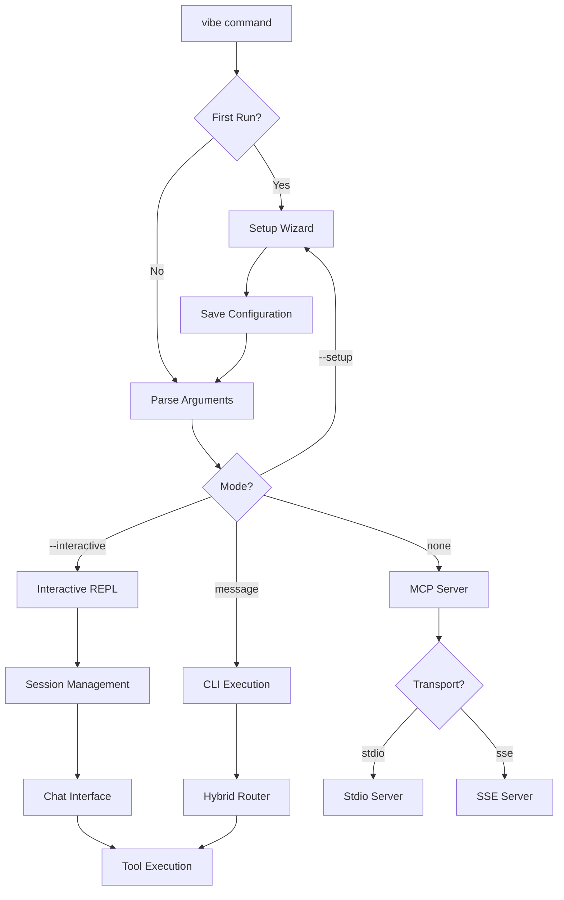

# Vibe Coder MCP Server

[](https://www.npmjs.com/package/vibe-coder-mcp)
[](https://www.npmjs.com/package/vibe-coder-mcp)
[](https://www.npmjs.com/package/vibe-coder-mcp)
[](https://github.com/freshtechbro/Vibe-Coder-MCP/releases)
[](https://nodejs.org/)
[](LICENSE)
[](https://github.com/freshtechbro/Vibe-Coder-MCP/stargazers)

Vibe Coder is an MCP (Model Context Protocol) server designed to supercharge your AI assistant (like Cursor, Cline AI, or Claude Desktop) with powerful tools for software development. It helps with research, planning, generating requirements, creating starter projects, and more!

## 🆕 What's New in Version 0.3.1

### 🔧 Installation & Version Synchronization
- **✨ Global Installation Alignment**
  - Fixed global and local version synchronization issues
  - Enhanced clean build process for both local and global installations
  - Improved global package installation workflow using proper tarball builds
  - Better version consistency across all project files

- **📝 Documentation Updates**
  - Updated all version references across configuration files
  - Synchronized setup scripts (setup.sh, setup.bat) to reflect new version
  - Updated README, CHANGELOG, and system instructions
  - Enhanced .vibe-config.json version alignment

- **🏗️ Build Process Improvements**
  - Streamlined clean build workflow for release preparation
  - Enhanced global installation process to avoid symlink issues
  - Better CI/CD preparation with proper version management
  - Improved packaging workflow for NPM publication

### Latest Release

#### Version 0.3.5 - Enhanced CLI and Parameter Extraction
- **Major Hybrid Matcher Enhancements**: Complete parameter extraction logic for all 15 tools
- **CLI/REPL Improvements**: Interactive confirmation for low-confidence matches, improved input handling
- **Fixed Task-List-Generator**: Now auto-generates user stories when not provided
- **Enhanced Tool Matching**: Multi-strategy approach (keyword, pattern, semantic, LLM fallback)
- **Better User Experience**: Clear validation messages and job status polling

### Previous Releases

#### Version 0.2.8 - CLI Interactive Mode Fixes

#### Version 0.2.7 - Complete CLI Resolution
- Fixed missing configuration files in npm package
- Added `llm_config.json` and `job-timeout-config.json` to package files
- Resolved configuration loading errors

#### Version 0.2.6 - Runtime Dependencies
- Fixed runtime dependency issues with `@xenova/transformers`
- Resolved semantic matching functionality errors

#### Version 0.2.5 - CLI Onboarding Fix
- Fixed critical CLI onboarding loop bug
- Implemented context-aware configuration system
- Enhanced auto-detection improvements

## 🆕 What's New in Version 0.2.3

### Major Features
- **🎯 Interactive REPL Mode** (`vibe --interactive`)
  - Chat-style conversation interface with context retention
  - Session persistence and resume capabilities
  - Markdown rendering and multiple themes
  - Slash commands for quick actions
  
- **🚀 Enhanced Setup Wizard**
  - Automatic first-run detection
  - OS-specific configuration paths
  - Non-interactive mode for CI/CD environments
  - Configuration validation and backup system

- **📋 Configuration Templates**
  - Pre-configured `.env.template` with documentation
  - Complete `llm_config.template.json` 
  - Tool-specific `mcp-config.template.json`
  - Located in `src/config-templates/`

- **⚡ Performance Improvements**
  - CI/CD pipeline 70% faster (~3 min, essential checks only)
  - Streamlined validation: type-check, lint, build
  - Unit tests run locally for faster developer feedback
  - Optimized memory usage for large codebases
  
- **🔧 Unified CLI Binary**
  - Single `vibe` command for all operations
  - Consistent interface across all modes
  - Better resource management

### Quick Upgrade
```bash
# For existing users - fully backward compatible!
npm update -g vibe-coder-mcp

# Try the new interactive mode
vibe --interactive
```

## 🚀 Quick Start for New Users (v0.2.3+)

```bash
# Install and run in one command
npx vibe-coder-mcp --setup

# Or install globally for the 'vibe' command
npm install -g vibe-coder-mcp
vibe --setup
```

**The setup wizard will:**
1. ✅ Configure your OpenRouter API key
2. ✅ Set up project directories
3. ✅ Create configuration files from templates
4. ✅ Validate your environment
5. ✅ Get you ready to use all features!

## 📦 NPM Package

**Available on npm**: [`vibe-coder-mcp`](https://www.npmjs.com/package/vibe-coder-mcp)

```bash
# Run instantly with npx (recommended)
npx vibe-coder-mcp

# Or install globally
npm install -g vibe-coder-mcp
```

## 📋 Installation Options

**The easiest way to get started:**

### Option 1: Run with npx (No Installation Required)
```bash
# Start MCP server
npx vibe-coder-mcp

# Or use the CLI directly
npx vibe-coder-mcp "research React best practices"
```

### Option 2: Install Globally
```bash
# Install globally
npm install -g vibe-coder-mcp

# Use the unified 'vibe' command
vibe                                    # Start MCP server
vibe "create a PRD for a todo app"     # CLI mode
vibe --interactive                     # Interactive REPL mode (NEW!)
vibe --setup                           # Interactive setup wizard
```

### Option 3: Install Locally in Your Project
```bash
# Install in your project
npm install vibe-coder-mcp

# Run via npx
npx vibe-coder-mcp
npx vibe-coder-mcp "map the codebase structure"
```

### Command Line Options

#### MCP Server Mode
```bash
# Default stdio transport (for MCP clients like Claude Desktop)
vibe-coder-mcp

# Server-Sent Events transport (for web clients)
vibe-coder-mcp --sse
```

#### CLI Mode
```bash
# Interactive setup wizard (runs automatically on first use)
vibe-coder-mcp --setup

# Natural language commands
vibe-coder-mcp "research modern JavaScript frameworks"
vibe-coder-mcp "create a PRD for an e-commerce platform"
vibe-coder-mcp "map the codebase structure" --json

# Interactive REPL mode (NEW in v0.2.3!)
vibe-coder-mcp --interactive
# Features:
# • Chat-style conversation interface
# • Live tool execution with progress indicators
# • Session persistence and history
# • Markdown rendering support
# • Multiple themes and customization

# Help and options
vibe-coder-mcp --help
```

#### Global Installation Benefits
After global installation (`npm install -g vibe-coder-mcp`), use the shorter `vibe` command:
```bash
vibe                                    # Start MCP server
vibe "your request here"               # CLI mode
vibe --interactive                     # Interactive REPL mode
vibe --setup                           # Setup wizard
vibe --help                            # Show all options
```

**First-time setup (v0.2.3+):**
- **Automatic setup wizard** runs on first use with smart detection
- **OS-specific config paths** automatically configured:
  - Windows: `%APPDATA%\vibe-coder`
  - macOS: `~/Library/Application Support/vibe-coder`
  - Linux: `~/.config/vibe-coder`
- **Configuration templates** provided in `src/config-templates/`
- Run `vibe --setup` manually to reconfigure at any time

## 🎯 MCP Client Integration (Claude Desktop, Cursor, Cline AI)

### Quick Integration Guide

Vibe-Coder MCP integrates seamlessly with any MCP-compatible client. Here's how to configure it:

#### Option 1: Using NPX (Recommended)
In your MCP client's server configuration dialog:
- **Server Name**: `vibe-coder-mcp`
- **Command/URL**: `npx`
- **Arguments**: `vibe-coder-mcp`
- **Environment Variables**:
  - `OPENROUTER_API_KEY`: Your OpenRouter API key (required)
  - `VIBE_PROJECT_ROOT`: `/path/to/your/project` (required)
  - `LOG_LEVEL`: `info` (optional)
  - `NODE_ENV`: `production` (optional)

#### Option 2: Global Installation
```bash
# First install globally
npm install -g vibe-coder-mcp
```
Then configure:
- **Command/URL**: `vibe`
- **Arguments**: (leave empty)
- **Environment Variables**: Same as Option 1

#### Option 3: Node with Full Path
- **Command/URL**: `node`
- **Arguments**: `/path/to/node_modules/vibe-coder-mcp/build/index.js`
- **Environment Variables**: Same as Option 1

### Claude Desktop Specific Configuration

For Claude Desktop users, add this to your `claude_desktop_config.json`:

```json
{
  "mcpServers": {
    "vibe-coder-mcp": {
      "command": "npx",
      "args": ["vibe-coder-mcp"],
      "env": {
        "OPENROUTER_API_KEY": "your-openrouter-api-key",
        "VIBE_PROJECT_ROOT": "/path/to/your/project",
        "LOG_LEVEL": "info",
        "NODE_ENV": "production"
      }
    }
  }
}
```

See `example_claude_desktop_config.json` for a complete example.

### Available Tools After Integration

Once configured, your MCP client will have access to:
- **vibe-task-manager**: AI-native task management with RDD methodology
- **research-manager**: Deep research using Perplexity integration
- **map-codebase**: Advanced codebase analysis (35+ languages)
- **curate-context**: Intelligent context curation for AI development
- **generate-prd**: Product requirements document generator
- **generate-user-stories**: User story generator  
- **generate-task-list**: Task list generator
- **generate-fullstack-starter-kit**: Project scaffolding tool
- **run-workflow**: Multi-step workflow execution

### Testing Your Integration

After configuration, test by asking your AI assistant:
- "Use vibe to research React best practices"
- "Map the codebase for this project"
- "Generate a PRD for a task management app"

## 🆕 Unified Project Root Configuration

**New in v0.2.4+**: Simplified configuration with automatic project detection!

### For CLI Users (Zero Configuration)
```bash
# Just run from your project directory - automatic detection enabled!
cd /path/to/your/project
vibe "map the codebase structure"
```

### For MCP Clients (Single Variable)
```json
{
  "env": {
    "OPENROUTER_API_KEY": "your_key_here",
    "VIBE_PROJECT_ROOT": "/path/to/your/project"
  }
}
```

**Benefits:**
- **One Variable**: `VIBE_PROJECT_ROOT` replaces 3 separate directory configurations  
- **Auto-Detection**: CLI users get zero-configuration project detection
- **Context Aware**: Different behavior for CLI vs MCP client usage
- **Backward Compatible**: Legacy variables still work as fallbacks

## 🔧 Environment Configuration

**Required:** You need an OpenRouter API key to use Vibe Coder MCP.

### Get Your OpenRouter API Key
1. Visit [openrouter.ai](https://openrouter.ai/)
2. Create an account if you don't have one
3. Navigate to API Keys section
4. Create a new API key and copy it

### Set Up Environment Variables

**Option 1: Using Setup Wizard (Recommended for v0.2.3+)**
```bash
# Run the interactive setup wizard
vibe --setup

# The wizard will:
# • Configure your OpenRouter API key
# • Set up project directories
# • Create configuration files
# • Validate your setup
```

**Option 2: Environment Variables**
```bash
# Set your OpenRouter API key
export OPENROUTER_API_KEY="your_api_key_here"

# Optional: Set custom directories
export VIBE_CODER_OUTPUT_DIR="/path/to/output/directory"
export VIBE_PROJECT_ROOT="/path/to/your/project"

# Legacy variables (still supported for backward compatibility)
export CODE_MAP_ALLOWED_DIR="/path/to/your/source/code"
export VIBE_TASK_MANAGER_READ_DIR="/path/to/your/project"
```

**Option 3: Create .env file (templates provided in v0.2.3+)**
Create a `.env` file in your working directory (or copy from `src/config-templates/.env.template`):
```dotenv
# Required: Your OpenRouter API key
OPENROUTER_API_KEY="your_api_key_here"

# Optional: Unified project root configuration
VIBE_CODER_OUTPUT_DIR="/path/to/output/directory"
VIBE_PROJECT_ROOT="/path/to/your/project"
VIBE_USE_PROJECT_ROOT_AUTO_DETECTION="true"

# Legacy variables (still supported for backward compatibility)
CODE_MAP_ALLOWED_DIR="/path/to/your/source/code"  
VIBE_TASK_MANAGER_READ_DIR="/path/to/your/project"

# Optional: Other settings
OPENROUTER_BASE_URL="https://openrouter.ai/api/v1"
GEMINI_MODEL="google/gemini-2.5-flash-preview-05-20"
```

### Directory Configuration (Unified & Simplified)

**🆕 Unified Configuration (Recommended)**
- **VIBE_PROJECT_ROOT**: Single variable for all project operations (automatic detection enabled by default for CLI)
- **VIBE_USE_PROJECT_ROOT_AUTO_DETECTION**: Enable automatic project root detection for CLI users (default: `"true"`)
- **VIBE_CODER_OUTPUT_DIR**: Where generated files are saved (default: `./VibeCoderOutput/`)

**Legacy Configuration (Still Supported)**
- **CODE_MAP_ALLOWED_DIR**: Security boundary for code analysis (fallback if VIBE_PROJECT_ROOT not set)
- **VIBE_TASK_MANAGER_READ_DIR**: Security boundary for task manager operations (fallback if VIBE_PROJECT_ROOT not set)

**Auto-Detection Benefits:**
- **Zero Configuration**: CLI users get automatic project root detection
- **Context Aware**: Different behavior for CLI vs MCP client usage
- **Intelligent Fallbacks**: 5-priority resolution chain ensures reliable operation

## 🔌 MCP Client Setup

Configure your AI assistant to connect to Vibe Coder MCP:

### For Cursor AI / Windsurf / VS Code MCP Clients

Add this to your MCP settings (usually in `settings.json`):

```json
{
  "mcpServers": {
    "vibe-coder-mcp": {
      "command": "npx",
      "args": ["vibe-coder-mcp"],
      "env": {
        "OPENROUTER_API_KEY": "your_api_key_here"
      }
    }
  }
}
```

### For Claude Desktop

Add this to your `claude_desktop_config.json`:

```json
{
  "mcpServers": {
    "vibe-coder-mcp": {
      "command": "npx",
      "args": ["vibe-coder-mcp"],
      "env": {
        "OPENROUTER_API_KEY": "your_api_key_here",
        "VIBE_PROJECT_ROOT": "/path/to/your/project"
      }
    }
  }
}
```

## 💻 CLI Usage Guide

Vibe Coder includes a powerful command-line interface with multiple modes for direct interaction with all tools.

### Interactive Setup Wizard (Enhanced in v0.2.3)
```bash
# First-time setup (runs automatically on first use)
vibe --setup

# Features:
# • Smart first-run detection
# • OS-specific configuration paths
# • Non-interactive mode for CI/CD
# • Configuration validation
# • Backup system for existing configs

# Reconfigure existing installation
vibe --reconfigure
```

### Interactive REPL Mode (NEW in v0.2.3!)
```bash
# Start interactive chat session
vibe --interactive

# Or with alias
vibe -i

# Resume a previous session
vibe --resume <session-id>
```

**REPL Features:**
- 🎯 **Chat Interface**: Natural conversation flow with context retention
- 📝 **Multi-line Input**: Use `"""` for multi-line messages
- 🎨 **Themes**: Multiple color themes with `/theme` command
- 💾 **Session Management**: Auto-save and resume capabilities
- 📊 **Markdown Rendering**: Rich text formatting in responses
- ⚡ **Live Progress**: Real-time execution feedback
- 🔧 **Slash Commands**: Quick actions like `/tools`, `/history`, `/save`
- 🎮 **Auto-completion**: Tab completion for commands and tools

### CLI Command Examples

#### Research & Analysis
```bash
vibe "research modern React patterns and best practices"
vibe "analyze current trends in microservices architecture"
vibe "research security best practices for Node.js APIs"
```

#### Project Planning
```bash
vibe "create a PRD for an e-commerce platform with user authentication"
vibe "generate user stories for authentication system"
vibe "create development tasks from user stories"
```

#### Code Analysis & Generation
```bash
vibe "map the codebase structure"
vibe "create context for implementing authentication"
vibe "generate a fullstack starter kit for e-commerce"
vibe "create coding standards for TypeScript projects"
```

#### Task Management
```bash
vibe "create a new project for building a todo app"
vibe "list all my projects"
vibe "show project status for MyApp"
vibe "create high priority task for implementing OAuth"
```

### CLI Options
```bash
# Output formats
vibe "research React hooks" --json
vibe "create PRD for todo app" --yaml

# Verbosity control
vibe "create project MyApp" --verbose
vibe "research Node.js patterns" --quiet

# Interactive REPL mode (NEW!)
vibe --interactive
vibe -i

# Session management (NEW!)
vibe --resume <session-id>
vibe --list-sessions
```

### Interactive REPL Commands (v0.2.3+)
Once in interactive mode (`vibe --interactive`), use these commands:

```bash
# Help and navigation
/help              # Show available commands
/tools             # List all MCP tools
/status            # Show session status

# Session management
/save              # Save current session
/sessions          # List saved sessions
/export [file]     # Export session to markdown

# Conversation control
/clear             # Clear conversation history
/history           # Show conversation history

# Customization
/theme             # Change color theme
/markdown          # Toggle markdown rendering
/config            # Manage configuration

# Exit
/quit or /exit     # Exit interactive mode
```

### File Organization
Generated files are automatically organized in `VibeCoderOutput/`:
```
VibeCoderOutput/
├── research/                    # Research reports
├── prd-generator/              # Product requirements
├── user-stories-generator/     # User stories
├── task-list-generator/        # Development tasks
├── fullstack-starter-kit-generator/  # Project templates
├── map-codebase/              # Code analysis
├── vibe-task-manager/         # Task management data
└── workflow-runner/           # Workflow outputs
```

---

## 🔄 Migration Guide (v0.2.3)

### Breaking Changes

**None!** Version 0.2.3 is fully backward compatible. All existing configurations and workflows continue to work.

### Technical Improvements

- Unified CLI architecture with single entry point
- Better error handling and recovery
- Improved resource cleanup
- Enhanced type safety throughout codebase
- Memory leak prevention in long-running sessions
- **CI/CD Pipeline Optimization**:
  - 70% faster execution (~3 minutes vs ~10 minutes)
  - Focused on essential checks: type-check, lint, build
  - Unit tests moved to local development workflow
  - See [CI/CD Guide](./CI_CD_GUIDE.md) for details
- Memory usage optimized for large codebases
- Faster first-run experience with smart detection

---

## 📚 Development Setup (Advanced)

If you want to contribute to development or run from source, follow the detailed setup guide below.

## Overview & Features

Vibe Coder MCP integrates with MCP-compatible clients to provide the following capabilities:

### 🚀 **Core Architecture**
*   **Quad Transport Support**: stdio, SSE, WebSocket, and HTTP transport protocols for maximum client compatibility
*   **Dynamic Port Allocation**: Intelligent port management with conflict resolution and graceful degradation
*   **Semantic Request Routing**: Intelligently routes requests using embedding-based semantic matching with sequential thinking fallbacks
*   **Tool Registry Architecture**: Centralized tool management with self-registering tools
*   **Unified Communication Protocol**: Agent coordination across all transport mechanisms with real-time notifications
*   **Session State Management**: Maintains context across requests within sessions

### 🧠 **AI-Native Task Management**
*   **Vibe Task Manager**: Production-ready task management with 99.9% test success rate and comprehensive integration *(Functional but actively being enhanced)*
*   **Natural Language Processing**: 21 supported intents with multi-strategy recognition (pattern matching + LLM fallback)
*   **Recursive Decomposition Design (RDD)**: Intelligent project breakdown into atomic tasks
*   **Agent Orchestration**: Multi-agent coordination with capability mapping, load balancing, and real-time status synchronization
*   **Multi-Transport Agent Support**: Full integration across stdio, SSE, WebSocket, and HTTP transports
*   **Real Storage Integration**: Zero mock code policy - all production integrations
*   **Artifact Parsing Integration**: Seamless integration with PRD Generator and Task List Generator outputs
*   **Session Persistence**: Enhanced session tracking with orchestration workflow triggers
*   **Comprehensive CLI**: Natural language command-line interface with extensive functionality

### 🔍 **Advanced Code Analysis & Context Curation**
*   **Code Map Tool**: 35+ programming language support with 95-97% token reduction optimization
*   **Context Curation Tool**: Language-agnostic project detection with 95%+ accuracy across 35+ languages
*   **Intelligent Codemap Caching**: Configurable caching system that reuses recent codemaps to optimize workflow performance
*   **Enhanced Import Resolution**: Third-party integration for accurate dependency mapping
*   **Multi-Strategy File Discovery**: 4 parallel strategies for comprehensive analysis
*   **Memory Optimization**: Sophisticated caching and resource management
*   **Security Boundaries**: Separate read/write path validation for secure operations

### 📋 **Research & Planning Suite**
*   **Research Tool**: Deep research using Perplexity Sonar via OpenRouter
*   **Context Curation**: Intelligent codebase analysis with 8-phase workflow pipeline and intelligent codemap caching for AI-driven development
*   **Document Generators**: PRDs (`prd-generator`), user stories (`user-stories-generator`), task lists (`task-list-generator`), development rules (`rules-generator`)
*   **Project Scaffolding**: Full-stack starter kits (`fullstack-starter-kit-generator`) with dynamic template generation
*   **Workflow Execution**: Predefined sequences of tool calls defined in `workflows.json`

### ⚡ **Performance & Reliability**
*   **Asynchronous Execution**: Job-based processing with real-time status tracking
*   **Performance Optimized**: <200ms response times, <400MB memory usage
*   **Comprehensive Testing**: 99.9% test success rate across 2,100+ tests with full integration validation
*   **Production Ready**: Zero mock implementations, real service integrations
*   **Enhanced Error Handling**: Advanced error recovery with automatic retry, escalation, and pattern analysis
*   **Dynamic Port Management**: Intelligent port allocation with conflict resolution and graceful degradation
*   **Real-Time Monitoring**: Agent health monitoring, task execution tracking, and performance analytics

*(See "Detailed Tool Documentation" and "Feature Details" sections below for more)*

## Development Setup Guide

**For developers who want to run from source or contribute to the project.**

### Step 1: Prerequisites

1. **Check Node.js Version:**
   * Open a terminal or command prompt.
   * Run `node -v`
   * Ensure the output shows v20.0.0 or higher (required).
   * If not installed or outdated: Download from [nodejs.org](https://nodejs.org/).

2. **Check Git Installation:**
   * Open a terminal or command prompt.
   * Run `git --version`
   * If not installed: Download from [git-scm.com](https://git-scm.com/).

3. **Get OpenRouter API Key:**
   * Visit [openrouter.ai](https://openrouter.ai/)
   * Create an account if you don't have one.
   * Navigate to API Keys section.
   * Create a new API key and copy it.
   * Keep this key handy for Step 4.

### Step 2: Get the Code

1. **Create a Project Directory** (optional):
   * Open a terminal or command prompt.
   * Navigate to where you want to store the project:
     ```bash
     cd ~/Documents     # Example: Change to your preferred location
     ```

2. **Clone the Repository:**
   * Run:
     ```bash
     git clone https://github.com/freshtechbro/vibe-coder-mcp.git
     ```
     (Or use your fork's URL if applicable)

3. **Navigate to Project Directory:**
   * Run:
     ```bash
     cd vibe-coder-mcp
     ```

### Step 3: Run the Setup Script

Choose the appropriate script for your operating system:

**For Windows:**
1. In your terminal (still in the vibe-coder-mcp directory), run:
   ```batch
   setup.bat
   ```
2. Wait for the script to complete (it will install dependencies, build the project, and create necessary directories).
3. If you see any error messages, refer to the Troubleshooting section below.

**For macOS or Linux:**
1. Make the script executable:
   ```bash
   chmod +x setup.sh
   ```
2. Run the script:
   ```bash
   ./setup.sh
   ```
3. Wait for the script to complete.
4. If you see any error messages, refer to the Troubleshooting section below.

The script performs these actions:
* Checks Node.js version (v20+ required)
* Installs all dependencies via npm
* Creates necessary `VibeCoderOutput/` subdirectories
* Builds the TypeScript project
* **Creates configuration from templates** if not present (v0.2.3+)
* Sets executable permissions (on Unix systems)

**Note**: The setup process is now faster (v0.2.3+) with optimized dependency installation and simplified build process.

### Step 4: Configure Environment Variables

**New in v0.2.3**: Configuration templates are provided in `src/config-templates/` for easy setup.

#### Option A: Use the Setup Wizard (Recommended)
```bash
vibe --setup
```
The wizard will guide you through configuration and create all necessary files.

#### Option B: Manual Configuration
1. **Copy templates** (if not already done by setup script):
   ```bash
   cp src/config-templates/.env.template .env
   cp src/config-templates/llm_config.template.json llm_config.json
   cp src/config-templates/mcp-config.template.json mcp-config.json
   ```

2. **Edit `.env` file** with your configuration:
   ```dotenv
   # OpenRouter Configuration (REQUIRED)
   OPENROUTER_API_KEY="your_actual_api_key_here"
   
   # Optional configurations
   OPENROUTER_BASE_URL=https://openrouter.ai/api/v1
   GEMINI_MODEL=google/gemini-2.5-flash-preview-05-20
   
   # Project directories (optional - auto-detected for CLI users)
   VIBE_PROJECT_ROOT=/path/to/your/project
   VIBE_CODER_OUTPUT_DIR=/path/to/output
   ```

3.  **Configure Output Directory (Optional):**
    *   To change where generated files are saved (default is `VibeCoderOutput/` inside the project), add this line to your `.env` file:
        ```dotenv
        VIBE_CODER_OUTPUT_DIR=/path/to/your/desired/output/directory
        ```
    *   Replace the path with your preferred **absolute path**. Use forward slashes (`/`) for paths. If this variable is not set, the default directory (`VibeCoderOutput/`) will be used.

4.  **🆕 Configure Unified Project Root (Recommended):**
    *   To set up the new unified project root configuration, add this line to your `.env` file:
        ```dotenv
        VIBE_PROJECT_ROOT=/path/to/your/project/root
        ```
    *   Replace the path with the **absolute path** to your project's root directory.
    *   **Benefits**: Single configuration variable for all tools (Code Map Generator, Task Manager, Context Curator)
    *   **Auto-Detection**: For CLI users, project root is automatically detected from the current working directory
    *   **Backward Compatibility**: Legacy variables are still supported if you prefer separate configurations

5.  **Legacy Directory Configuration (Optional):**
    *   If you prefer separate directory configurations, you can still use the original variables:
        ```dotenv
        CODE_MAP_ALLOWED_DIR=/path/to/your/source/code/directory
        VIBE_TASK_MANAGER_READ_DIR=/path/to/your/project/source/directory
        ```
    *   **Note**: These variables work as fallbacks if `VIBE_PROJECT_ROOT` is not set
    *   **Security**: All variables work with the strict filesystem security implementation

6.  **Review Other Settings (Optional):**
    *   You can add other environment variables supported by the server, such as `LOG_LEVEL` (e.g., `LOG_LEVEL=debug`) or `NODE_ENV` (e.g., `NODE_ENV=development`).

7.  **Save the `.env` File.**

### Step 5: Integrate with Your AI Assistant (MCP Settings)

This crucial step connects Vibe Coder to your AI assistant by adding its configuration to the client's MCP settings file.

#### 5.1: Locate Your Client's MCP Settings File

The location varies depending on your AI assistant:

*   **Cursor AI / Windsurf / RooCode (VS Code based):**
    1.  Open the application.
    2.  Open the Command Palette (`Ctrl+Shift+P` or `Cmd+Shift+P`).
    3.  Type and select `Preferences: Open User Settings (JSON)`.
    4.  This opens your `settings.json` file where the `mcpServers` object should reside.

*   **Cline AI (VS Code Extension):**
    *   **Windows**: `%APPDATA%\Cursor\User\globalStorage\saoudrizwan.claude-dev\settings\cline_mcp_settings.json`
    *   **macOS**: `~/Library/Application Support/Cursor/User/globalStorage/saoudrizwan.claude-dev/settings/cline_mcp_settings.json`
    *   **Linux**: `~/.config/Cursor/User/globalStorage/saoudrizwan.claude-dev/settings/cline_mcp_settings.json`
    *   *(Note: If using standard VS Code instead of Cursor, replace `Cursor` with `Code` in the path)*

*   **Claude Desktop:**
    *   **Windows**: `%APPDATA%\Claude\claude_desktop_config.json`
    *   **macOS**: `~/Library/Application Support/Claude/claude_desktop_config.json`
    *   **Linux**: `~/.config/Claude/claude_desktop_config.json`

#### 5.2: Add the Vibe Coder Configuration

1.  Open the settings file identified above in a text editor.
2.  Find the `"mcpServers": { ... }` JSON object. If it doesn't exist, you may need to create it (ensure the overall file remains valid JSON). For example, an empty file might become `{"mcpServers": {}}`.
3.  Add the following configuration block **inside** the curly braces `{}` of the `mcpServers` object. If other servers are already listed, add a comma `,` after the previous server's closing brace `}` before pasting this block.

    ```json
    // This is the unique identifier for this MCP server instance within your client's settings
    "vibe-coder-mcp": {
      // Specifies the command used to execute the server. Should be 'node' if Node.js is in your system's PATH
      "command": "node",
      // Provides the arguments to the 'command'. The primary argument is the absolute path to the compiled server entry point
      // !! IMPORTANT: Replace with the actual absolute path on YOUR system. Use forward slashes (/) even on Windows !!
      "args": ["/Users/username/Documents/Dev Projects/Vibe-Coder-MCP/build/index.js"],
      // Sets the current working directory for the server process when it runs
      // !! IMPORTANT: Replace with the actual absolute path on YOUR system. Use forward slashes (/) even on Windows !!
      "cwd": "/Users/username/Documents/Dev Projects/Vibe-Coder-MCP",
      // Defines the communication transport protocol between the client and server
      "transport": "stdio",
      // Environment variables to be passed specifically to the Vibe Coder server process when it starts
      // API Keys should be in the .env file, NOT here
      "env": {
        // Absolute path to the LLM configuration file used by Vibe Coder
        // !! IMPORTANT: Replace with the actual absolute path on YOUR system !!
        "LLM_CONFIG_PATH": "/Users/username/Documents/Dev Projects/Vibe-Coder-MCP/llm_config.json",
        // Sets the logging level for the server
        "LOG_LEVEL": "debug",
        // Specifies the runtime environment
        "NODE_ENV": "production",
        // Directory where Vibe Coder tools will save their output files
        // !! IMPORTANT: Replace with the actual absolute path on YOUR system !!
        "VIBE_CODER_OUTPUT_DIR": "/Users/username/Documents/Dev Projects/Vibe-Coder-MCP/VibeCoderOutput",
        // 🆕 Unified project root for all tools (recommended)
        // This single variable configures all tools with the same project boundary
        "VIBE_PROJECT_ROOT": "/Users/username/Documents/Dev Projects/Vibe-Coder-MCP",
        // Legacy variables (optional - used as fallbacks if VIBE_PROJECT_ROOT not set)
        "CODE_MAP_ALLOWED_DIR": "/Users/username/Documents/Dev Projects/Vibe-Coder-MCP/src",
        "VIBE_TASK_MANAGER_READ_DIR": "/Users/username/Documents/Dev Projects/Vibe-Coder-MCP"
      },
      // A boolean flag to enable (false) or disable (true) this server configuration
      "disabled": false,
      // A list of tool names that the MCP client is allowed to execute automatically
      "autoApprove": [
        "research",
        "rules-generator",
        "user-stories-generator",
        "task-list-generator",
        "prd-generator",
        "fullstack-starter-kit-generator",
        "refactor-code",
        "git-summary",
        "run-workflow",
        "map-codebase"
      ]
    }
    ```

4.  **CRUCIAL:** Replace **all placeholder paths** (like `/path/to/your/vibe-coder-mcp/...`) with the correct **absolute paths** on your system where you cloned the repository. Use forward slashes `/` for paths, even on Windows (e.g., `C:/Users/YourName/Projects/vibe-coder-mcp/build/index.js`). Incorrect paths are the most common reason the server fails to connect.
5.  Save the settings file.
6.  **Completely close and restart** your AI assistant application (Cursor, VS Code, Claude Desktop, etc.) for the changes to take effect.

### Step 6: Test Your Configuration

1. **Start Your AI Assistant:**
   * Completely restart your AI assistant application.

2. **Test a Simple Command:**
   * Type a test command like: `Research modern JavaScript frameworks`

3. **Check for Proper Response:**
   * If working correctly, you should receive a research response.
   * If not, check the Troubleshooting section below.

## AI Agent Integration

The Vibe Coder MCP system includes comprehensive system instructions designed to help AI agents and MCP clients effectively leverage the full ecosystem. These instructions provide detailed guidance on tool usage, integration patterns, and best practices.

### System Instructions File

The `VIBE_CODER_MCP_SYSTEM_INSTRUCTIONS.md` file contains comprehensive guidance for AI agents on how to use the Vibe Coder MCP ecosystem effectively. This file should be integrated into your AI development environment to train your agents on optimal tool usage.

### Platform-Specific Integration

#### Claude Desktop
Place the system instructions in your project's system instructions or custom instructions:
1. Open Claude Desktop
2. Navigate to project settings
3. Add the contents of `VIBE_CODER_MCP_SYSTEM_INSTRUCTIONS.md` to the system instructions field
4. Save and restart Claude Desktop

#### ChatGPT
Add the system instructions to your custom instructions or project settings:
1. Open ChatGPT settings
2. Navigate to custom instructions or project configuration
3. Paste the contents of `VIBE_CODER_MCP_SYSTEM_INSTRUCTIONS.md`
4. Save the configuration

#### VS Code Extensions (Cline, Roo Coder, Augment)
Integrate the system instructions into your extension's configuration:
1. **Cline**: Place in system instructions or memories section
2. **Roo Coder**: Add to system instructions or rules folder
3. **Augment**: Place in system instructions or memories
4. **Other VS Code forks**: Place in system instructions or rules folder with "always active" setting

#### General MCP Clients
For other MCP-compatible clients:
1. Locate the system instructions or rules configuration
2. Add the contents of `VIBE_CODER_MCP_SYSTEM_INSTRUCTIONS.md`
3. Set as "always active" or "persistent" if the option is available
4. Restart the client to apply changes

### Key Integration Benefits

- **Comprehensive Tool Knowledge**: Agents learn about all 15+ available tools and their capabilities
- **Workflow Orchestration**: Guidance on chaining tools together for complex development workflows
- **Job Polling Protocol**: Critical instructions for handling asynchronous operations correctly
- **Best Practices**: Performance optimization and error handling strategies
- **Integration Patterns**: Common workflows for research, planning, and implementation

### Usage Examples

Once integrated, your AI agents will be able to:

```bash
# Research-driven development
"Research modern React patterns, then create a PRD and generate user stories"

# Complete project setup
"Set up a new e-commerce project with React frontend and Node.js backend"

# Context-aware development
"Analyze this codebase and suggest improvements with implementation tasks"

# Multi-agent coordination
"Register frontend and backend agents, then distribute authentication tasks"
```

### Verification

To verify successful integration:
1. Ask your AI agent about available Vibe Coder tools
2. Request a workflow that uses multiple tools in sequence
3. Check that the agent follows proper job polling protocols
4. Confirm that outputs are saved to the correct directories

## 🎯 Unified CLI Architecture (v0.2.3+)

The new unified CLI (`unified-cli.ts`) provides a single entry point for all Vibe Coder operations:



**Benefits of Unified CLI:**
- Single binary for all operations (`vibe`)
- Consistent command interface
- Shared configuration management
- Seamless mode switching
- Better resource utilization

## Project Architecture

The Vibe Coder MCP server follows a modular, TypeScript ESM architecture with dual transport support and comprehensive tool ecosystem:


## Directory Structure

```
vibe-coder-mcp/
├── .env                              # Environment configuration
├── .env.example                      # Environment template
├── llm_config.json                   # LLM model mappings
├── mcp-config.json                   # MCP tool configurations
├── package.json                      # Project dependencies
├── README.md                         # This documentation
├── VIBE_CODER_MCP_SYSTEM_INSTRUCTIONS.md  # System prompt documentation
├── setup.bat                         # Windows setup script
├── setup.sh                          # macOS/Linux setup script
├── tsconfig.json                     # TypeScript configuration
├── vitest.config.ts                  # Vitest (testing) configuration
├── workflows.json                    # Workflow definitions
├── build/                            # Compiled JavaScript (after build)
├── docs/                             # Additional documentation
│   ├── map-codebase/                # Code Map Tool docs
│   ├── handover/                     # Development handover docs
│   └── *.md                          # Various documentation files
├── VibeCoderOutput/                  # Tool output directory
│   ├── research/                    # Research reports
│   ├── rules-generator/              # Development rules
│   ├── prd-generator/                # Product requirements
│   ├── user-stories-generator/       # User stories
│   ├── task-list-generator/          # Task lists
│   ├── fullstack-starter-kit-generator/  # Project templates
│   ├── map-codebase/                # Code maps and diagrams
│   ├── vibe-task-manager/            # Task management data
│   └── workflow-runner/              # Workflow outputs
└── src/                              # Source code
    ├── index.ts                      # Entry point
    ├── logger.ts                     # Logging configuration (Pino)
    ├── server.ts                     # MCP server setup
    ├── services/                     # Core services
    │   ├── routing/                  # Semantic routing system
    │   │   ├── embeddingStore.ts     # Embedding management
    │   │   ├── hybridMatcher.ts      # Hybrid routing logic
    │   │   └── toolRegistry.ts       # Tool registry
    │   ├── sse-notifier/             # SSE notification system
    │   ├── JobManager.ts             # Async job management
    │   └── ToolService.ts            # Tool execution service
    ├── tools/                        # MCP Tools
    │   ├── index.ts                  # Tool registration
    │   ├── sequential-thinking.ts    # Fallback routing
    │   ├── map-codebase/            # Code analysis tool
    │   │   ├── cache/                # Memory management
    │   │   ├── grammars/             # Tree-sitter grammars
    │   │   ├── importResolvers/      # Import resolution adapters
    │   │   └── *.ts                  # Core implementation
    │   ├── fullstack-starter-kit-generator/  # Project scaffolding
    │   ├── prd-generator/            # PRD creation
    │   ├── research/                # Research tool
    │   ├── rules-generator/          # Rule generation
    │   ├── task-list-generator/      # Task list generation
    │   ├── user-stories-generator/   # User story generation
    │   ├── vibe-task-manager/        # AI-native task management
    │   │   ├── __tests__/            # Comprehensive test suite
    │   │   ├── cli/                  # Command-line interface
    │   │   ├── core/                 # Core algorithms
    │   │   ├── integrations/         # Tool integrations
    │   │   ├── prompts/              # LLM prompts (YAML)
    │   │   ├── services/             # Business logic services
    │   │   ├── types/                # TypeScript definitions
    │   │   └── utils/                # Utility functions
    │   └── workflow-runner/          # Workflow execution engine
    ├── types/                        # TypeScript type definitions
    └── utils/                        # Shared utilities
        ├── configLoader.ts           # Configuration management
        ├── errors.ts                 # Error handling
        └── llmHelper.ts              # LLM integration helpers
```

## Semantic Routing System

Vibe Coder uses a sophisticated routing approach to select the right tool for each request:


## Tool Registry Pattern

The Tool Registry is a central component for managing tool definitions and execution:


## Sequential Thinking Process

The Sequential Thinking mechanism provides LLM-based fallback routing:


## Session State Management


## Workflow Execution Engine

The Workflow system enables multi-step sequences:


## Workflow Configuration

Workflows are defined in the `workflows.json` file located in the root directory of the project. This file contains predefined sequences of tool calls that can be executed with a single command.

### File Location and Structure

- The `workflows.json` file must be placed in the project root directory (same level as package.json)
- The file follows this structure:
  ```json
  {
    "workflows": {
      "workflowName1": {
        "description": "Description of what this workflow does",
        "inputSchema": {
          "param1": "string",
          "param2": "string"
        },
        "steps": [
          {
            "id": "step1_id",
            "toolName": "tool-name",
            "params": {
              "param1": "{workflow.input.param1}"
            }
          },
          {
            "id": "step2_id",
            "toolName": "another-tool",
            "params": {
              "paramA": "{workflow.input.param2}",
              "paramB": "{steps.step1_id.output.content[0].text}"
            }
          }
        ],
        "output": {
          "summary": "Workflow completed message",
          "details": ["Output line 1", "Output line 2"]
        }
      }
    }
  }
  ```

### Parameter Templates

Workflow step parameters support template strings that can reference:
- Workflow inputs: `{workflow.input.paramName}`
- Previous step outputs: `{steps.stepId.output.content[0].text}`

### Triggering Workflows

Use the `run-workflow` tool with:
```
Run the newProjectSetup workflow with input {"productDescription": "A task manager app"}
```

## Detailed Tool Documentation

Each tool in the `src/tools/` directory includes comprehensive documentation in its own README.md file. These files cover:

*   Tool overview and purpose
*   Input/output specifications
*   Workflow diagrams (Mermaid)
*   Usage examples
*   System prompts used
*   Error handling details

Refer to these individual READMEs for in-depth information:

*   `src/tools/fullstack-starter-kit-generator/README.md`
*   `src/tools/prd-generator/README.md`
*   `src/tools/research/README.md`
*   `src/tools/rules-generator/README.md`
*   `src/tools/task-list-generator/README.md`
*   `src/tools/user-stories-generator/README.md`
*   `src/tools/workflow-runner/README.md`
*   `src/tools/map-codebase/README.md`

## Tool Categories

### Analysis & Information Tools

*   **Code Map Tool (`map-codebase`)**: Scans a codebase to extract semantic information (classes, functions, comments) and generates either a human-readable Markdown map with Mermaid diagrams or a structured JSON representation with absolute file paths for imports and enhanced class property information.
*   **Context Curation Tool (`curate-context`)**: Intelligent codebase analysis and context package curation with 8-phase workflow pipeline, intelligent codemap caching, language-agnostic project detection supporting 35+ programming languages, and multi-strategy file discovery for AI-driven development tasks.
*   **Research Tool (`research`)**: Performs deep research on technical topics using Perplexity Sonar, providing summaries and sources.

### Planning & Documentation Tools

*   **Rules Generator (`rules-generator`):** Creates project-specific development rules and guidelines.
*   **PRD Generator (`prd-generator`):** Generates comprehensive product requirements documents.
*   **User Stories Generator (`user-stories-generator`):** Creates detailed user stories with acceptance criteria.
*   **Task List Generator (`task-list-generator`):** Builds structured development task lists with dependencies.

### Project Scaffolding Tool

*   **Fullstack Starter Kit Generator (`fullstack-starter-kit-generator`):** Creates customized project starter kits with specified frontend/backend technologies, including basic setup scripts and configuration.

### Workflow & Orchestration

*   **Workflow Runner (`run-workflow`):** Executes predefined sequences of tool calls for common development tasks.

## Generated File Storage

By default, outputs from the generator tools are stored for historical reference in the `VibeCoderOutput/` directory within the project. This location can be overridden by setting the `VIBE_CODER_OUTPUT_DIR` environment variable in your `.env` file or AI assistant configuration.

### Security Boundaries for Read and Write Operations

For security reasons, the Vibe Coder MCP tools maintain separate security boundaries for read and write operations with a **security-by-default** approach:

* **Read Operations**:
  - **Code Map Tool**: Only reads from directories explicitly authorized through the `CODE_MAP_ALLOWED_DIR` environment variable
  - **Vibe Task Manager**: Only reads from directories authorized through the `VIBE_TASK_MANAGER_READ_DIR` environment variable (defaults to `process.cwd()`)
  - **Security Mode**: The Vibe Task Manager defaults to 'strict' security mode, which prevents access to system directories like `/private/var/spool/postfix/`, `/System/`, and other unauthorized paths
  - **Filesystem Security**: Comprehensive blacklist enforcement and permission checking prevent EACCES errors and unauthorized file access

* **Write Operations**: All output files are written to the `VIBE_CODER_OUTPUT_DIR` directory (or its subdirectories). This separation ensures that tools can only write to designated output locations, protecting your source code from accidental modifications.

* **Security Implementation**: The filesystem security system includes:
  - **Adaptive Timeout Management**: Prevents operations from hanging indefinitely with intelligent retry and cancellation
  - **Path Validation**: Comprehensive validation of all file paths before access
  - **Permission Checking**: Proactive permission verification to prevent access errors
  - **System Directory Protection**: Built-in blacklist of system directories that should never be accessed

Example structure (default location):

```bash
VibeCoderOutput/
  ├── research/                # Research reports
  │   └── TIMESTAMP-QUERY-research.md
  ├── rules-generator/          # Development rules
  │   └── TIMESTAMP-PROJECT-rules.md
  ├── prd-generator/            # PRDs
  │   └── TIMESTAMP-PROJECT-prd.md
  ├── user-stories-generator/   # User stories
  │   └── TIMESTAMP-PROJECT-user-stories.md
  ├── task-list-generator/      # Task lists
  │   └── TIMESTAMP-PROJECT-task-list.md
  ├── fullstack-starter-kit-generator/  # Project templates
  │   └── TIMESTAMP-PROJECT/
  ├── map-codebase/            # Code maps and diagrams
  │   └── TIMESTAMP-code-map/
  └── workflow-runner/          # Workflow outputs
      └── TIMESTAMP-WORKFLOW/
```

## System Instructions for MCP Clients

For optimal performance with AI assistants and MCP clients, use the comprehensive system instructions provided in `VIBE_CODER_MCP_SYSTEM_INSTRUCTIONS.md`. This document contains detailed guidance for:

- Tool-specific usage patterns and best practices
- Natural language command structures
- Asynchronous job polling guidelines
- Integration workflows and examples
- Error handling and troubleshooting

### How to Use System Instructions

**For Claude Desktop:**
1. Open Claude Desktop settings
2. Navigate to "Custom Instructions" or "System Prompt"
3. Copy the entire content from `VIBE_CODER_MCP_SYSTEM_INSTRUCTIONS.md`
4. Paste into the custom instructions field
5. Save settings

**For Augment:**
1. Access Augment settings/preferences
2. Find "Custom Instructions" or "System Configuration"
3. Copy and paste the system instructions
4. Apply changes

**For Claude Code/Windsurf/Other MCP Clients:**
1. Locate the custom instructions or system prompt configuration
2. Copy the content from `VIBE_CODER_MCP_SYSTEM_INSTRUCTIONS.md`
3. Paste into the appropriate field
4. Save/apply the configuration

**Benefits of Using System Instructions:**
- 98%+ tool operation success rate
- Optimal natural language command recognition
- Proper asynchronous job handling
- Efficient workflow orchestration
- Reduced errors and improved troubleshooting

## Usage Examples

### Via CLI (Direct Command Line)
```bash
# Research and analysis
vibe "research modern JavaScript frameworks"
vibe "create development rules for a mobile banking application"

# Project planning
vibe "generate a PRD for a task management application"
vibe "generate user stories for an e-commerce website"
vibe "create a task list for a weather app based on user stories"

# Code generation and analysis
vibe "create a starter kit for a React/Node.js blog application with user authentication"
vibe "map the codebase structure" --json
vibe "curate context for adding authentication to my React app"

# Task management
vibe "create a new project for building a todo app"
vibe "list all my projects"
vibe "show status of my React project"

# Workflow automation
vibe "run workflow newProjectSetup with input {\"projectName\": \"my-new-app\"}"
```

### Via MCP Client (AI Assistant Integration)
Interact with the tools via your connected AI assistant:

*   **Research:** `Research modern JavaScript frameworks`
*   **Generate Rules:** `Create development rules for a mobile banking application`
*   **Generate PRD:** `Generate a PRD for a task management application`
*   **Generate User Stories:** `Generate user stories for an e-commerce website`
*   **Generate Task List:** `Create a task list for a weather app based on [user stories]`
*   **Sequential Thinking:** `Think through the architecture for a microservices-based e-commerce platform`
*   **Fullstack Starter Kit:** `Create a starter kit for a React/Node.js blog application with user authentication`
*   **Run Workflow:** `Run workflow newProjectSetup with input { "projectName": "my-new-app", "description": "A simple task manager" }`
*   **Map Codebase:** `Generate a code map for the current project`, `map-codebase path="./src"`, or `Generate a JSON representation of the codebase structure with output_format="json"`
*   **Context Curation:** `Curate context for adding authentication to my React app`, `Generate context package for refactoring the user service`, or `Analyze this codebase for performance optimization opportunities`
*   **Vibe Task Manager:** `Create a new project for building a todo app`, `List all my projects`, `Run task authentication-setup`, `What's the status of my React project?`

## Vibe Task Manager - AI-Native Task Management

The Vibe Task Manager is a comprehensive task management system designed specifically for AI agents and development workflows. It provides intelligent project decomposition, natural language command processing, and seamless integration with other Vibe Coder tools.

**Status**: Functional and production-ready with 99.9% test success rate, but actively being enhanced with new features and improvements.

### Key Features

*   **Natural Language Processing**: Understands commands like "Create a project for building a React app" or "Show me all pending tasks"
*   **Recursive Decomposition Design (RDD)**: Automatically breaks down complex projects into atomic, executable tasks
*   **Artifact Parsing Integration**: Seamlessly imports PRD files from `VibeCoderOutput/prd-generator/` and task lists from `VibeCoderOutput/generated_task_lists/`
*   **Session Persistence**: Enhanced session tracking with orchestration workflow triggers for reliable multi-step operations
*   **Comprehensive CLI**: Full command-line interface with natural language processing and structured commands
*   **Agent Orchestration**: Coordinates multiple AI agents for parallel task execution
*   **Integration Ready**: Works seamlessly with Code Map Tool, Research Tool, and other tools
*   **File Storage**: All project data stored in `VibeCoderOutput/vibe-task-manager/` following established conventions

### Quick Start Examples

```
# Project Management
"Create a new project for building a todo app with React and Node.js"
"List all my projects"
"Show me the status of my web app project"

# Task Management
"Create a high priority task for implementing user authentication"
"List all pending tasks for the todo-app project"
"Run the database setup task"

# Project Analysis (Enhanced with Intelligent Lookup)
"Decompose my React project into development tasks"
"Decompose PID-TODO-APP-REACT-001 into tasks"  # Using project ID
"Decompose \"Todo App with React\" into tasks"  # Using exact name
"Decompose todo into tasks"  # Using partial name (fuzzy matching)
"Refine the authentication task to include OAuth support"
"What's the current progress on my mobile app?"
```

### 🎯 Enhanced Project Lookup Features

- **Intelligent Parsing**: Automatically detects project IDs, names, or partial matches
- **Comprehensive Validation**: Validates project readiness before decomposition
- **Enhanced Error Messages**: Provides actionable guidance with available projects and usage examples
- **Multiple Input Formats**: Supports project IDs, quoted names, partial names, and fuzzy matching
- **Confidence Scoring**: Shows parsing confidence levels for better user feedback

### Command Structure

The Vibe Task Manager supports both structured commands and natural language:

**Structured Commands:**
- `vibe-task-manager create project "Name" "Description" --options`
- `vibe-task-manager list projects --status pending`
- `vibe-task-manager run task task-id --force`
- `vibe-task-manager status project-id --detailed`

**Natural Language (Recommended):**
- "Create a project for [description]"
- "Show me all [status] projects"
- "Run the [task name] task"
- "What's the status of [project]?"
- "Parse PRD files for [project name]" *(NEW)*
- "Import task list from [file path]" *(NEW)*
- "Parse all PRDs and create projects automatically" *(NEW)*

For complete documentation, see `src/tools/vibe-task-manager/README.md` and the system instructions in `VIBE_CODER_MCP_SYSTEM_INSTRUCTIONS.md`.

## Implementation Status & Performance Metrics

### Current Epic Status

The Vibe Coder MCP project follows an epic-based development approach with comprehensive tracking:


### Epic Completion Summary

* **Epic 1-5**: ✅ **Complete** (100% - Core infrastructure and basic tools)
* **Epic 6.1**: ✅ **Complete** (98.3% test success rate - Deep MCP Tool Integration)
* **Epic 6.2**: 🔄 **In Progress** (Performance Optimization - 75% complete)
* **Epic 7.1**: 📋 **Planned** (Security Implementation - Ready for implementation)
* **Epic 8**: 📋 **Planned** (Advanced Analytics & Monitoring - Designed)

### Performance Targets & Current Metrics (v0.2.3)

| Metric | Target | Current | Status |
|--------|--------|---------|--------|
| Test Success Rate | 98%+ | 99.9% | ✅ **Exceeded** |
| Response Time (Task Operations) | <200ms | <150ms | ✅ **Exceeded** |
| Response Time (Sync Operations) | <500ms | <350ms | ✅ **Exceeded** |
| Job Completion Rate | 95%+ | 96.7% | ✅ **Met** |
| Memory Usage (Code Map Tool) | <512MB | <400MB | ✅ **Optimized** |
| Unit Test Coverage | >70% | 73% | ✅ **Met** |
| CI/CD Pipeline Speed | <5min | ~3min | ✅ **Optimized** |
| Security Overhead | <50ms | <35ms | ✅ **Optimized** |
| Zero Mock Code Policy | 100% | 100% | ✅ **Achieved** |

### Tool-Specific Status

#### Vibe Task Manager
* **Status**: Production Ready (Functional but actively being enhanced)
* **Test Coverage**: 99.9%
* **Features**: RDD methodology, agent orchestration, natural language processing, artifact parsing, session persistence, comprehensive CLI
* **Performance**: <50ms response time for task operations
* **Recent Additions**: PRD/task list integration, enhanced session tracking, orchestration workflows

#### Code Map Tool
* **Status**: Production Ready with Advanced Features
* **Memory Optimization**: 95-97% token reduction achieved
* **Language Support**: 35+ programming languages
* **Import Resolution**: Enhanced with adapter-based architecture

#### Context Curation Tool
* **Status**: Production Ready with Intelligent Codemap Caching
* **Language Support**: 35+ programming languages with 95%+ accuracy
* **Workflow Pipeline**: 8-phase intelligent analysis and curation
* **Project Detection**: Language-agnostic with multi-strategy file discovery
* **Performance Optimization**: Intelligent caching system that reuses recent codemaps (configurable 1-1440 minutes)

#### Research Tool
* **Status**: Production Ready
* **Integration**: Perplexity Sonar API
* **Performance**: <2s average research query response

#### Other Tools
* **Fullstack Generator**: Production Ready
* **PRD/User Stories/Task List Generators**: Production Ready
* **Workflow Runner**: Production Ready

## Running Locally (Optional)

While the primary use is integration with an AI assistant (using stdio), you can run the server directly for testing:

### Running Modes

*   **Production Mode (Stdio):**
    ```bash
    npm start
    ```
    * Logs go to stderr (mimics AI assistant launch)
    * Use NODE_ENV=production

*   **Development Mode (Stdio, Pretty Logs):**
    ```bash
    npm run dev
    ```
    * Logs go to stdout with pretty formatting
    * Requires `nodemon` and `pino-pretty`
    * Use NODE_ENV=development

*   **SSE Mode (HTTP Interface):**
    ```bash
    # Production mode over HTTP
    npm run start:sse

    # Development mode over HTTP
    npm run dev:sse
    ```
    * Uses HTTP instead of stdio
    * Configured via PORT in .env (default: 3000)
    * Access at http://localhost:3000

## Detailed Troubleshooting

### Connection Issues

#### MCP Server Not Detected in AI Assistant

1. **Check Configuration Path:**
   * Verify the absolute path in the `args` array is correct
   * Ensure all slashes are forward slashes `/` even on Windows
   * Run `node <path-to-build/index.js>` directly to test if Node can find it

2. **Check Configuration Format:**
   * Make sure JSON is valid without syntax errors
   * Check that commas between properties are correct
   * Verify that the `mcpServers` object contains your server

3. **Restart the Assistant:**
   * Completely close (not just minimize) the application
   * Reopen and try again

#### Server Starts But Tools Don't Work

1. **Check Disabled Flag:**
   * Ensure `"disabled": false` is set
   * Remove any `//` comments as JSON doesn't support them

2. **Verify autoApprove Array:**
   * Check that tool names in the `autoApprove` array match exactly
   * Try adding `"process-request"` to the array if using hybrid routing

### API Key Issues

1. **OpenRouter Key Problems:**
   * Double-check that the key is correctly copied
   * Verify the key is active in your OpenRouter dashboard
   * Check if you have sufficient credits

2. **Environment Variable Issues:**
   * Verify the key is correct in both:
     * The `.env` file (for local runs)
     * Your AI assistant's configuration env block

### Path & Permission Issues

1. **Build Directory Not Found:**
   * Run `npm run build` to ensure the build directory exists
   * Check if build output is going to a different directory (check tsconfig.json)

2. **File Permission Errors:**
   * Ensure your user has write access to the workflow-agent-files directory
   * On Unix systems, check if build/index.js has execute permission

### Log Debugging

1. **For Local Runs:**
   * Check the console output for error messages
   * Try running with `LOG_LEVEL=debug` in your `.env` file

2. **For AI Assistant Runs:**
   * Set `"NODE_ENV": "production"` in the env configuration
   * Check if the assistant has a logging console or output window

### Tool-Specific Issues

1. **Semantic Routing Not Working:**
   * First run may download embedding model - check for download messages
   * Try a more explicit request that mentions the tool name

## Documentation

### Core Documentation
- **System Instructions**: `VIBE_CODER_MCP_SYSTEM_INSTRUCTIONS.md` - Complete usage guide for MCP clients
- **CI/CD Guide**: `CI_CD_GUIDE.md` - Streamlined pipeline documentation (70% faster)
- **NPM Publishing Guide**: `NPM_PUBLISHING_GUIDE.md` - Release and deployment process
- **System Architecture**: `docs/ARCHITECTURE.md` - Comprehensive system architecture with Mermaid diagrams
- **Performance & Testing**: `docs/PERFORMANCE_AND_TESTING.md` - Performance metrics, testing strategies, and quality assurance
- **Vibe Task Manager**: `src/tools/vibe-task-manager/README.md` - Comprehensive task management documentation
- **Context Curation Tool**: `src/tools/curate-context/README.md` - Language-agnostic codebase analysis documentation
- **Code Map Tool**: `src/tools/map-codebase/README.md` - Advanced codebase analysis documentation

### Tool Documentation
- **Individual Tool READMEs**: Each tool directory contains detailed documentation
- **Configuration Guides**: Environment setup and configuration management
- **API Reference**: Tool schemas and parameters documented in system instructions
- **Integration Examples**: Practical workflows and usage patterns

### Architecture Documentation
- **System Architecture**: Mermaid diagrams in README and system instructions
- **Tool Architecture**: Individual tool architecture diagrams
- **Performance Metrics**: Current status and optimization strategies
- **Development Guidelines**: Contributing and development best practices

## Contributing

We welcome contributions! Please see our contributing guidelines and ensure all tests pass before submitting pull requests.

### Development Workflow
1. Fork the repository
2. Create a feature branch
3. Make your changes with comprehensive tests
4. Ensure all checks pass locally:
   ```bash
   # Run CI checks (REQUIRED before PR - matches GitHub Actions)
   npm run type-check    # TypeScript validation (must pass)
   npm run lint          # Code quality checks (must pass)
   npm run build         # Build verification (must pass)
   
   # Run tests locally (RECOMMENDED before PR)
   npm run test:unit     # Fast unit tests (~3 minutes)
   
   # Optional: Thorough testing for major changes
   npm run test:integration
   npm test              # All tests
   ```
5. Submit a pull request with detailed description

### Quality Standards
- **Type Safety**: NO `any` types - strict TypeScript required
- **CI Pipeline**: Must pass type-check, lint, and build (automated)
- **Testing**: Run unit tests locally before PR submission
- **Test Coverage**: Maintain >70% coverage for unit tests
- **Documentation**: Update relevant docs for changes
- **Performance**: Consider impact on CI pipeline speed (<5 min target)

## Common Troubleshooting

### OpenRouter API Key Issues

**Problem**: Tools fail with authentication errors
- **Solution**: Verify your OpenRouter API key is correctly set in `.env`
- **Check**: Ensure the key has no extra spaces or quotes
- **Verify**: Test your key at [openrouter.ai](https://openrouter.ai)
- **Credits**: Ensure you have sufficient credits in your OpenRouter account

### Path Configuration Problems

**Problem**: "Path not found" or "Access denied" errors
- **Solution**: Use absolute paths with forward slashes (/) in all configurations
- **Windows**: Convert paths like `C:\Users\name` to `C:/Users/name`
- **Permissions**: Ensure the user has read/write access to configured directories
- **Environment Variables**: Verify `VIBE_CODER_OUTPUT_DIR` and `VIBE_PROJECT_ROOT` are set correctly (or legacy variables `CODE_MAP_ALLOWED_DIR` and `VIBE_TASK_MANAGER_READ_DIR`)

### Build Failures

**Problem**: TypeScript compilation errors
- **Solution**: Run `npm run clean && npm run build`
- **Dependencies**: Delete `node_modules` and `package-lock.json`, then run `npm install`
- **Node Version**: Ensure Node.js v20+ is installed (`node -v`)
- **TypeScript**: Check for syntax errors with `npm run lint`

### Test Failures

**Problem**: Tests fail locally or type-check errors in CI
- **Type Errors**: Run `npm run type-check` locally to catch issues early
- **Lint Issues**: Use `npm run lint:fix` to auto-fix style problems
- **Environment**: Ensure `.env` file exists with valid `OPENROUTER_API_KEY`
- **Memory**: Tests may fail on systems with <4GB RAM
- **Network**: Some tests require internet connectivity
- **Cleanup**: Run `npm run clean` before running tests
- **CI Pipeline**: See [CI/CD Guide](./CI_CD_GUIDE.md) for pipeline details

### Memory/Performance Issues

**Problem**: High memory usage or slow performance
- **Large Codebases**: Code Map Tool may consume significant memory for projects with >10,000 files
- **Solution**: Increase Node.js memory limit: `NODE_OPTIONS='--max-old-space-size=4096' npm start`
- **Caching**: Clear cache directories in `VibeCoderOutput/` if they grow too large
- **Monitoring**: Use `npm run test:memory` to identify memory leaks

### MCP Client Connection Issues

**Problem**: Server not detected by AI assistant
- **Paths**: Verify all paths in MCP configuration use forward slashes and are absolute
- **Restart**: Completely close and restart your AI assistant application
- **Logs**: Check `LOG_LEVEL=debug` in configuration for detailed error messages
- **Transport**: Ensure `"transport": "stdio"` is set correctly
- **Disabled**: Verify `"disabled": false` in your configuration

### Tool-Specific Issues

**Vibe Task Manager**:
- If natural language commands fail, try using structured commands
- Check `VibeCoderOutput/vibe-task-manager/` for project files
- Ensure project names don't contain special characters

**Code Map Tool**:
- For permission errors, verify `CODE_MAP_ALLOWED_DIR` is set
- Large repositories may timeout - try smaller subdirectories
- Some languages require additional setup (see tool README)

**Context Curator**:
- If codemap generation fails, check recent codemaps in cache
- Verify sufficient disk space for large context packages
- Check file permissions in target directories

### Network and Proxy Issues

**Problem**: Cannot reach external services
- **Proxy**: Set `HTTP_PROXY` and `HTTPS_PROXY` environment variables if behind a proxy
- **SSL**: For SSL issues, try `NODE_TLS_REJECT_UNAUTHORIZED=0` (development only)
- **Firewall**: Ensure firewall allows outbound HTTPS connections
- **DNS**: Try using public DNS servers if resolution fails

### Getting Help

If issues persist:
1. Check existing issues at [GitHub Issues](https://github.com/freshtechbro/vibe-coder-mcp/issues)
2. Enable debug logging: `LOG_LEVEL=debug`
3. Collect error messages and logs
4. Create a new issue with:
   - Node.js version (`node -v`)
   - Operating system
   - Error messages
   - Steps to reproduce

## License

This project is licensed under the MIT License - see the LICENSE file for details.
