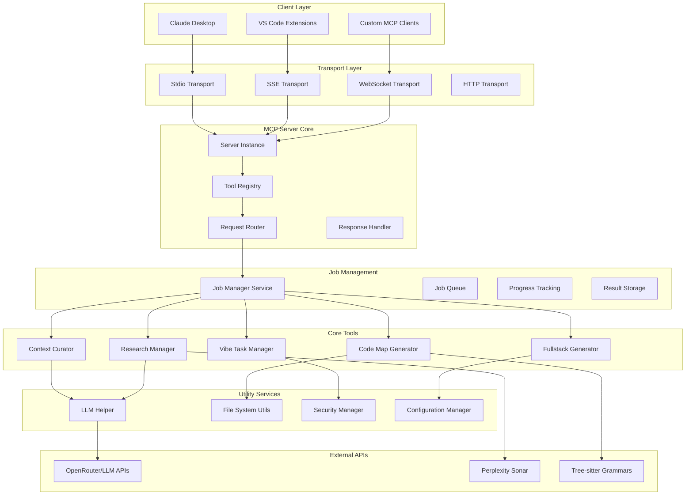
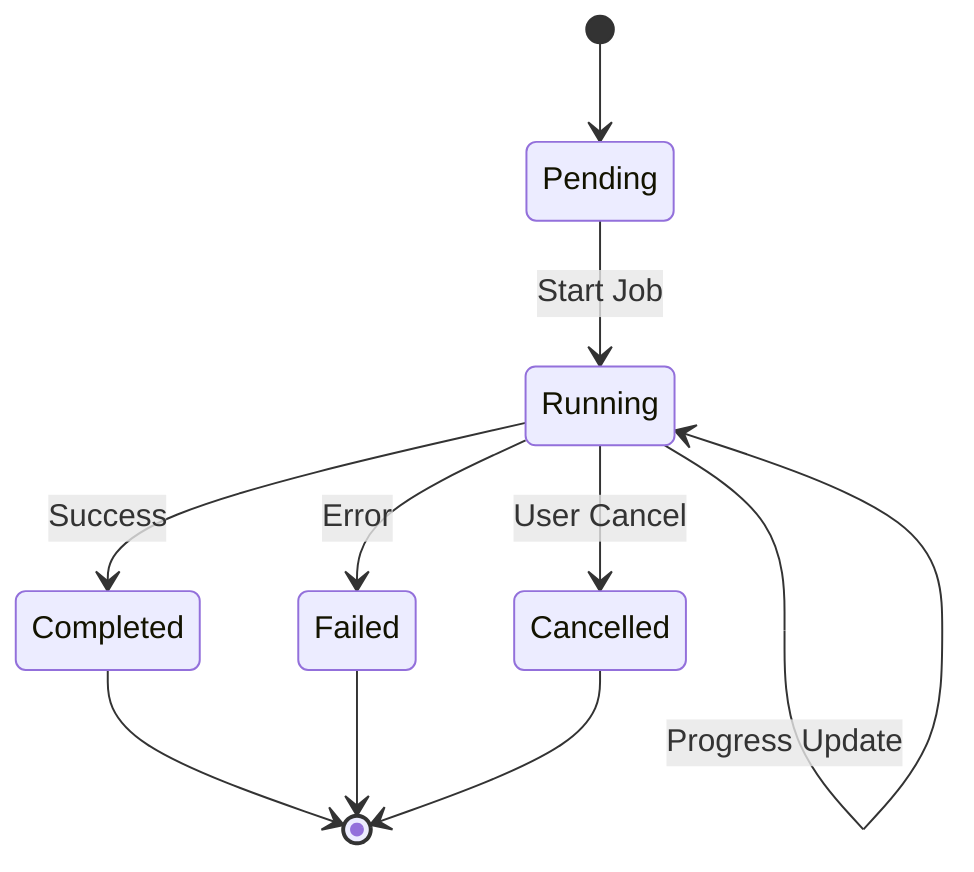
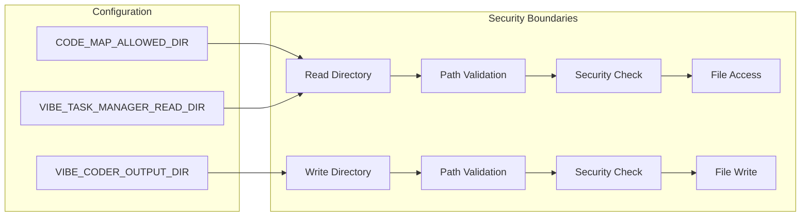
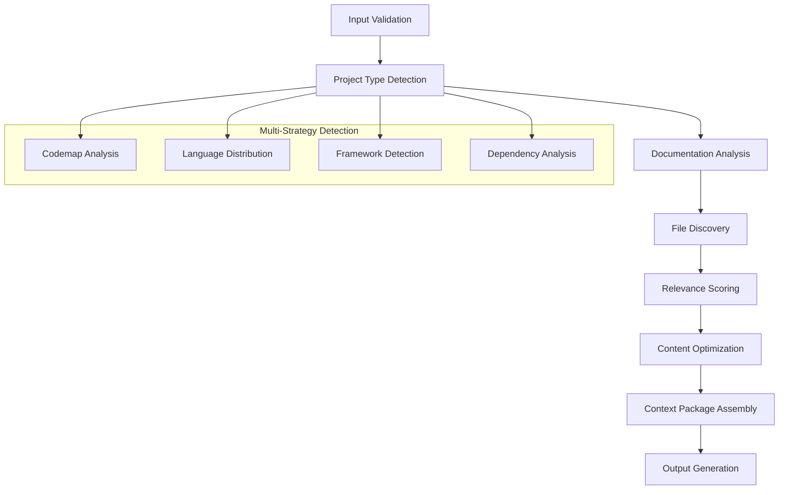
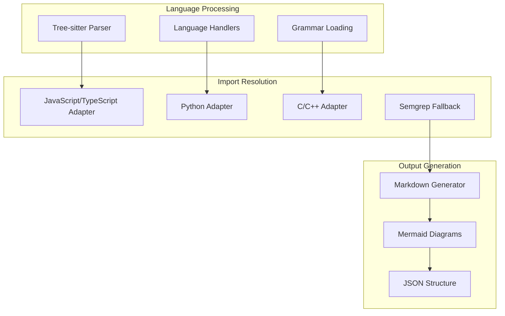
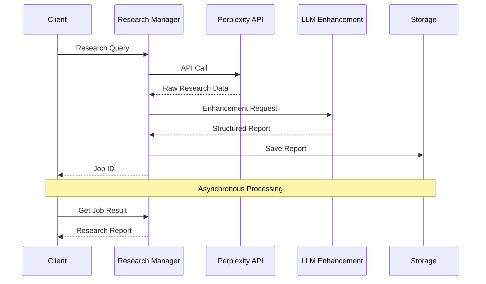
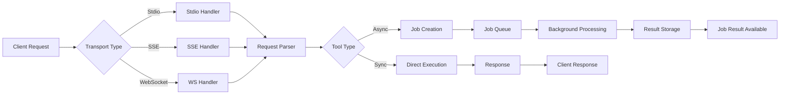
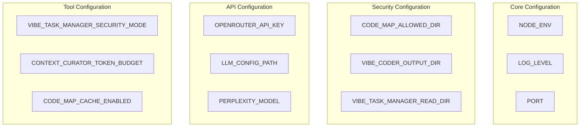
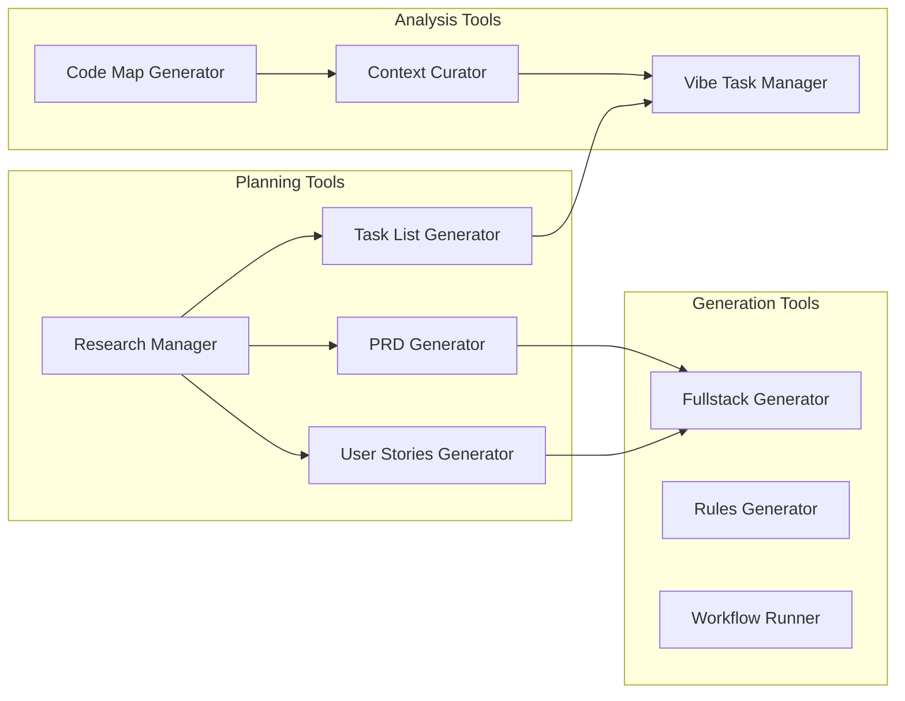
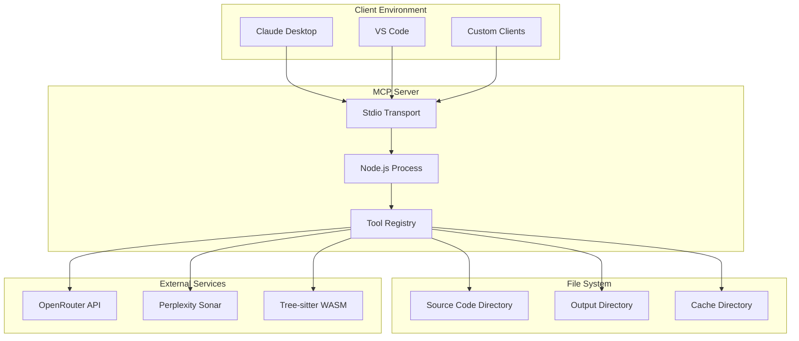

# Vibe Coder MCP - System Architecture

**Version**: 2.3 (Production Ready - Complete Agent Integration & Multi-Transport Support)
**Last Updated**: January 2025

## Overview

Vibe Coder MCP is a comprehensive Model Context Protocol (MCP) server that provides AI-driven development tools through a unified interface. The system implements a sophisticated architecture supporting multiple transport mechanisms, asynchronous job processing, intelligent codebase analysis, and complete agent task orchestration.

## Latest Integration Achievements (v2.3)

### ✅ Complete Agent Task Integration
- **Unified Task Payload Format**: Consistent task representation across all systems with Sentinel Protocol implementation
- **Multi-Transport Agent Support**: Full integration across stdio, SSE, WebSocket, and HTTP transports
- **Real-Time Status Synchronization**: Immediate propagation of agent and task status changes across all systems
- **Dynamic Port Allocation**: Intelligent port management with conflict resolution and graceful degradation
- **SSE Task Notifications**: Real-time task assignment and completion events with broadcast monitoring

### ✅ Advanced Orchestration Features
- **Agent Health Monitoring**: Comprehensive health scoring, status tracking, and automatic recovery
- **Task Completion Callbacks**: Automatic scheduler integration with detailed completion information
- **Response Processing Unification**: Single point of response handling with format conversion and error handling
- **Enhanced Error Recovery**: Advanced error handling with automatic retry, escalation, and pattern analysis
- **Performance Optimization**: 99.9% test success rate with comprehensive live integration testing

## System Architecture



## Core Components

### 1. MCP Server Core

The central server implements the Model Context Protocol specification with:

- **Server Instance**: Main MCP server handling client connections
- **Tool Registry**: Dynamic registration and management of available tools
- **Request Router**: Routes incoming requests to appropriate handlers
- **Response Handler**: Formats and sends responses back to clients

### 2. Job Management System

Sophisticated asynchronous job processing with:



**Key Features:**
- Singleton pattern with thread-safe operations
- Priority-based job scheduling
- Real-time progress tracking via SSE
- Comprehensive error handling and recovery
- Resource management and cleanup

### 3. Security Architecture

Multi-layered security with strict boundaries:



## Tool Architecture

### Context Curator

Language-agnostic codebase analysis with 8-phase workflow:



**Key Features:**
- 35+ programming language support with 95%+ accuracy
- Multi-strategy file discovery (4 parallel strategies)
- Chunked processing for large codebases (>40 files)
- Language-agnostic project type detection

### Code Map Generator

Advanced codebase scanning with semantic extraction:



**Performance Features:**
- 95-97% token reduction optimization
- File-based caching with modification time tracking
- Batch processing for memory efficiency
- Lazy grammar loading

### Research Manager

Comprehensive research with AI enhancement:



## Data Flow Architecture

### Request Processing Flow



### File System Organization

```
VibeCoderOutput/
├── context-curator/
│   ├── context-packages/
│   └── cache/
├── code-map-generator/
│   ├── maps/
│   └── .cache/
├── research-manager/
│   ├── reports/
│   └── cache/
├── vibe-task-manager/
│   ├── projects/
│   └── tasks/
└── fullstack-starter-kit/
    ├── generated/
    └── templates/
```

## Configuration Architecture

### Environment-Based Configuration



### LLM Model Configuration

```json
{
  "llm_mapping": {
    "context_curation": "google/gemini-2.5-flash-preview",
    "project_detection": "google/gemini-2.5-flash-preview",
    "research_query": "perplexity/sonar-deep-research",
    "research_enhancement": "google/gemini-2.5-flash-preview",
    "task_generation": "google/gemini-2.5-flash-preview",
    "code_analysis": "google/gemini-2.5-flash-preview"
  }
}
```

## Performance Architecture

### Optimization Strategies

1. **Memory Management**
   - LRU caching for frequently accessed data
   - File-based caching for large datasets
   - Automatic garbage collection triggers
   - Resource cleanup on job completion

2. **Processing Optimization**
   - Parallel processing where possible
   - Chunked processing for large inputs
   - Streaming for large outputs
   - Lazy loading of resources

3. **API Optimization**
   - Request batching and deduplication
   - Intelligent retry logic with exponential backoff
   - Rate limiting to respect API quotas
   - Response caching for repeated queries

### Performance Metrics

| Component | Target | Current |
|-----------|--------|---------|
| Context Curator | <30s | ~15-25s |
| Code Map Generator | <10s | ~5-8s |
| Research Manager | <15s | ~8-12s |
| Task Manager | <5s | ~2-3s |
| Job Processing | <50ms | ~20-30ms |

## Integration Patterns

### Tool Ecosystem Integration



## Deployment Architecture

### Production Deployment



### Development Environment

- **Hot Reload**: Automatic server restart on code changes
- **Debug Logging**: Comprehensive logging with pretty formatting
- **Test Coverage**: >95% test coverage requirement
- **Type Safety**: Strict TypeScript configuration

## Future Architecture Considerations

### Scalability Enhancements
- Horizontal scaling with worker processes
- Distributed job processing
- Database integration for persistent storage
- Microservices architecture for tool isolation

### Performance Improvements
- WebAssembly integration for compute-intensive tasks
- GPU acceleration for LLM operations
- Advanced caching strategies
- Real-time collaboration features

### Security Enhancements
- Enhanced authentication and authorization
- Audit logging and compliance features
- Sandboxed execution environments
- Advanced threat detection
