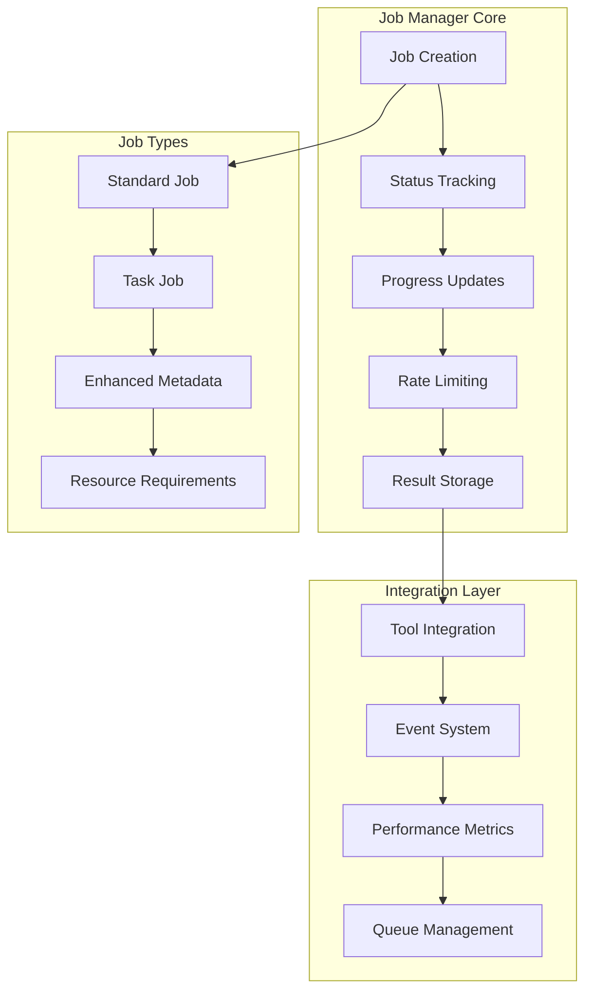

# Job Manager Service

## Overview

The Job Manager Service is a sophisticated asynchronous job processing system that provides centralized job state management, rate limiting, and comprehensive lifecycle tracking for all Vibe Coder MCP tools. It implements a singleton pattern with advanced features for production-ready job orchestration.

**Core Capabilities:**
- **Centralized Job Management**: Singleton pattern for unified job state across all tools
- **Rate Limiting**: Exponential backoff strategy to prevent excessive polling
- **Progress Monitoring**: Real-time updates with percentage completion and stage information
- **Resource Management**: Memory and performance optimization for concurrent execution
- **Enhanced Debugging**: Detailed job information with diagnostics and metadata
- **Event-Driven Architecture**: Job lifecycle events for system integration

## Architecture

The Job Manager follows a singleton pattern with comprehensive job lifecycle management:



## Job Status Lifecycle

Jobs progress through the following states:

1. **PENDING**: Job created and queued, not yet started
2. **RUNNING**: Job actively processing with progress updates
3. **COMPLETED**: Job finished successfully with results available
4. **FAILED**: Job encountered error with detailed error information

## Core Interfaces

### Job Interface

```typescript
interface Job {
  id: string;
  toolName: string;
  params: Record<string, unknown>;
  status: JobStatus;
  createdAt: number;
  updatedAt: number;
  progressMessage?: string;
  progressPercentage?: number;
  result?: CallToolResult;
  details?: JobDetails;
  lastAccessTime?: number;
  accessCount?: number;
}
```

### Job Status Message

```typescript
interface JobStatusMessage {
  jobId: string;
  toolName: string;
  status: JobStatus;
  message?: string;
  progress?: number; // 0-100
  timestamp: number;
  pollingRecommendation?: {
    interval: number; // milliseconds
    nextCheckTime: number;
  };
  details?: JobDetails;
}
```

### Enhanced Job Details

```typescript
interface JobDetails {
  currentStage?: string;
  diagnostics?: string[];
  subProgress?: number;
  metadata?: Record<string, any>;
}
```

## Key Features

### Rate Limiting

The Job Manager implements intelligent rate limiting with exponential backoff:

- **Initial Access**: No wait time for first access
- **Subsequent Access**: Exponential backoff based on access count
- **Maximum Wait**: Capped at 30 seconds for long-running jobs
- **Completed Jobs**: No rate limiting for finished jobs

### Progress Monitoring

Real-time progress tracking with multiple levels of detail:

- **Overall Progress**: 0-100% completion percentage
- **Stage Information**: Current processing stage
- **Sub-Progress**: Progress within current stage
- **Diagnostic Messages**: Detailed status information

### Resource Management

Optimized for concurrent job execution:

- **Memory Optimization**: Efficient job state storage
- **Performance Metrics**: Real-time resource usage tracking
- **Concurrent Limits**: Configurable maximum concurrent jobs
- **Cleanup**: Automatic cleanup of completed jobs

## Enhanced Task Job Management

### Task Job Interface

```typescript
interface TaskJob extends Job {
  taskId?: string;
  projectId?: string;
  operationType: 'decomposition' | 'execution' | 'validation' | 'analysis' | 'codemap' | 'context_enrichment';
  priority: 'low' | 'medium' | 'high' | 'critical';
  estimatedDuration?: number;
  resourceRequirements?: {
    memoryMB: number;
    cpuWeight: number;
    diskSpaceMB?: number;
  };
  dependencies?: string[];
  metadata?: {
    sessionId?: string;
    userId?: string;
    batchId?: string;
    retryCount?: number;
    maxRetries?: number;
  };
}
```

### Job Queue Management

Advanced queuing system with:

- **Priority-Based Scheduling**: Critical jobs processed first
- **Dependency Resolution**: Jobs wait for dependencies to complete
- **Concurrent Execution**: Configurable limits for parallel processing
- **Resource Allocation**: Memory and CPU weight considerations

### Performance Metrics

```typescript
interface JobMetrics {
  jobId: string;
  startTime: number;
  endTime?: number;
  duration?: number;
  resourceUsage: {
    peakMemoryMB: number;
    averageCpuUsage: number;
  };
  performanceScore: number;
  errorCount: number;
  retryCount: number;
}
```

## Usage Examples

### Basic Job Management

```typescript
import { jobManager } from './job-manager/index.js';

// Create a new job
const jobId = jobManager.createJob('context-curator', {
  prompt: 'Add authentication',
  project_path: '/path/to/project'
});

// Update job status
jobManager.updateJobStatus(jobId, JobStatus.RUNNING, 'Processing files...', 25);

// Set job result
jobManager.setJobResult(jobId, {
  isError: false,
  content: [{ type: 'text', text: 'Context package generated' }]
});
```

### Enhanced Task Job Management

```typescript
import { JobManagerIntegrationService } from './integrations/job-manager-integration.js';

const service = JobManagerIntegrationService.getInstance();

// Create enhanced task job
const jobId = await service.createTaskJob('vibe-task-manager', params, {
  taskId: 'TSK-001',
  projectId: 'PRJ-001',
  operationType: 'decomposition',
  priority: 'high',
  estimatedDuration: 300000, // 5 minutes
  resourceRequirements: {
    memoryMB: 512,
    cpuWeight: 2
  },
  dependencies: ['JOB-001'],
  metadata: {
    sessionId: 'session-123',
    retryCount: 0,
    maxRetries: 3
  }
});

// Update progress with resource usage
await service.updateJobProgress(jobId, 50, 'Half complete', {
  peakMemoryMB: 256,
  averageCpuUsage: 30
});

// Complete job with metrics
await service.completeJob(jobId, result, {
  resourceUsage: { peakMemoryMB: 512, averageCpuUsage: 45 },
  errorCount: 0
});
```

## Integration with Tools

### Tool Registration

Tools integrate with the Job Manager through standardized patterns:

```typescript
// Tool implementation
export async function executeTool(params: ToolParams): Promise<CallToolResult> {
  const jobId = jobManager.createJob('tool-name', params);
  
  try {
    jobManager.updateJobStatus(jobId, JobStatus.RUNNING, 'Starting processing...');
    
    // Perform work with progress updates
    const result = await performWork(params, (progress, message) => {
      jobManager.updateJobStatus(jobId, JobStatus.RUNNING, message, progress);
    });
    
    jobManager.setJobResult(jobId, {
      isError: false,
      content: [{ type: 'text', text: JSON.stringify(result) }]
    });
    
    return { content: [{ type: 'text', text: JSON.stringify({ jobId }) }] };
  } catch (error) {
    jobManager.setJobResult(jobId, {
      isError: true,
      content: [{ type: 'text', text: error.message }]
    });
    throw error;
  }
}
```

## Configuration

### Environment Variables

- **`JOB_MANAGER_MAX_CONCURRENT`**: Maximum concurrent jobs (default: 5)
- **`JOB_MANAGER_CLEANUP_INTERVAL`**: Cleanup interval in milliseconds (default: 300000)
- **`JOB_MANAGER_MAX_RETENTION`**: Maximum job retention time (default: 3600000)

### Queue Configuration

```typescript
interface JobQueueConfig {
  maxConcurrentJobs: number;
  priorityWeights: Record<string, number>;
  retryPolicy: {
    maxRetries: number;
    backoffMultiplier: number;
    initialDelayMs: number;
  };
  timeoutPolicy: {
    defaultTimeoutMs: number;
    operationTimeouts: Record<string, number>;
  };
  resourceLimits: {
    maxMemoryMB: number;
    maxCpuWeight: number;
    maxDiskSpaceMB: number;
  };
}
```

## Error Handling

### Job Failure Management

- **Automatic Retry**: Configurable retry policies with exponential backoff
- **Error Classification**: Detailed error categorization and handling
- **Fallback Strategies**: Graceful degradation for failed operations
- **Diagnostic Information**: Comprehensive error context and debugging data

### Recovery Mechanisms

- **State Recovery**: Automatic recovery from service restarts
- **Orphaned Job Cleanup**: Detection and cleanup of abandoned jobs
- **Resource Leak Prevention**: Automatic resource cleanup and monitoring

## Performance Optimization

### Memory Management

- **Efficient Storage**: Optimized job state representation
- **Garbage Collection**: Automatic cleanup of completed jobs
- **Memory Monitoring**: Real-time memory usage tracking

### Concurrent Processing

- **Thread Safety**: Safe concurrent access to job state
- **Resource Allocation**: Intelligent resource distribution
- **Load Balancing**: Even distribution of work across available resources

## Monitoring and Metrics

### Job Statistics

- **Completion Rates**: Success/failure ratios by tool and operation type
- **Performance Metrics**: Average execution times and resource usage
- **Queue Depth**: Real-time monitoring of pending jobs
- **Error Rates**: Tracking and analysis of failure patterns

### Health Monitoring

- **System Health**: Overall job manager health status
- **Resource Usage**: Memory, CPU, and disk utilization
- **Performance Trends**: Historical performance analysis
- **Alert Thresholds**: Configurable monitoring and alerting

## Testing

The Job Manager includes comprehensive test coverage:

- **Unit Tests**: Core functionality and edge cases
- **Integration Tests**: Tool integration and workflow testing
- **Performance Tests**: Load testing and resource usage validation
- **Error Handling Tests**: Failure scenarios and recovery testing

## Best Practices

### Job Design

1. **Atomic Operations**: Design jobs as atomic, idempotent operations
2. **Progress Updates**: Provide regular progress updates for long-running jobs
3. **Error Handling**: Implement comprehensive error handling and recovery
4. **Resource Management**: Monitor and optimize resource usage

### Integration Patterns

1. **Standardized Interface**: Use consistent job creation and management patterns
2. **Event-Driven Updates**: Leverage event system for real-time updates
3. **Graceful Degradation**: Handle job failures gracefully
4. **Performance Monitoring**: Track and optimize job performance

## Future Enhancements

- **Distributed Processing**: Support for distributed job execution
- **Advanced Scheduling**: Cron-like scheduling for recurring jobs
- **Job Persistence**: Database persistence for job state
- **Advanced Analytics**: Machine learning-based performance optimization
