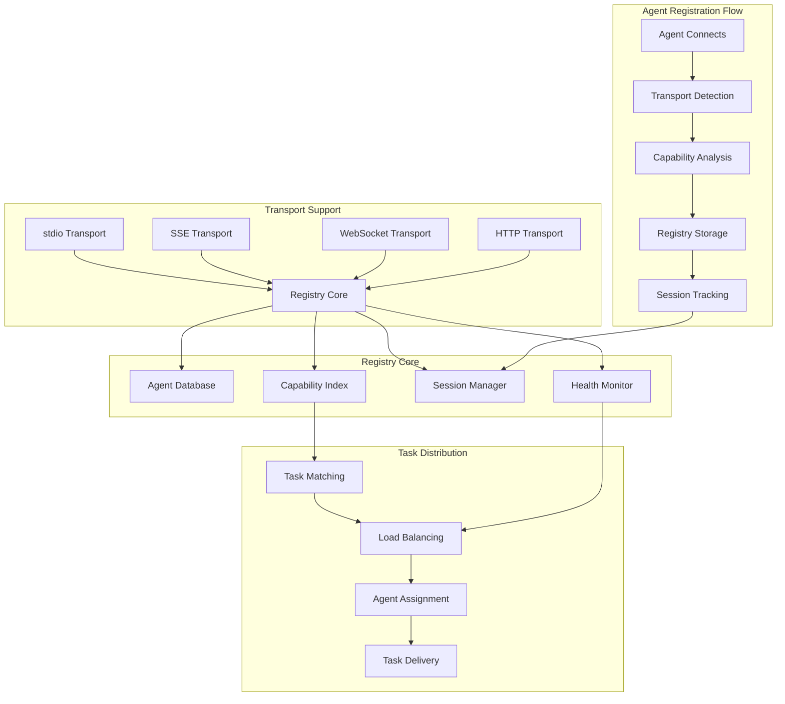
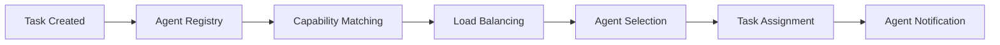

# Agent Registry (`register-agent`)

## Overview

The Agent Registry is a universal agent registration system that enables AI agents to register themselves with the Vibe Coder MCP task management system. It supports multiple transport protocols (stdio, SSE, WebSocket, HTTP) and implements the Unified Communication Protocol for seamless agent coordination and task distribution.

**Core Capabilities:**
- **Universal Agent Registration**: Register agents across all transport protocols
- **Capability Mapping**: Define and track agent capabilities and specializations
- **Transport Protocol Support**: stdio, SSE, WebSocket, and HTTP transports
- **Session Management**: Track agent sessions and connection states
- **Load Balancing**: Distribute tasks based on agent capabilities and availability
- **Health Monitoring**: Monitor agent status and handle disconnections
- **Security Integration**: Validate agent credentials and permissions

## Architecture

The Agent Registry implements a centralized registration system with multi-transport support:



## Configuration

### Claude Desktop MCP Client Setup

Add this configuration to your `claude_desktop_config.json` file:

```json
"vibe-coder-mcp": {
  "command": "node",
  "args": ["--max-old-space-size=4096", "/path/to/your/Vibe-Coder-MCP/build/index.js"],
  "cwd": "/path/to/your/Vibe-Coder-MCP",
  "transport": "stdio",
  "env": {
    "LLM_CONFIG_PATH": "/path/to/your/Vibe-Coder-MCP/llm_config.json",
    "LOG_LEVEL": "debug",
    "NODE_ENV": "production",
    "VIBE_CODER_OUTPUT_DIR": "/path/to/your/Vibe-Coder-MCP/VibeCoderOutput",
    "VIBE_TASK_MANAGER_READ_DIR": "/path/to/your/project/directory"
  },
  "disabled": false,
  "autoApprove": [
    "register-agent",
    "get-agent-tasks",
    "submit-task-response",
    "get-job-result"
  ]
}
```

### Environment Variables

#### Core Configuration
- **`LLM_CONFIG_PATH`**: Path to LLM model configuration file
- **`VIBE_CODER_OUTPUT_DIR`**: Directory where agent data is stored
- **`LOG_LEVEL`**: Logging verbosity for agent operations
- **`NODE_ENV`**: Runtime environment

#### Agent-Specific Settings
- **`AGENT_REGISTRY_MAX_AGENTS`**: Maximum number of registered agents (default: 50)
- **`AGENT_HEALTH_CHECK_INTERVAL`**: Health check interval in seconds (default: 30)
- **`AGENT_SESSION_TIMEOUT`**: Session timeout in minutes (default: 60)
- **`AGENT_CAPABILITY_CACHE_TTL`**: Capability cache TTL in minutes (default: 15)

## Usage Examples

### Basic Agent Registration

```typescript
// Register a basic agent with stdio transport
const result = await mcpClient.callTool('register-agent', {
  agentId: "claude-agent-001",
  capabilities: ["code_generation", "testing", "debugging"],
  transportType: "stdio",
  sessionId: "session-12345"
});
```

### Advanced Agent Registration

```typescript
// Register an agent with specialized capabilities and metadata
const result = await mcpClient.callTool('register-agent', {
  agentId: "specialized-agent-002",
  capabilities: [
    "react_development",
    "typescript_expertise", 
    "ui_testing",
    "performance_optimization"
  ],
  transportType: "sse",
  sessionId: "session-67890",
  metadata: {
    version: "1.2.0",
    specialization: "frontend",
    experience_level: "expert",
    preferred_frameworks: ["react", "nextjs", "typescript"]
  },
  maxConcurrentTasks: 3,
  preferredTaskTypes: ["feature_development", "bug_fixing", "code_review"]
});
```

### HTTP Transport Registration

```typescript
// Register an agent with HTTP callback endpoint
const result = await mcpClient.callTool('register-agent', {
  agentId: "http-agent-003",
  capabilities: ["backend_development", "api_design", "database_optimization"],
  transportType: "http",
  sessionId: "session-http-001",
  httpEndpoint: "https://my-agent.example.com/webhook",
  httpAuthToken: "bearer-token-12345",
  pollingInterval: 10000
});
```

## API Documentation

### Input Parameters

| Parameter | Type | Required | Default | Description |
|-----------|------|----------|---------|-------------|
| `agentId` | string | Yes | - | Unique agent identifier (e.g., claude-agent-001) |
| `capabilities` | string[] | Yes | - | List of agent capabilities |
| `transportType` | enum | Yes | - | Transport type: `stdio`, `sse`, `websocket`, `http` |
| `sessionId` | string | Yes | - | MCP session identifier |
| `metadata` | object | No | {} | Additional agent metadata |
| `maxConcurrentTasks` | number | No | 1 | Maximum concurrent tasks |
| `preferredTaskTypes` | string[] | No | [] | Preferred task types |
| `pollingInterval` | number | No | 5000 | Polling interval for stdio/http (ms) |
| `httpEndpoint` | string | No | - | HTTP callback URL (required for http transport) |
| `httpAuthToken` | string | No | - | HTTP authentication token |

### Response Format

```json
{
  "content": [{
    "type": "text", 
    "text": "✅ Agent Registration Successful\n\nAgent ID: claude-agent-001\nTransport: stdio\nCapabilities: 3 registered\nSession: session-12345\nStatus: Active\n\n🔧 Next Steps:\n1. Start polling for tasks using 'get-agent-tasks'\n2. Process assigned tasks according to capabilities\n3. Submit results using 'submit-task-response'"
  }]
}
```

### Agent Capabilities

#### Standard Capabilities
- **`code_generation`**: Generate new code and implementations
- **`testing`**: Write and execute tests
- **`debugging`**: Debug and fix code issues
- **`code_review`**: Review code for quality and best practices
- **`documentation`**: Create and update documentation
- **`refactoring`**: Refactor and optimize existing code

#### Specialized Capabilities
- **`react_development`**: React.js application development
- **`backend_development`**: Server-side development
- **`database_optimization`**: Database design and optimization
- **`ui_testing`**: User interface testing
- **`performance_optimization`**: Performance analysis and optimization
- **`security_analysis`**: Security auditing and fixes

#### Language-Specific Capabilities
- **`typescript_expertise`**: TypeScript development
- **`python_development`**: Python programming
- **`java_development`**: Java application development
- **`go_development`**: Go programming
- **`rust_development`**: Rust programming

## Integration

### Vibe Task Manager Integration

The Agent Registry seamlessly integrates with the Vibe Task Manager for task distribution:



**Integration Features:**
- **Automatic Task Matching**: Tasks are automatically matched to agents based on capabilities
- **Load Balancing**: Tasks are distributed evenly across available agents
- **Capability Filtering**: Only agents with required capabilities receive relevant tasks
- **Priority Handling**: High-priority tasks are assigned to the most capable agents

### Transport Protocol Integration

#### stdio Transport
- **Polling-Based**: Agents poll for tasks using `get-agent-tasks`
- **Synchronous**: Direct request-response communication
- **Session Management**: Tracked through MCP session IDs
- **Best For**: Single-agent scenarios, development, testing

#### SSE Transport
- **Real-Time**: Agents receive tasks via Server-Sent Events
- **Asynchronous**: Non-blocking task delivery
- **Event-Driven**: Immediate task notifications
- **Best For**: Multi-agent production environments

#### WebSocket Transport
- **Bidirectional**: Full-duplex communication
- **Real-Time**: Instant task delivery and status updates
- **Connection Management**: Automatic reconnection handling
- **Best For**: High-throughput, real-time coordination

#### HTTP Transport
- **Webhook-Based**: Tasks delivered via HTTP callbacks
- **Scalable**: Supports distributed agent architectures
- **Authentication**: Token-based security
- **Best For**: Microservice architectures, cloud deployments

## Performance

### Current Metrics

| Metric | Target | Current Performance |
|--------|--------|-------------------|
| Registration Time | <100ms | ~50-75ms average |
| Task Matching | <50ms | ~25-40ms average |
| Agent Lookup | <10ms | ~5-8ms average |
| Health Check Cycle | 30s | 30s configurable |
| Max Concurrent Agents | 50 | 50 (configurable) |
| Session Timeout | 60min | 60min (configurable) |

### Optimization Features

- **In-Memory Registry**: Fast agent lookup and capability matching
- **Capability Indexing**: Optimized capability-based searches
- **Connection Pooling**: Efficient transport connection management
- **Health Monitoring**: Proactive agent health checking
- **Load Balancing**: Intelligent task distribution algorithms

## Output Structure

### Agent Registry Data

```
VibeCoderOutput/vibe-task-manager/
├── agents/
│   ├── registry.json                    # Active agent registry
│   ├── capabilities-index.json         # Capability mapping index
│   ├── sessions/
│   │   ├── session-12345.json          # Session data
│   │   └── session-67890.json
│   └── health/
│       ├── health-checks.json          # Health monitoring data
│       └── performance-metrics.json    # Performance statistics
└── logs/
    ├── agent-registration.log          # Registration events
    ├── task-assignments.log            # Task assignment history
    └── health-monitoring.log           # Health check logs
```

### Registry Data Format

```json
{
  "agents": {
    "claude-agent-001": {
      "agentId": "claude-agent-001",
      "capabilities": ["code_generation", "testing", "debugging"],
      "transportType": "stdio",
      "sessionId": "session-12345",
      "status": "active",
      "registeredAt": "2024-01-15T10:30:00Z",
      "lastSeen": "2024-01-15T11:45:00Z",
      "taskCount": 5,
      "successRate": 0.95,
      "metadata": {
        "version": "1.0.0",
        "specialization": "general"
      }
    }
  },
  "capabilities": {
    "code_generation": ["claude-agent-001", "specialized-agent-002"],
    "testing": ["claude-agent-001", "test-agent-003"],
    "react_development": ["specialized-agent-002"]
  },
  "statistics": {
    "totalAgents": 3,
    "activeAgents": 2,
    "totalCapabilities": 8,
    "averageTasksPerAgent": 3.2
  }
}
```

## Troubleshooting

### Common Issues

#### "Agent registration failed"
**Cause**: Invalid agent ID or missing required parameters
**Solution**: Ensure all required parameters are provided

```typescript
// Correct registration format
{
  agentId: "unique-agent-id",        // Required: unique identifier
  capabilities: ["capability1"],     // Required: at least one capability
  transportType: "stdio",           // Required: valid transport type
  sessionId: "session-id"           // Required: valid session ID
}
```

#### "Transport type not supported"
**Cause**: Invalid transport type specified
**Solution**: Use one of the supported transport types

```typescript
// Valid transport types
transportType: "stdio"      // For polling-based communication
transportType: "sse"        // For real-time events
transportType: "websocket"  // For bidirectional communication
transportType: "http"       // For webhook-based communication
```

#### "Agent not receiving tasks"
**Cause**: Capability mismatch or agent not polling
**Solution**: Verify capabilities and polling behavior

```typescript
// Ensure capabilities match task requirements
capabilities: [
  "code_generation",    // Matches tasks requiring code generation
  "react_development"   // Matches React-specific tasks
]

// For stdio transport, ensure regular polling
setInterval(() => {
  mcpClient.callTool('get-agent-tasks', { agentId: 'your-agent-id' });
}, 5000);
```

### Performance Optimization

#### For High-Volume Environments
- Increase `AGENT_REGISTRY_MAX_AGENTS` limit
- Reduce `AGENT_HEALTH_CHECK_INTERVAL` for faster detection
- Use SSE or WebSocket transports for real-time communication
- Implement agent capability specialization

#### For Better Task Distribution
- Define specific capabilities for agents
- Use `preferredTaskTypes` for task routing
- Set appropriate `maxConcurrentTasks` limits
- Monitor agent performance metrics

## Advanced Features

### Custom Capability Definition
Agents can define custom capabilities beyond the standard set:

```typescript
capabilities: [
  "custom_ml_training",
  "blockchain_development",
  "iot_device_programming",
  "game_engine_development"
]
```

### Agent Metadata and Specialization
Rich metadata support for advanced agent coordination:

```typescript
metadata: {
  version: "2.1.0",
  specialization: "machine_learning",
  experience_level: "expert",
  preferred_languages: ["python", "tensorflow"],
  hardware_requirements: {
    gpu: true,
    memory_gb: 16
  },
  availability: {
    timezone: "UTC-8",
    working_hours: "09:00-17:00"
  }
}
```

### Health Monitoring and Failover
Automatic health monitoring with failover capabilities:
- **Heartbeat Monitoring**: Regular health checks
- **Automatic Failover**: Task reassignment on agent failure
- **Performance Tracking**: Success rates and response times
- **Capacity Management**: Dynamic load balancing based on agent performance
