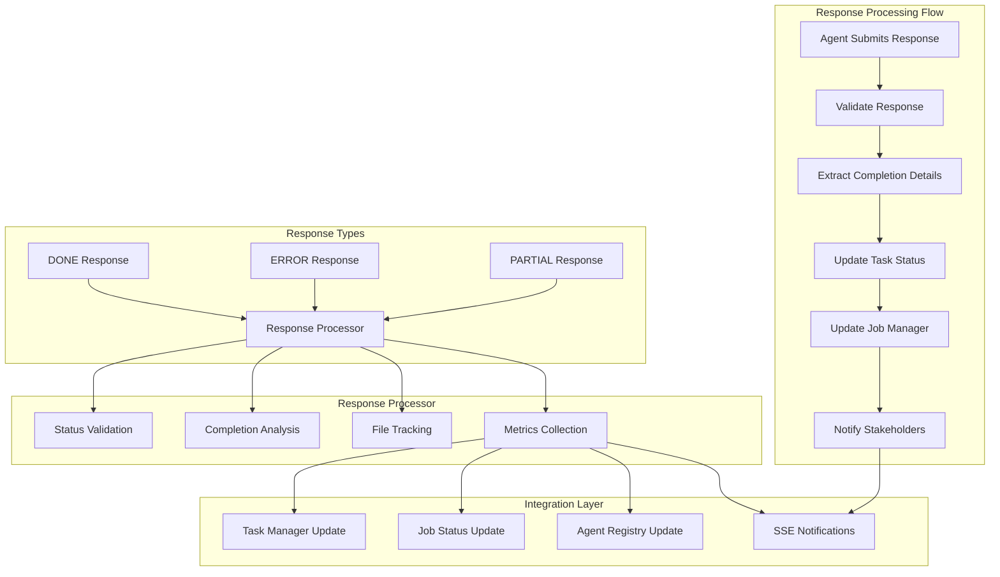
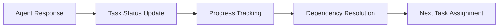

# Agent Response (`submit-task-response`)

## Overview

The Agent Response system handles task completion responses from AI agents across all transport protocols. It processes agent responses, updates task statuses, manages completion details, and integrates with the job management system for comprehensive task lifecycle management.

**Core Capabilities:**
- **Universal Response Processing**: Handle responses from all transport types (stdio, SSE, WebSocket, HTTP)
- **Status Management**: Process DONE, ERROR, and PARTIAL task completion statuses
- **Completion Details**: Track files modified, test results, build status, and execution metrics
- **Job Integration**: Seamless integration with the job manager for status updates
- **Error Handling**: Comprehensive error processing and recovery mechanisms
- **Sentinel Protocol**: Full compliance with the Sentinel Protocol for agent communication

## Architecture

The Agent Response system implements a centralized response processing pipeline:



## Configuration

### Claude Desktop MCP Client Setup

Add this configuration to your `claude_desktop_config.json` file:

```json
"vibe-coder-mcp": {
  "command": "node",
  "args": ["--max-old-space-size=4096", "/path/to/your/Vibe-Coder-MCP/build/index.js"],
  "cwd": "/path/to/your/Vibe-Coder-MCP",
  "transport": "stdio",
  "env": {
    "LLM_CONFIG_PATH": "/path/to/your/Vibe-Coder-MCP/llm_config.json",
    "LOG_LEVEL": "debug",
    "NODE_ENV": "production",
    "VIBE_CODER_OUTPUT_DIR": "/path/to/your/Vibe-Coder-MCP/VibeCoderOutput",
    "VIBE_TASK_MANAGER_READ_DIR": "/path/to/your/project/directory"
  },
  "disabled": false,
  "autoApprove": [
    "submit-task-response",
    "get-agent-tasks",
    "register-agent",
    "get-job-result"
  ]
}
```

### Environment Variables

#### Core Configuration
- **`LLM_CONFIG_PATH`**: Path to LLM model configuration file
- **`VIBE_CODER_OUTPUT_DIR`**: Directory where response data is stored
- **`LOG_LEVEL`**: Logging verbosity for response processing
- **`NODE_ENV`**: Runtime environment

#### Response Processing Settings
- **`RESPONSE_TIMEOUT_MS`**: Response processing timeout (default: 30000)
- **`MAX_RESPONSE_SIZE_MB`**: Maximum response size in MB (default: 10)
- **`RESPONSE_VALIDATION_STRICT`**: Enable strict response validation (default: true)
- **`COMPLETION_DETAILS_REQUIRED`**: Require completion details for DONE status (default: true)

## Usage Examples

### Basic Task Completion

```typescript
// Submit a successful task completion
const result = await mcpClient.callTool('submit-task-response', {
  agentId: "claude-agent-001",
  taskId: "T001-implement-auth",
  status: "DONE",
  response: "Successfully implemented OAuth2 authentication system with JWT tokens. All tests passing.",
  completionDetails: {
    filesModified: [
      "src/auth/oauth.ts",
      "src/auth/jwt.ts", 
      "src/middleware/auth.ts",
      "tests/auth.test.ts"
    ],
    testsPass: true,
    buildSuccessful: true,
    executionTime: 1800000
  }
});
```

### Error Response

```typescript
// Submit an error response with details
const result = await mcpClient.callTool('submit-task-response', {
  agentId: "claude-agent-001",
  taskId: "T002-fix-memory-leak",
  status: "ERROR",
  response: "Unable to fix memory leak due to missing dependency information.",
  completionDetails: {
    filesModified: [],
    testsPass: false,
    buildSuccessful: false,
    executionTime: 600000,
    errorDetails: "Missing webpack configuration for memory profiling tools"
  }
});
```

### Partial Progress Response

```typescript
// Submit partial progress update
const result = await mcpClient.callTool('submit-task-response', {
  agentId: "claude-agent-001", 
  taskId: "T003-refactor-components",
  status: "PARTIAL",
  response: "Completed refactoring of 3 out of 8 components. Authentication and user profile components are done.",
  completionDetails: {
    filesModified: [
      "src/components/Auth/LoginForm.tsx",
      "src/components/Auth/SignupForm.tsx",
      "src/components/User/Profile.tsx"
    ],
    testsPass: true,
    buildSuccessful: true,
    executionTime: 900000,
    partialProgress: 37.5
  }
});
```

## API Documentation

### Input Parameters

| Parameter | Type | Required | Default | Description |
|-----------|------|----------|---------|-------------|
| `agentId` | string | Yes | - | Agent identifier that completed the task |
| `taskId` | string | Yes | - | Task identifier being reported on |
| `status` | enum | Yes | - | Completion status: `DONE`, `ERROR`, `PARTIAL` |
| `response` | string | Yes | - | Detailed response message from the agent |
| `completionDetails` | object | No | {} | Detailed completion information |
| `metadata` | object | No | {} | Additional response metadata |

### Completion Details Schema

| Field | Type | Required | Description |
|-------|------|----------|-------------|
| `filesModified` | string[] | No | List of files that were modified |
| `testsPass` | boolean | No | Whether all tests passed |
| `buildSuccessful` | boolean | No | Whether the build was successful |
| `executionTime` | number | No | Execution time in milliseconds |
| `errorDetails` | string | No | Error details for ERROR status |
| `partialProgress` | number | No | Progress percentage for PARTIAL status (0-100) |

### Response Format

```json
{
  "content": [{
    "type": "text",
    "text": "✅ Task Response Submitted Successfully\n\nAgent: claude-agent-001\nTask: T001-implement-auth\nStatus: DONE\nSubmitted: 2024-01-15T12:30:00Z\n\n📊 Completion Details:\n- Files Modified: 4\n- Tests Passed: ✅\n- Build Successful: ✅\n- Execution Time: 30 minutes\n\n🔧 Next Steps:\n- Task has been marked as done\n- Job status updated for client polling\n- Continue polling for new task assignments"
  }]
}
```

## Integration

### Vibe Task Manager Integration

The Agent Response system integrates seamlessly with the Vibe Task Manager:



**Integration Features:**
- **Automatic Status Updates**: Task statuses are automatically updated based on agent responses
- **Progress Tracking**: Completion details are used to track overall project progress
- **Dependency Management**: Completed tasks trigger dependent task availability
- **Performance Metrics**: Response data feeds into agent performance tracking

### Job Manager Integration

Responses are integrated with the asynchronous job management system:

- **Job Status Updates**: Completed tasks update corresponding job statuses
- **Result Storage**: Response data is stored for job result retrieval
- **Error Propagation**: Error responses are properly propagated to job clients
- **Progress Notifications**: Partial responses trigger progress notifications

### Agent Registry Integration

Response processing updates agent performance metrics:

- **Success Rate Tracking**: DONE responses improve agent success rates
- **Error Rate Monitoring**: ERROR responses are tracked for agent reliability
- **Performance Metrics**: Execution times and completion details update agent profiles
- **Capability Validation**: Response quality validates agent capability claims

## Response Status Types

### DONE Status
Indicates successful task completion:

```typescript
{
  status: "DONE",
  response: "Task completed successfully with all requirements met.",
  completionDetails: {
    filesModified: ["file1.ts", "file2.ts"],
    testsPass: true,
    buildSuccessful: true,
    executionTime: 1200000
  }
}
```

**Requirements:**
- All task requirements must be fulfilled
- Tests should pass (if applicable)
- Build should be successful (if applicable)
- Files modified should be listed

### ERROR Status
Indicates task failure or inability to complete:

```typescript
{
  status: "ERROR",
  response: "Unable to complete task due to missing dependencies.",
  completionDetails: {
    filesModified: [],
    testsPass: false,
    buildSuccessful: false,
    executionTime: 300000,
    errorDetails: "Missing required npm package: @types/node"
  }
}
```

**Requirements:**
- Clear error description in response
- Error details explaining the specific issue
- Any partial work should be documented
- Execution time should be provided

### PARTIAL Status
Indicates partial completion with ongoing work:

```typescript
{
  status: "PARTIAL",
  response: "Completed 60% of the refactoring task. Authentication module done.",
  completionDetails: {
    filesModified: ["auth.ts", "login.ts"],
    testsPass: true,
    buildSuccessful: true,
    executionTime: 1800000,
    partialProgress: 60
  }
}
```

**Requirements:**
- Progress percentage (0-100)
- Description of completed work
- List of files modified so far
- Indication of remaining work

## Performance

### Current Metrics

| Metric | Target | Current Performance |
|--------|--------|-------------------|
| Response Processing | <100ms | ~50-75ms average |
| Status Update | <50ms | ~25-40ms average |
| Job Integration | <200ms | ~150-180ms average |
| Error Handling | <100ms | ~60-80ms average |
| Notification Delivery | <500ms | ~300-400ms average |

### Optimization Features

- **Async Processing**: Non-blocking response processing
- **Batch Updates**: Efficient batch status updates
- **Caching**: Response data caching for performance
- **Validation**: Fast response validation with detailed error messages
- **Streaming**: Large response streaming for memory efficiency

## Output Structure

### Response Data Storage

```
VibeCoderOutput/vibe-task-manager/
├── responses/
│   ├── agent-responses.json             # All agent responses
│   ├── completion-details.json          # Detailed completion data
│   ├── by-agent/
│   │   ├── claude-agent-001/
│   │   │   ├── responses.json           # Agent-specific responses
│   │   │   └── metrics.json             # Agent performance metrics
│   │   └── specialized-agent-002/
│   └── by-task/
│       ├── T001-implement-auth/
│       │   ├── response.json            # Task response data
│       │   └── completion-timeline.json # Completion timeline
│       └── T002-fix-memory-leak/
└── logs/
    ├── response-processing.log          # Response processing events
    ├── status-updates.log               # Task status changes
    └── error-responses.log              # Error response details
```

### Response Data Format

```json
{
  "responseId": "resp-12345",
  "agentId": "claude-agent-001",
  "taskId": "T001-implement-auth",
  "status": "DONE",
  "response": "Successfully implemented OAuth2 authentication...",
  "completionDetails": {
    "filesModified": ["src/auth/oauth.ts", "src/auth/jwt.ts"],
    "testsPass": true,
    "buildSuccessful": true,
    "executionTime": 1800000,
    "errorDetails": null,
    "partialProgress": null
  },
  "metadata": {
    "submittedAt": "2024-01-15T12:30:00Z",
    "processedAt": "2024-01-15T12:30:05Z",
    "processingTime": 5000,
    "validationPassed": true
  },
  "integrationResults": {
    "taskStatusUpdated": true,
    "jobStatusUpdated": true,
    "agentMetricsUpdated": true,
    "notificationsSent": 2
  }
}
```

## Troubleshooting

### Common Issues

#### "Invalid response status"
**Cause**: Status field contains invalid value
**Solution**: Use only valid status values

```typescript
// Valid status values
status: "DONE"     // Task completed successfully
status: "ERROR"    // Task failed or encountered error
status: "PARTIAL"  // Task partially completed
```

#### "Missing completion details"
**Cause**: Required completion details not provided for DONE status
**Solution**: Include completion details for successful tasks

```typescript
// Required for DONE status
completionDetails: {
  filesModified: ["file1.ts"],  // List modified files
  testsPass: true,              // Test results
  buildSuccessful: true,        // Build status
  executionTime: 1200000        // Execution time in ms
}
```

#### "Response too large"
**Cause**: Response exceeds maximum size limit
**Solution**: Reduce response size or use file references

```typescript
// Instead of including large content
response: "See detailed output in: /path/to/output/file.log"

// Or summarize large responses
response: "Completed refactoring of 15 components. See commit: abc123"
```

### Performance Optimization

#### For High-Volume Responses
- Use batch response submission when possible
- Implement response compression for large payloads
- Use file references instead of inline content
- Optimize completion details structure

#### For Better Integration
- Provide detailed completion information
- Use consistent file path formats
- Include accurate execution times
- Implement proper error categorization

## Advanced Features

### Response Validation
Comprehensive validation ensures response quality:

```typescript
// Validation rules
- agentId must match registered agent
- taskId must exist and be assigned to agent
- status must be valid enum value
- response must be non-empty string
- completionDetails must match status requirements
```

### Sentinel Protocol Compliance
Full compliance with the Sentinel Protocol for agent communication:

- **Status Reporting**: Standardized status reporting format
- **Error Handling**: Consistent error response structure
- **Progress Tracking**: Standardized progress reporting
- **Metadata Support**: Rich metadata for response context

### Response Analytics
Advanced analytics for response patterns:

- **Success Rate Analysis**: Track agent success rates over time
- **Performance Trends**: Monitor execution time trends
- **Error Pattern Detection**: Identify common error patterns
- **Quality Metrics**: Assess response quality and completeness
