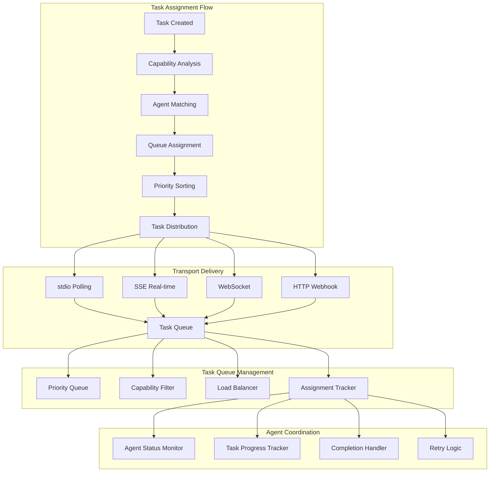
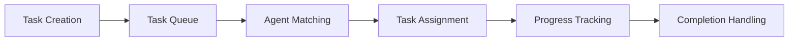

# Agent Tasks (`get-agent-tasks`)

## Overview

The Agent Tasks system provides universal task assignment and polling capabilities for AI agents across all transport protocols. It implements intelligent task queuing, load balancing, and real-time task distribution to ensure efficient agent coordination and optimal task execution.

**Core Capabilities:**
- **Universal Task Polling**: Support for stdio polling and SSE real-time notifications
- **Intelligent Queue Management**: Priority-based task queuing with capability matching
- **Load Balancing**: Distribute tasks based on agent availability and capabilities
- **Real-Time Notifications**: Instant task delivery via SSE for responsive agents
- **Transport Agnostic**: Works seamlessly across stdio, SSE, WebSocket, and HTTP transports
- **Capability Matching**: Automatic task-to-agent matching based on required skills
- **Priority Handling**: High-priority tasks are delivered first to appropriate agents

## Architecture

The Agent Tasks system implements a sophisticated task distribution architecture:



## Configuration

### Claude Desktop MCP Client Setup

Add this configuration to your `claude_desktop_config.json` file:

```json
"vibe-coder-mcp": {
  "command": "node",
  "args": ["--max-old-space-size=4096", "/path/to/your/Vibe-Coder-MCP/build/index.js"],
  "cwd": "/path/to/your/Vibe-Coder-MCP",
  "transport": "stdio",
  "env": {
    "LLM_CONFIG_PATH": "/path/to/your/Vibe-Coder-MCP/llm_config.json",
    "LOG_LEVEL": "debug",
    "NODE_ENV": "production",
    "VIBE_CODER_OUTPUT_DIR": "/path/to/your/Vibe-Coder-MCP/VibeCoderOutput",
    "VIBE_TASK_MANAGER_READ_DIR": "/path/to/your/project/directory"
  },
  "disabled": false,
  "autoApprove": [
    "get-agent-tasks",
    "submit-task-response",
    "register-agent",
    "get-job-result"
  ]
}
```

### Environment Variables

#### Core Configuration
- **`LLM_CONFIG_PATH`**: Path to LLM model configuration file
- **`VIBE_CODER_OUTPUT_DIR`**: Directory where task data is stored
- **`LOG_LEVEL`**: Logging verbosity for task operations
- **`NODE_ENV`**: Runtime environment

#### Task Management Settings
- **`TASK_QUEUE_MAX_SIZE`**: Maximum tasks in queue per agent (default: 10)
- **`TASK_ASSIGNMENT_TIMEOUT`**: Task assignment timeout in seconds (default: 300)
- **`TASK_RETRY_ATTEMPTS`**: Maximum retry attempts for failed tasks (default: 3)
- **`TASK_PRIORITY_LEVELS`**: Number of priority levels (default: 5)
- **`AGENT_POLLING_INTERVAL`**: Recommended polling interval in ms (default: 5000)

## Usage Examples

### Basic Task Polling

```typescript
// Poll for available tasks (stdio transport)
const result = await mcpClient.callTool('get-agent-tasks', {
  agentId: "claude-agent-001",
  maxTasks: 1
});
```

### Multiple Task Retrieval

```typescript
// Retrieve multiple tasks for batch processing
const result = await mcpClient.callTool('get-agent-tasks', {
  agentId: "specialized-agent-002",
  maxTasks: 3
});
```

### Capability-Specific Polling

```typescript
// Poll for tasks matching specific capabilities
const result = await mcpClient.callTool('get-agent-tasks', {
  agentId: "react-specialist-003",
  maxTasks: 2,
  capabilities: ["react_development", "typescript_expertise"]
});
```

## API Documentation

### Input Parameters

| Parameter | Type | Required | Default | Description |
|-----------|------|----------|---------|-------------|
| `agentId` | string | Yes | - | Agent identifier requesting tasks |
| `maxTasks` | number | No | 1 | Maximum number of tasks to retrieve (1-5) |
| `capabilities` | string[] | No | [] | Filter tasks by required capabilities |
| `priority` | enum | No | 'any' | Task priority filter: `high`, `medium`, `low`, `any` |

### Response Format

#### No Tasks Available
```json
{
  "content": [{
    "type": "text",
    "text": "📋 No Tasks Available\n\nAgent: claude-agent-001\nTasks Retrieved: 0\nRemaining in Queue: 0\n\n🔧 Next Steps:\n1. Continue polling for new task assignments\n2. Check back in 5-10 seconds\n3. Ensure agent capabilities match available tasks"
  }]
}
```

#### Tasks Retrieved
```json
{
  "content": [{
    "type": "text", 
    "text": "✅ Task Assignment Retrieved\n\nAgent: claude-agent-001\nTasks Retrieved: 2\nRemaining in Queue: 3\n\n📋 Task Details:\n\n**Task 1: T001-implement-auth**\n- Priority: High\n- Type: feature_addition\n- Description: Implement OAuth2 authentication system\n- Required Capabilities: code_generation, security_analysis\n- Estimated Time: 2-3 hours\n\n**Task 2: T002-fix-memory-leak**\n- Priority: Medium  \n- Type: bug_fix\n- Description: Fix memory leak in WebSocket handler\n- Required Capabilities: debugging, performance_optimization\n- Estimated Time: 1-2 hours\n\n🔧 Next Steps:\n1. Process the task(s) according to the Sentinel Protocol\n2. Submit results using 'submit-task-response' tool\n3. Continue polling for additional tasks"
  }]
}
```

### Task Object Structure

```json
{
  "taskId": "T001-implement-auth",
  "title": "Implement OAuth2 Authentication",
  "description": "Implement a complete OAuth2 authentication system with JWT tokens",
  "type": "feature_addition",
  "priority": "high",
  "status": "assigned",
  "requiredCapabilities": ["code_generation", "security_analysis"],
  "estimatedTime": 10800000,
  "assignedAt": "2024-01-15T10:30:00Z",
  "dueDate": "2024-01-16T18:00:00Z",
  "projectId": "P001-ecommerce-platform",
  "epicId": "E001-user-management",
  "dependencies": [],
  "context": {
    "files": ["src/auth/", "src/middleware/"],
    "requirements": ["OAuth2 compliance", "JWT tokens", "Role-based access"],
    "constraints": ["Must use existing user database", "Backward compatibility required"]
  }
}
```

## Integration

### Vibe Task Manager Integration

The Agent Tasks system is deeply integrated with the Vibe Task Manager:



**Integration Features:**
- **Automatic Task Queuing**: New tasks are automatically queued for appropriate agents
- **Dependency Management**: Tasks with dependencies are held until prerequisites are met
- **Progress Synchronization**: Task progress is synchronized between agents and task manager
- **Completion Workflow**: Completed tasks trigger dependent task availability

### Agent Registry Integration

Task assignment leverages the Agent Registry for intelligent matching:

- **Capability Matching**: Tasks are matched to agents based on registered capabilities
- **Load Balancing**: Tasks are distributed based on agent availability and current workload
- **Performance Tracking**: Agent performance metrics influence task assignment decisions
- **Health Monitoring**: Unhealthy agents are excluded from task assignment

### Transport Protocol Support

#### stdio Transport (Polling)
- **Polling-Based**: Agents actively poll for tasks using `get-agent-tasks`
- **Configurable Interval**: Recommended 5-second polling interval
- **Batch Retrieval**: Support for retrieving multiple tasks per poll
- **Timeout Handling**: Automatic timeout for unresponsive agents

#### SSE Transport (Real-Time)
- **Event-Driven**: Tasks are pushed to agents via Server-Sent Events
- **Immediate Delivery**: Zero-latency task assignment
- **Connection Management**: Automatic reconnection handling
- **Selective Delivery**: Tasks delivered only to capable agents

#### WebSocket Transport (Bidirectional)
- **Full-Duplex**: Bidirectional communication for task assignment and status updates
- **Real-Time**: Instant task delivery and progress updates
- **Connection Persistence**: Persistent connections for continuous communication
- **Error Recovery**: Automatic error recovery and reconnection

#### HTTP Transport (Webhook)
- **Webhook Delivery**: Tasks delivered via HTTP POST to agent endpoints
- **Authentication**: Token-based authentication for secure delivery
- **Retry Logic**: Automatic retry for failed deliveries
- **Scalability**: Supports distributed agent architectures

## Task Queue Management

### Priority Levels

| Priority | Description | Assignment Order | Typical Use Cases |
|----------|-------------|------------------|-------------------|
| **Critical** | Urgent production issues | 1st | Security fixes, critical bugs |
| **High** | Important features/fixes | 2nd | Major features, important bugs |
| **Medium** | Standard development tasks | 3rd | Regular features, refactoring |
| **Low** | Nice-to-have improvements | 4th | Documentation, minor enhancements |
| **Backlog** | Future considerations | 5th | Research tasks, future features |

### Queue Strategies

#### Round Robin
- **Description**: Tasks distributed evenly across all capable agents
- **Best For**: Balanced workload distribution
- **Use Case**: General development tasks with similar complexity

#### Capability-Based
- **Description**: Tasks assigned to agents with best matching capabilities
- **Best For**: Specialized tasks requiring specific skills
- **Use Case**: Complex features requiring domain expertise

#### Load-Balanced
- **Description**: Tasks assigned based on current agent workload
- **Best For**: Optimal resource utilization
- **Use Case**: High-volume task processing

#### Priority-First
- **Description**: High-priority tasks always assigned first
- **Best For**: Critical issue resolution
- **Use Case**: Production support and urgent fixes

## Performance

### Current Metrics

| Metric | Target | Current Performance |
|--------|--------|-------------------|
| Task Assignment | <50ms | ~25-40ms average |
| Queue Processing | <100ms | ~60-80ms average |
| Agent Matching | <25ms | ~15-20ms average |
| Task Retrieval | <200ms | ~150-180ms average |
| Queue Throughput | 1000 tasks/min | ~800-900 tasks/min |

### Optimization Features

- **In-Memory Queues**: Fast task queue operations
- **Capability Indexing**: Optimized agent-capability matching
- **Batch Processing**: Efficient batch task assignment
- **Connection Pooling**: Optimized transport connections
- **Caching**: Task and agent data caching for performance

## Output Structure

### Task Queue Data

```
VibeCoderOutput/vibe-task-manager/
├── queues/
│   ├── agent-queues.json               # Per-agent task queues
│   ├── priority-queues.json            # Priority-based queues
│   ├── capability-index.json           # Capability-based task index
│   └── assignment-history.json         # Task assignment history
├── assignments/
│   ├── active-assignments.json         # Currently assigned tasks
│   ├── completed-assignments.json      # Completed task assignments
│   └── failed-assignments.json         # Failed task assignments
└── metrics/
    ├── queue-performance.json          # Queue performance metrics
    ├── agent-utilization.json          # Agent utilization statistics
    └── assignment-analytics.json       # Assignment pattern analysis
```

### Queue Data Format

```json
{
  "agentQueues": {
    "claude-agent-001": {
      "agentId": "claude-agent-001",
      "queueSize": 3,
      "assignedTasks": ["T001", "T002", "T003"],
      "capabilities": ["code_generation", "testing"],
      "maxConcurrentTasks": 2,
      "currentLoad": 2,
      "lastPolled": "2024-01-15T12:30:00Z",
      "averageCompletionTime": 1800000
    }
  },
  "priorityQueues": {
    "high": ["T004", "T005"],
    "medium": ["T006", "T007", "T008"],
    "low": ["T009"]
  },
  "statistics": {
    "totalTasksQueued": 8,
    "totalAgentsActive": 3,
    "averageQueueTime": 300000,
    "taskThroughput": 45.2
  }
}
```

## Troubleshooting

### Common Issues

#### "No tasks available"
**Cause**: No tasks match agent capabilities or all tasks assigned
**Solution**: Check agent capabilities and task requirements

```typescript
// Verify agent capabilities match task requirements
{
  agentCapabilities: ["code_generation", "testing"],
  taskRequirements: ["code_generation", "debugging"]  // Mismatch: debugging
}

// Solution: Register agent with required capabilities
await mcpClient.callTool('register-agent', {
  agentId: "claude-agent-001",
  capabilities: ["code_generation", "testing", "debugging"]
});
```

#### "Task assignment timeout"
**Cause**: Agent not polling frequently enough or connection issues
**Solution**: Increase polling frequency or check connection

```typescript
// Recommended polling pattern for stdio transport
setInterval(async () => {
  try {
    const tasks = await mcpClient.callTool('get-agent-tasks', {
      agentId: 'your-agent-id',
      maxTasks: 2
    });
    // Process tasks
  } catch (error) {
    console.error('Polling error:', error);
  }
}, 5000); // Poll every 5 seconds
```

#### "Queue overflow"
**Cause**: Too many tasks queued for agent capacity
**Solution**: Increase agent capacity or add more agents

```typescript
// Increase agent concurrent task capacity
await mcpClient.callTool('register-agent', {
  agentId: "claude-agent-001",
  maxConcurrentTasks: 5,  // Increase from default 1
  capabilities: ["code_generation", "testing"]
});
```

### Performance Optimization

#### For High-Volume Environments
- Increase `maxTasks` parameter for batch processing
- Use SSE or WebSocket transports for real-time delivery
- Implement multiple specialized agents
- Monitor queue sizes and agent utilization

#### For Better Task Distribution
- Define specific agent capabilities
- Use priority levels appropriately
- Monitor agent performance metrics
- Implement load balancing strategies

## Advanced Features

### Custom Task Filtering
Agents can implement custom task filtering logic:

```typescript
// Filter tasks by custom criteria
const result = await mcpClient.callTool('get-agent-tasks', {
  agentId: "specialized-agent",
  maxTasks: 3,
  capabilities: ["react_development"],
  priority: "high",
  customFilters: {
    projectType: "frontend",
    complexity: "medium",
    estimatedTime: { max: 7200000 } // Max 2 hours
  }
});
```

### Task Prefetching
Intelligent task prefetching for improved performance:

- **Predictive Loading**: Preload tasks based on agent patterns
- **Capability Prediction**: Predict task requirements based on project context
- **Batch Optimization**: Optimize task batching for agent efficiency
- **Cache Warming**: Pre-warm task data for faster retrieval

### Real-Time Coordination
Advanced coordination features for multi-agent environments:

- **Task Splitting**: Automatically split large tasks across multiple agents
- **Collaborative Tasks**: Coordinate tasks requiring multiple agents
- **Dependency Chains**: Manage complex task dependency relationships
- **Resource Sharing**: Share resources and context between agents
```
