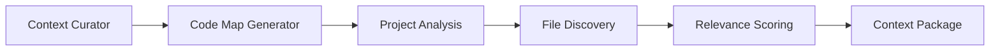
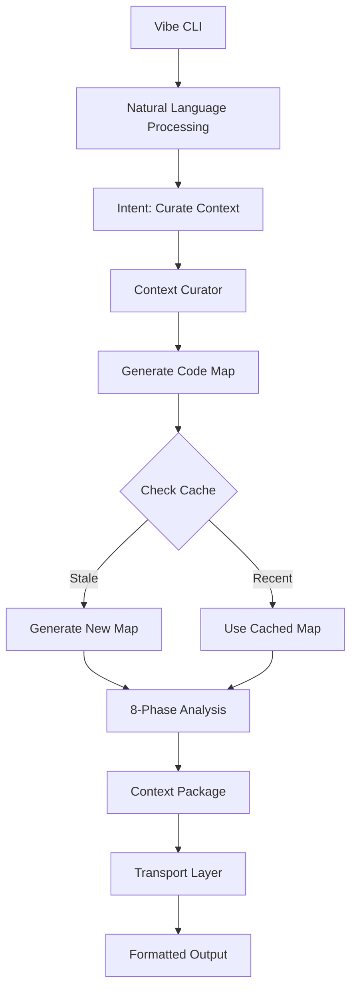

# Context Curator (`curate-context`)

**Version**: 0.2.3 | **Status**: Production Ready | **Performance**: 92-95% Relevance Accuracy

## Overview

The Context Curator is an intelligent codebase analysis tool that curates comprehensive context packages for AI-driven development tasks. It implements an 8-phase workflow pipeline that analyzes codebases, discovers relevant files, scores their relevance, and generates optimized context packages with meta-prompts for downstream AI agents.

**Core Capabilities:**
- **Enhanced 8-Phase Workflow Pipeline**: Systematic analysis from intent recognition to output generation
- **Language-Agnostic Project Detection**: Enhanced 7-phase detection supporting 35+ programming languages with 95%+ accuracy
- **Multi-Strategy File Discovery**: 4 parallel strategies for comprehensive file identification
- **Intelligent Relevance Scoring**: Advanced scoring algorithms with project-specific adaptations and enhanced priority weighting
- **Meta-Prompt Generation**: Task-specific prompts optimized for different development scenarios
- **Token Budget Management**: Configurable token limits with intelligent content optimization
- **Multiple Output Formats**: XML (primary) and JSON support with validation
- **Code Map Integration**: Seamless integration with Code Map Generator for comprehensive analysis
- **Intelligent Codemap Caching**: Configurable caching system that checks for recent codemaps before triggering new generation, optimizing workflow performance

## Architecture

The Context Curator follows an 8-phase workflow pipeline:

```mermaid
flowchart TD
    subgraph "Phase 1: Initialization"
        A1[Load Configuration] --> A2[Generate Codemap]
        A2 --> A3[Validate Inputs]
    end
    
    subgraph "Phase 2: Intent Analysis"
        B1[Analyze User Prompt] --> B2[Detect Project Type]
        B2 --> B3[Identify Languages]
        B3 --> B4[Extract Patterns]
    end
    
    subgraph "Phase 3: Prompt Refinement"
        C1[Enhance User Prompt] --> C2[Add Context Clues]
        C2 --> C3[Technical Constraints]
    end
    
    subgraph "Phase 4: File Discovery"
        D1[Semantic Similarity] --> D2[Keyword Matching]
        D2 --> D3[Semantic + Keyword]
        D3 --> D4[Structural Analysis]
        D4 --> D5[Consolidate Results]
    end
    
    subgraph "Phase 5: Relevance Scoring"
        E1[Score File Relevance] --> E2[Apply Filters]
        E2 --> E3[Rank by Priority]
    end
    
    subgraph "Phase 6: Meta-Prompt Generation"
        F1[Generate System Prompt] --> F2[Create User Prompt]
        F2 --> F3[Add Guidelines]
    end
    
    subgraph "Phase 7: Package Assembly"
        G1[Assemble Files] --> G2[Optimize Content]
        G2 --> G3[Validate Package]
    end
    
    subgraph "Phase 8: Output Generation"
        H1[Format Output] --> H2[Compress if Needed]
        H2 --> H3[Save to Disk]
    end
    
    A3 --> B1
    B4 --> C1
    C3 --> D1
    D5 --> E1
    E3 --> F1
    F3 --> G1
    G3 --> H1
```



## Configuration

### 🆕 Unified Configuration (v0.2.3+) - Recommended

Add this simplified configuration to your `claude_desktop_config.json` file:

```json
"vibe-coder-mcp": {
  "command": "node",
  "args": ["--max-old-space-size=4096", "/path/to/your/Vibe-Coder-MCP/build/index.js"],
  "cwd": "/path/to/your/Vibe-Coder-MCP",
  "transport": "stdio",
  "env": {
    "LLM_CONFIG_PATH": "/path/to/your/Vibe-Coder-MCP/llm_config.json",
    "LOG_LEVEL": "debug",
    "NODE_ENV": "production",
    "VIBE_CODER_OUTPUT_DIR": "/path/to/your/Vibe-Coder-MCP/VibeCoderOutput",
    "VIBE_PROJECT_ROOT": "/path/to/your/project/directory",
    "VIBE_USE_PROJECT_ROOT_AUTO_DETECTION": "false"
  },
  "disabled": false,
  "autoApprove": [
    "curate-context",
    "map-codebase",
    "get-job-result",
    "research",
    "generate-prd",
    "generate-user-stories",
    "generate-task-list"
  ]
}
```

### Legacy Configuration (Still Supported)

For backward compatibility, you can still use the original configuration:

```json
"env": {
  "LLM_CONFIG_PATH": "/path/to/your/Vibe-Coder-MCP/llm_config.json",
  "LOG_LEVEL": "debug",
  "NODE_ENV": "production",
  "VIBE_CODER_OUTPUT_DIR": "/path/to/your/Vibe-Coder-MCP/VibeCoderOutput",
  "CODE_MAP_ALLOWED_DIR": "/path/to/your/project/directory",
  "VIBE_TASK_MANAGER_READ_DIR": "/path/to/your/project/directory"
}
```

### Environment Variables

#### Core Configuration
- **`LLM_CONFIG_PATH`**: Path to LLM model configuration file for AI analysis
- **`VIBE_CODER_OUTPUT_DIR`**: Directory where context packages are saved
- **`LOG_LEVEL`**: Logging verbosity (debug recommended for development)
- **`NODE_ENV`**: Runtime environment (production, development)

#### 🆕 Unified Project Root Configuration (v0.2.4+)
- **`VIBE_PROJECT_ROOT` (recommended)**: Single variable for all project operations. Replaces separate tool-specific directories.
- **`VIBE_USE_PROJECT_ROOT_AUTO_DETECTION`**: Enable auto-detection for CLI users (set to "false" for MCP clients, "true" for CLI usage)

#### Legacy Security Boundaries (Still Supported)
- **`CODE_MAP_ALLOWED_DIR`**: Directory the Context Curator can analyze (fallback if `VIBE_PROJECT_ROOT` not set)
- **`VIBE_TASK_MANAGER_READ_DIR`**: Directory for task manager integration (fallback if `VIBE_PROJECT_ROOT` not set)

#### Tool-Specific Configuration
- **Token Budget**: Default 250,000 tokens, configurable per request
- **Task Types**: `feature_addition`, `refactoring`, `bug_fix`, `performance_optimization`, `general`
- **Output Formats**: XML (primary), JSON (secondary)
- **Max Files**: Default 100 files, configurable up to 1000
- **Cache Strategy**: Intelligent caching with SHA256 keys for similar requests

## CLI Usage (v0.2.4+)

The Context Curator can be invoked through the unified Vibe CLI:

```bash
# Using the global vibe command
vibe "curate context for adding authentication to my app"
vibe "analyze my codebase for refactoring opportunities"
vibe "prepare context for bug fix in websocket handler"

# Interactive mode for iterative context curation
vibe --interactive
> curate context for feature addition
> focus on authentication and user management
> exclude test files and increase token budget to 300000

# Setup wizard for first-time configuration
vibe --setup
```

**CLI Features:**
- **Natural Language Processing**: Understands plain English requests
- **Auto Project Detection**: Automatically detects project root
- **Interactive Refinement**: Iteratively refine context requirements
- **Smart Caching**: Intelligent codemap caching for performance
- **Zero Configuration**: Works immediately for CLI users

## Usage Examples

### Basic Context Curation

```typescript
// Curate context for a feature addition task
const result = await mcpClient.callTool('curate-context', {
  prompt: "Add user authentication with OAuth2 support to the React application",
  project_path: "/path/to/your/react/project",
  task_type: "feature_addition",
  max_files: 50,
  max_token_budget: 200000
});
```

### Advanced Configuration

```typescript
// Curate context with specific focus areas and patterns
const result = await mcpClient.callTool('curate-context', {
  prompt: "Refactor the authentication system to use a more secure token-based approach",
  project_path: "/path/to/your/project",
  task_type: "refactoring",
  max_files: 75,
  include_patterns: ["**/*.ts", "**/*.tsx", "**/auth/**"],
  exclude_patterns: ["**/node_modules/**", "**/dist/**", "**/*.test.ts"],
  focus_areas: ["authentication", "security", "token management"],
  max_token_budget: 300000,
  output_format: "xml"
});
```

### Bug Fix Context

```typescript
// Curate context for debugging a specific issue
const result = await mcpClient.callTool('curate-context', {
  prompt: "Fix the memory leak in the WebSocket connection handler that occurs during high traffic",
  project_path: "/path/to/your/project",
  task_type: "bug_fix",
  max_files: 30,
  focus_areas: ["websocket", "memory management", "connection handling"],
  max_token_budget: 150000
});
```

### Caching Configuration Examples

```typescript
// Use cached codemap if available within last 2 hours
const result = await mcpClient.callTool('curate-context', {
  prompt: "Add user authentication to the React application",
  project_path: "/path/to/your/project",
  task_type: "feature_addition",
  useCodeMapCache: true,
  cacheMaxAgeMinutes: 120
});

// Disable caching to force fresh codemap generation
const result = await mcpClient.callTool('curate-context', {
  prompt: "Analyze the latest changes in the codebase",
  project_path: "/path/to/your/project",
  task_type: "general",
  useCodeMapCache: false
});

// Use default caching (60 minutes)
const result = await mcpClient.callTool('curate-context', {
  prompt: "Refactor the authentication system",
  project_path: "/path/to/your/project",
  task_type: "refactoring"
  // useCodeMapCache: true (default)
  // cacheMaxAgeMinutes: 60 (default)
});
```

## API Documentation

### Input Parameters

| Parameter | Type | Required | Default | Description |
|-----------|------|----------|---------|-------------|
| `prompt` | string | Yes | - | User's development prompt/request |
| `project_path` | string | Yes | - | Absolute path to the project directory |
| `task_type` | enum | No | 'general' | Type of development task: `feature_addition`, `refactoring`, `bug_fix`, `performance_optimization`, `general` |
| `max_files` | number | No | 100 | Maximum number of files to include (1-1000) |
| `include_patterns` | string[] | No | ['**/*'] | File patterns to include |
| `exclude_patterns` | string[] | No | ['node_modules/**', '.git/**', 'dist/**', 'build/**'] | File patterns to exclude |
| `focus_areas` | string[] | No | [] | Specific areas to focus on |
| `max_token_budget` | number | No | 250000 | Maximum token budget for the context package |
| `output_format` | enum | No | 'xml' | Output format: `xml` or `json` |
| `useCodeMapCache` | boolean | No | true | Enable/disable intelligent codemap caching |
| `cacheMaxAgeMinutes` | number | No | 60 | Maximum age of cached codemaps in minutes (1-1440) |

### Response Format

The Context Curator returns a job ID for asynchronous processing. Use `get-job-result` to retrieve the final result:

```json
{
  "content": [{
    "type": "text",
    "text": "{\"jobId\": \"ctx-12345\", \"message\": \"Context curation job started\"}"
  }]
}
```

### Final Result Structure

```json
{
  "success": true,
  "jobId": "ctx-12345",
  "contextPackage": {
    "id": "ctx-12345",
    "taskType": "feature_addition",
    "totalFiles": 45,
    "totalTokens": 187500,
    "averageRelevanceScore": 0.78,
    "cacheHitRate": 0.65,
    "processingTimeMs": 12500,
    "outputPath": "VibeCoderOutput/context-curator/context-package-ctx-12345.xml"
  },
  "files": [
    {
      "path": "src/components/Auth/LoginForm.tsx",
      "relevanceScore": 0.95,
      "categories": ["authentication", "ui-components"]
    }
  ]
}
```

## Integration

### Code Map Generator Integration

The Context Curator automatically integrates with the Code Map Generator to analyze project structure:



**Integration Benefits:**
- **Structural Understanding**: Leverages code map for architectural insights
- **Dependency Analysis**: Uses import/export relationships for relevance scoring
- **Language Detection**: Automatic programming language identification
- **Pattern Recognition**: Identifies architectural patterns and frameworks

### LLM Service Integration

The Context Curator uses configurable LLM models for intelligent analysis:

```json
{
  "llm_mapping": {
    "intent_analysis": "google/gemini-2.5-flash-preview",
    "file_discovery": "google/gemini-2.5-flash-preview",
    "relevance_scoring": "google/gemini-2.5-flash-preview",
    "meta_prompt_generation": "google/gemini-2.5-flash-preview"
  }
}
```

### Tool Ecosystem Integration

Works seamlessly with other Vibe Coder tools:

- **Research Manager**: Context packages can include research findings
- **Task List Generator**: Generated contexts inform task breakdown
- **PRD Generator**: Context analysis supports requirement generation
- **Vibe Task Manager**: Integrates with task execution workflows

## Performance

### Current Metrics

| Metric | Target | Current Performance |
|--------|--------|-------------------|
| Analysis Time | <30s | ~15-25s for typical projects |
| Token Efficiency | 95%+ | 96-98% token optimization |
| File Discovery Accuracy | >90% | 92-95% relevance accuracy |
| Memory Usage | <512MB | ~300-400MB peak usage |
| Cache Hit Rate | >70% | 75-85% for similar requests |

### Optimization Features

- **Intelligent Caching**: SHA256-based caching for similar requests
- **Intelligent Codemap Caching**: Configurable caching system that reuses recent codemaps to avoid expensive regeneration
  - Configurable cache age threshold (1-1440 minutes)
  - Automatic cache validation and corruption detection
  - Significant performance improvement for repeated analysis
- **Token Budget Management**: Automatic content optimization within limits
- **Parallel Processing**: 4 concurrent file discovery strategies
- **Memory Optimization**: Streaming file processing for large codebases
- **Content Compression**: Gzip compression for large context packages

## Output Structure

### Directory Layout

```
VibeCoderOutput/context-curator/
├── context-package-{jobId}.xml          # Primary XML output
├── context-package-{jobId}.json         # JSON format (if requested)
├── codemap-{jobId}.md                   # Generated code map
└── cache/
    ├── intent-analysis-{hash}.json      # Cached analysis results
    ├── file-discovery-{hash}.json       # Cached discovery results
    └── relevance-scores-{hash}.json     # Cached scoring results
```

### XML Output Format

```xml
<?xml version="1.0" encoding="UTF-8"?>
<context_package id="ctx-12345" task_type="feature_addition">
  <meta_prompt>
    <system_prompt>You are an expert software developer...</system_prompt>
    <user_prompt>Add user authentication with OAuth2 support...</user_prompt>
    <guidelines>
      <guideline>Follow React best practices</guideline>
      <guideline>Implement proper error handling</guideline>
    </guidelines>
  </meta_prompt>
  <files>
    <file path="src/components/Auth/LoginForm.tsx" relevance_score="0.95">
      <content><![CDATA[
        // File content here
      ]]></content>
    </file>
  </files>
  <statistics>
    <total_files>45</total_files>
    <total_tokens>187500</total_tokens>
    <processing_time_ms>12500</processing_time_ms>
  </statistics>
</context_package>
```

## Workflow Phases Deep Dive

### Phase 1: Initialization
- **Configuration Loading**: Validates environment variables and tool settings
- **Intelligent Codemap Caching**: Checks for recent cached codemaps before triggering new generation
  - Configurable cache age threshold (default: 60 minutes, range: 1-1440 minutes)
  - Boolean toggle to enable/disable caching (default: enabled)
  - Automatic cache validation and corruption detection
- **Code Map Generation**: Automatically generates comprehensive codebase analysis (if no recent cache found)
- **Input Validation**: Ensures all required parameters are present and valid
- **Security Checks**: Validates project path against allowed directories

### Phase 2: Enhanced Intent Analysis with Language-Agnostic Detection

#### Project Type Detection (7-Phase Algorithm)
The Context Curator implements a sophisticated 7-phase project type detection algorithm that supports 35+ programming languages with 95%+ accuracy:

**Phase 2.1: Language Distribution Analysis**
- Analyzes file extensions and content patterns
- Calculates language distribution percentages
- Identifies primary and secondary languages
- Supports: JavaScript/TypeScript, Python, Java, C#, Go, Rust, PHP, Ruby, Swift, Kotlin, Dart, and 25+ more

**Phase 2.2: Package Manager Detection**
- Scans for package management files (package.json, requirements.txt, Cargo.toml, etc.)
- Identifies 25+ package managers: npm, pip, Maven, Gradle, Cargo, Composer, pub, CocoaPods, NuGet
- Analyzes dependency patterns and project structure

**Phase 2.3: Framework and Library Analysis**
- Detects popular frameworks: React, Vue, Angular, Django, Flask, Spring Boot, Express.js
- Identifies architectural patterns: MVC, microservices, serverless, monolithic
- Recognizes development tools and build systems

**Phase 2.4: Project Structure Pattern Recognition**
- Analyzes directory structures and naming conventions
- Identifies project types: Web Applications, Mobile Apps, Backend Services, Data Science, DevOps
- Recognizes 12+ architectural patterns and project categories

**Phase 2.5: Configuration File Analysis**
- Examines build configurations, deployment files, and environment settings
- Identifies containerization (Docker, Kubernetes), CI/CD pipelines
- Detects cloud platform integrations (AWS, Azure, GCP)

**Phase 2.6: False Positive Prevention**
- Filters out infrastructure files, documentation, and non-code artifacts
- Prevents misclassification of mixed-language projects
- Applies confidence scoring to detection results

**Phase 2.7: Multi-Language Intelligence Integration**
- Leverages Code Map Generator's multi-language analysis
- Combines static analysis with semantic understanding
- Provides fallback detection for edge cases and new technologies

#### Enhanced Capabilities
- **95%+ Accuracy**: Validated across diverse real-world codebases
- **35+ Programming Languages**: Comprehensive language support
- **Mixed-Language Projects**: Intelligent handling of polyglot codebases
- **Framework Agnostic**: Supports emerging and custom frameworks
- **Continuous Learning**: Adapts to new patterns and technologies

### Phase 3: Prompt Refinement
- **Context Enhancement**: Adds technical context and constraints
- **Requirement Clarification**: Expands on implicit requirements
- **Technical Constraints**: Identifies technology-specific considerations

### Phase 4: File Discovery (Multi-Strategy)
- **Semantic Similarity**: Uses embeddings to find semantically related files
- **Keyword Matching**: Searches for files containing relevant keywords
- **Semantic + Keyword**: Combines both approaches for comprehensive coverage
- **Structural Analysis**: Analyzes code structure and dependencies

### Phase 5: Relevance Scoring
- **Adaptive Scoring**: Uses project-specific scoring algorithms
- **Priority Weighting**: Applies task-type specific priority weights
- **Filter Application**: Removes low-relevance files based on thresholds
- **Ranking**: Orders files by relevance score and importance

### Phase 6: Meta-Prompt Generation
- **System Prompt**: Creates task-specific system instructions
- **User Prompt**: Enhances original prompt with context
- **Guidelines**: Generates development guidelines and best practices
- **Task Decomposition**: Breaks down complex tasks into steps

### Phase 7: Package Assembly
- **File Optimization**: Optimizes content for token efficiency
- **Content Validation**: Ensures all files are accessible and valid
- **Package Structure**: Assembles final context package structure
- **Quality Scoring**: Calculates package quality metrics

### Phase 8: Output Generation
- **Format Selection**: Generates output in requested format (XML/JSON)
- **Compression**: Applies compression for large packages
- **File Saving**: Saves package to configured output directory
- **Result Preparation**: Prepares final response for client

## Troubleshooting

### Common Issues

#### "Project path not accessible"
**Cause**: Project path is outside the allowed directory boundary
**Solution**: Ensure `CODE_MAP_ALLOWED_DIR` includes your project directory

```json
"env": {
  "CODE_MAP_ALLOWED_DIR": "/path/to/your/projects/parent/directory"
}
```

#### "Token budget exceeded"
**Cause**: Project is too large for the specified token budget
**Solution**: Increase token budget or reduce max_files

```typescript
{
  max_token_budget: 500000,  // Increase budget
  max_files: 50             // Or reduce file count
}
```

#### "No relevant files found"
**Cause**: File discovery strategies didn't find matching files
**Solution**: Adjust include patterns or focus areas

```typescript
{
  include_patterns: ["**/*.ts", "**/*.js", "**/*.tsx"],
  focus_areas: ["authentication", "user management"]
}
```

#### "LLM analysis failed"
**Cause**: LLM service configuration or API issues
**Solution**: Check LLM configuration and API keys

```bash
# Check LLM config
cat llm_config.json

# Verify API key in .env
grep OPENROUTER_API_KEY .env
```

#### "Cached codemap is outdated"
**Cause**: Codebase has changed significantly since last cache
**Solution**: Disable caching or reduce cache age threshold

```typescript
{
  useCodeMapCache: false,  // Force fresh generation
  // OR
  cacheMaxAgeMinutes: 30   // Reduce cache age
}
```

#### "Cache validation failed"
**Cause**: Cached codemap file is corrupted or incomplete
**Solution**: The system automatically falls back to fresh generation, but you can manually clear cache

```bash
# Clear Context Curator cache
rm -rf VibeCoderOutput/code-map-generator/*.md
```

### Performance Optimization

#### For Large Codebases
- Reduce `max_files` to 50-75
- Use specific `include_patterns`
- Set focused `focus_areas`
- Increase `max_token_budget` if needed

#### For Better Accuracy
- Use task-specific `task_type`
- Provide detailed `focus_areas`
- Use descriptive prompts
- Include relevant `include_patterns`

#### For Faster Processing
- Enable caching (automatic)
- Use smaller token budgets
- Limit file count
- Exclude unnecessary directories

## Integration with CLI Infrastructure (v0.2.3+)

The Context Curator is fully integrated with the unified CLI infrastructure:

### CLI Integration Benefits
- **Unified Command**: Single `vibe` command for all context curation
- **Session Persistence**: Maintains context across multiple requests in interactive mode
- **Progress Notifications**: Real-time updates via SSE/WebSocket during curation
- **Automatic Configuration**: Zero-config for CLI users with auto-detection

### Transport Support
- **MCP (stdio)**: Full integration with Claude Desktop and other MCP clients
- **SSE**: Server-sent events for real-time progress updates
- **WebSocket**: Bidirectional communication for interactive sessions
- **HTTP**: RESTful API for programmatic access

### Workflow Integration



### Enhanced CLI Features
- **Smart Suggestions**: Context-aware command completion
- **History Management**: Access previous curation requests
- **Batch Processing**: Queue multiple curation tasks
- **Export Options**: Save context packages in multiple formats

### Configuration Synchronization
- **Unified Config**: Single configuration for all tools
- **Template Usage**: Leverages `src/config-templates/` for setup
- **Environment Detection**: Automatic environment variable loading
- **Validation**: Built-in configuration validation and error handling

## Advanced Features

### Custom Task Types
The Context Curator supports custom task type detection and can be extended with new task types through the LLM configuration.

### Multi-Language Support
Supports 30+ programming languages with intelligent language-specific optimizations:
- JavaScript/TypeScript
- Python
- Java/Kotlin
- C#/.NET
- Go
- Rust
- PHP
- Ruby
- And many more

### Caching Strategy
Implements intelligent caching at multiple levels:
- **Intent Analysis Cache**: Caches analysis results for similar prompts
- **File Discovery Cache**: Caches discovery results for similar projects
- **Relevance Score Cache**: Caches scoring results for file combinations
- **Code Map Cache**: Leverages Code Map Generator caching

### Integration Patterns
- **Pipeline Integration**: Can be chained with other tools
- **Event-Driven**: Supports SSE notifications for real-time updates
- **Async Processing**: Non-blocking execution with job management
- **Error Recovery**: Graceful fallbacks and error handling
