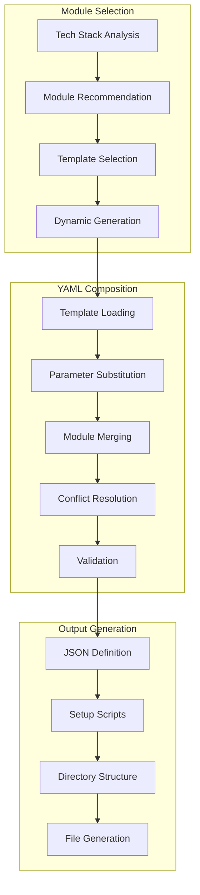

# Fullstack Starter Kit Generator (`generate-fullstack-starter-kit`)

## Overview

The Fullstack Starter Kit Generator creates complete, production-ready project scaffolds by intelligently composing YAML modules based on user requirements and tech stack preferences. It features dynamic template generation, comprehensive tech stack support, and automated project setup scripts for rapid development kickstart.

**Core Capabilities:**
- **Multi-Stack Support**: React, Vue, Angular, Node.js, Python, Go, and 20+ technology combinations
- **Dynamic YAML Module Generation**: Auto-generates missing templates using LLM when needed
- **Intelligent Composition**: Smart merging of modules with conflict resolution
- **Complete Project Setup**: Generates directory structure, dependencies, and setup scripts
- **Template Caching**: In-memory and persistent template caching for optimal performance
- **Cross-Platform Scripts**: Generates both Unix (.sh) and Windows (.bat) setup scripts
- **Integration Ready**: Works with other Vibe Coder tools for complete project planning

## Architecture

The Fullstack Starter Kit Generator implements a sophisticated module composition system:



## Configuration

### Claude Desktop MCP Client Setup

Add this configuration to your `claude_desktop_config.json` file:

```json
"vibe-coder-mcp": {
  "command": "node",
  "args": ["--max-old-space-size=4096", "/path/to/your/Vibe-Coder-MCP/build/index.js"],
  "cwd": "/path/to/your/Vibe-Coder-MCP",
  "transport": "stdio",
  "env": {
    "LLM_CONFIG_PATH": "/path/to/your/Vibe-Coder-MCP/llm_config.json",
    "LOG_LEVEL": "debug",
    "NODE_ENV": "production",
    "VIBE_CODER_OUTPUT_DIR": "/path/to/your/Vibe-Coder-MCP/VibeCoderOutput",
    "OPENROUTER_API_KEY": "your-openrouter-api-key"
  },
  "disabled": false,
  "autoApprove": [
    "generate-fullstack-starter-kit",
    "research",
    "generate-task-list",
    "get-job-result"
  ]
}
```

### Environment Variables

#### Core Configuration
- **`OPENROUTER_API_KEY`**: Required API key for research and dynamic template generation
- **`LLM_CONFIG_PATH`**: Path to LLM model configuration file
- **`VIBE_CODER_OUTPUT_DIR`**: Directory where starter kits are generated
- **`LOG_LEVEL`**: Logging verbosity for generation operations

#### Starter Kit-Specific Settings
- **`STARTER_KIT_TEMPLATE_CACHE_TTL`**: Template cache TTL in minutes (default: 60)
- **`STARTER_KIT_DYNAMIC_GENERATION`**: Enable dynamic template generation (default: true)
- **`STARTER_KIT_RESEARCH_ENABLED`**: Enable tech stack research (default: true)
- **`STARTER_KIT_MAX_MODULES`**: Maximum modules per kit (default: 10)

**Dynamic YAML Module Generation:**
If a specified YAML module template (e.g., `frontend/react-vite.yaml`) is not found in the `src/tools/fullstack-starter-kit-generator/templates/` directory, the system will attempt to dynamically generate it using an LLM. The generated module (in JSON format from LLM, then converted to YAML) will then be saved to the templates directory for future use and cached in memory for the current session.

## Inputs

This tool accepts the following parameters via the MCP call:

| Parameter                  | Type                                     | Description                                                                      | Required |
| -------------------------- | ---------------------------------------- | -------------------------------------------------------------------------------- | -------- |
| `use_case`                 | `string`                                 | The specific use case for the starter kit (e.g., 'E-commerce site')              | Yes      |
| `tech_stack_preferences`   | `Record<string, string \| undefined>`    | Optional tech stack preferences (e.g., { frontend: 'React', backend: 'Node.js', database: 'PostgreSQL' }) | No       |
| `request_recommendation`   | `boolean`                                | Whether to request LLM recommendations for tech stack components via research (influences module selection prompt) | No       |
| `include_optional_features`| `string[]`                               | Optional features to include (e.g., ['Docker', 'Authentication with JWT', 'Payment Processing'])       | No       |

## Outputs

*   **Primary Output (MCP Response):** A JSON string containing the job ID and an initial message. The actual result is retrieved asynchronously. The final job result is a formatted report summarizing the generated starter kit, including paths to the definition file and setup scripts.
*   **File Storage:** Artifacts are saved to the configured output directory (default: `VibeCoderOutput/`, override with `VIBE_CODER_OUTPUT_DIR` env var), under the `fullstack-starter-kit-generator` subdirectory:
    *   **JSON Definition:** `[output_dir]/fullstack-starter-kit-generator/[timestamp]-[sanitized-name]-definition.json`
        *   This JSON file contains the complete, assembled starter kit definition, composed from various YAML modules.
    *   **Shell Script:** `[output_dir]/fullstack-starter-kit-generator/[timestamp]-[sanitized-name]-setup.sh`
    *   **Batch Script:** `[output_dir]/fullstack-starter-kit-generator/[timestamp]-[sanitized-name]-setup.bat`
        *   These scripts are designed to unpack the accompanying JSON definition file to create the project.
    *   **Dynamically Generated YAML Templates:** Saved to `src/tools/fullstack-starter-kit-generator/templates/[category]/[template-name].yaml` if generated during the process.

## Asynchronous Execution

This tool executes asynchronously.
1.  An initial call returns a **Job ID** and a message indicating the job has started.
2.  The generation process, including research, LLM calls for module selection, YAML composition, dynamic template generation (if needed), and script creation, runs in the background.
3.  Use the `get-job-result` tool with the Job ID to retrieve the final outcome once the job status is `COMPLETED` or `FAILED`. Progress can be monitored via SSE if a `sessionId` is provided.

## Workflow

1.  **Input Validation & Job Creation:** Validates inputs and creates a background job, returning the Job ID.
2.  **Enhanced Research (Optional):** If `request_recommendation` is true, performs comprehensive research using 3 parallel queries:
    - **Technology & Architecture**: Current tech stack recommendations, best practices, architecture patterns, latest versions, performance considerations, and scalability factors
    - **Features & Requirements**: Essential features, user experience patterns, security requirements, integration capabilities, accessibility standards, and compliance requirements
    - **Development & Deployment**: Development workflows, deployment strategies, testing approaches, DevOps practices, CI/CD recommendations, monitoring solutions, and production readiness considerations

    This enhanced research approach aligns with the research manager's `maxConcurrentRequests: 3` limit and provides 5x more comprehensive context than the previous 2-query approach. The research context is then passed to the module selection LLM.

3.  **Schema Unification & Dynamic Types (Phase 2):** Enhanced schema validation system supporting complex project structures:
    - **Enhanced Module Selection Schema**: Supports up to 15 modules (vs 10 previously) with module type classification for complex projects like AI platforms and enterprise e-commerce
    - **Unified Template Schema**: Comprehensive schema for dynamic template generation with research-enhanced context, supporting flexible module types beyond the original 5 categories
    - **Backward Compatibility**: All existing schemas remain functional with new enhanced schemas as additive extensions
    - **Complex Scenario Support**: Validated against real-world scenarios including AI-powered coding platforms and enterprise e-commerce systems

4.  **Research-Enhanced Template Generation (Phase 3):** Dynamic template generation with research context integration:
    - **Research Context Integration**: Template generation prompts now include comprehensive research context for informed technology decisions
    - **Schema-Aware Generation**: Primary template generation uses schema-aware LLM calls with automatic retry logic and validation
    - **Intelligent Fallback**: Automatic fallback to existing template generation methods when schema-aware generation fails
    - **Research-Driven Decisions**: Generated templates incorporate latest best practices, recommended technologies, and architectural patterns from research
    - **Enhanced Prompts**: Template generation prompts include research findings on technology choices, features, and deployment strategies

5.  **Research-Enhanced Module Selection (Phase 4):** Intelligent module selection with research-driven decision making:
    - **Research-Driven Guidelines**: Module selection prompts include comprehensive research-driven guidelines for technology choices, architecture patterns, and feature requirements
    - **Adaptive Schema Selection**: Automatically selects enhanced schema (up to 15 modules) for complex projects based on use case analysis, research context, and tech stack complexity
    - **Project Complexity Analysis**: Intelligent analysis of project complexity using keyword detection, research context evaluation, and tech stack assessment
    - **Enhanced Module Selection Schema**: Support for complex projects with module type classification and increased module limits
    - **Comprehensive Validation**: Dual validation system supporting both standard and enhanced schemas with detailed error reporting

6.  **Enhanced Template Preprocessing & Error Recovery:** Robust preprocessing system for handling LLM format variations:
    - **SetupCommands Format Correction**: Automatically converts string setupCommands to required object format `{command: string, context?: string}`
    - **Enhanced Prompt Engineering**: Improved prompts with explicit format requirements, validation checklists, and negative examples
    - **Intelligent Error Recovery**: Multi-layered preprocessing with format detection, automatic conversion, and comprehensive logging
    - **Schema Validation Helpers**: Dedicated validation functions with detailed error context and debugging information
    - **Backward Compatibility**: All preprocessing is additive - valid templates remain unchanged while invalid formats are automatically corrected
3.  **YAML Module Selection (LLM):**
    *   An LLM is prompted with the user's request, preferences, optional features, and any research context.
    *   The LLM is expected to return a JSON object specifying:
        *   `globalParams`: Project-wide parameters (e.g., `projectName`, `projectDescription`, `frontendPath`, `backendPath`, `backendPort`, `frontendPort`).
        *   `moduleSelections`: An array of objects, each defining a YAML module to use (e.g., `{ modulePath: "frontend/react-vite", moduleKey: "frontendPath", params: { /* module-specific overrides */ } }`). `modulePath` refers to a path within the `templates` directory (e.g., `frontend/react-vite` for `frontend/react-vite.yaml`).
4.  **YAML Composition (`YAMLComposer`):**
    *   The `YAMLComposer` class takes the `globalParams` and `moduleSelections` from the LLM.
    *   For each selected module:
        *   It first checks an in-memory cache.
        *   If not cached, it attempts to load the corresponding `.yaml` file from `src/tools/fullstack-starter-kit-generator/templates/`.
        *   **Dynamic Generation:** If the YAML file does not exist, `YAMLComposer` instructs an LLM to generate the content for that module (as a JSON object conforming to `ParsedYamlModule` schema). This JSON is then validated against `parsedYamlModuleSchema`, converted to YAML, saved as a new `.yaml` file in the `templates` directory for future use, and cached.
        *   The loaded or dynamically generated YAML module content is parsed.
    *   Placeholders (e.g., `{projectName}`, `{backendPort}`) within each module's content (file content, dependency paths, setup command contexts) are substituted using the effective parameters (global + module-specific).
    *   The `techStack`, `directoryStructure`, `dependencies`, and `setupCommands` from all chosen and processed modules are intelligently merged into a single, comprehensive `StarterKitDefinition` object. This includes merging file structures under appropriate paths (e.g., `client/`, `server/`, or project root based on the `moduleKey` and `globalParams` like `frontendPath`).
5.  **Final JSON Validation:** The fully composed `StarterKitDefinition` is validated against its Zod schema (`starterKitDefinitionSchema` in `schema.ts`).
6.  **Artifact Generation:**
    *   The validated `StarterKitDefinition` is saved as a `[timestamp]-[sanitized-name]-definition.json` file.
    *   `setup.sh` (for Linux/macOS) and `setup.bat` (for Windows) scripts are generated. These scripts are designed to be run in an empty directory *alongside* the `definition.json` file. They read this JSON file to:
        *   Create the project directory structure.
        *   Generate all necessary files with content (or handle file generation prompts if specified in YAML, though current composer primarily handles direct content).
        *   Install dependencies (e.g., `npm install` in specified subdirectories or root).
        *   Run setup commands as defined in the YAML modules.
7.  **Job Completion:** The background job is marked as `COMPLETED`, and the final result (a summary report with paths to the generated files) is stored. If any step fails, the job is marked `FAILED` with error details.

### YAML Templates (`src/tools/fullstack-starter-kit-generator/templates/`)

Modular components (e.g., frontend frameworks, backend services, database configurations, authentication scaffolds, utility functions) are defined in YAML files. These files are organized into categories (subdirectories like `frontend`, `backend`). If a selected template is missing, it will be dynamically generated and saved here.

Each YAML file (or dynamically generated module structure) should typically specify:
*   `moduleName`: A unique name for the module (e.g., `react-vite-frontend`).
*   `description`: A brief description of the module.
*   `type`: The category of the module (e.g., `frontend`, `backend`, `database`, `auth`, `utility`).
*   `placeholders`: An optional list of placeholder keys (e.g., `projectName`, `backendPort`) that are expected to be substituted in its content.
*   `provides`: An object containing the contributions of this module:
    *   `techStack`: An object where keys are unique identifiers for tech stack components (e.g., `frontendFramework`, `backendLanguage`) and values are objects with `name`, optional `version`, and `rationale`.
    *   `directoryStructure`: An array of `FileStructureItem` objects (defined in `schema.ts`) defining files and directories. Paths are relative to the module's assumed root (e.g., `src/index.js`). The `YAMLComposer` will place these items under the correct parent directory (e.g., `client/`, `server/`, or project root) based on the `moduleKey` and `globalParams` like `frontendPath`. File content can be directly included. `FileStructureItem` includes `path`, `type` ('file' or 'directory'), `content` (string or null), `generationPrompt` (string or null, for LLM-based file content generation, though current focus is on direct content), and `children` (array of `FileStructureItem` for directories).
    *   `dependencies`: An object defining package dependencies (e.g., for `npm`). Keys for dependency groups can use placeholders like `"{frontendPath}"` or be `"root"`. Example: `npm: { "{frontendPath}": { dependencies: { "react": "^18.0.0" } } }`.
    *   `setupCommands`: An array of objects, each with a `command` string and an optional `context` string (which can use placeholders like `"{backendPath}"`) indicating where the command should be run. Example: `{ context: "{backendPath}", command: "npm run build" }`.

### Script Usage Change

The generated `setup.sh` and `setup.bat` scripts **require** the corresponding `[timestamp]-[sanitized-name]-definition.json` file to be present in the **same directory** from which they are run. The scripts parse this JSON file to perform all setup tasks, including directory creation, file generation, dependency installation, and running commands.

*   **Bash scripts (`.sh`)** will attempt to use `jq` for parsing the JSON definition. It's recommended to have `jq` installed for robust parsing.
*   **Batch scripts (`.bat`)** will attempt to use PowerShell for parsing the JSON definition.

## Error Handling

*   Validates user inputs and parameters passed to the LLM.
*   Manages errors during research queries.
*   Handles failures in LLM calls for module selection and dynamic YAML generation (e.g., API errors, malformed JSON responses, schema validation failures of LLM output against `parsedYamlModuleSchema`).
*   Catches errors during YAML file loading (e.g., file not found if dynamic generation is also disabled or fails), parsing (invalid YAML syntax), and composition (e.g., placeholder resolution issues, schema validation failures of loaded YAML against `parsedYamlModuleSchema`).
*   Ensures that failures in any step of the background job (including validation of the final composed `StarterKitDefinition` against `starterKitDefinitionSchema`) are caught, logged, and result in the job status being set to `FAILED` with appropriate error details in the job result.