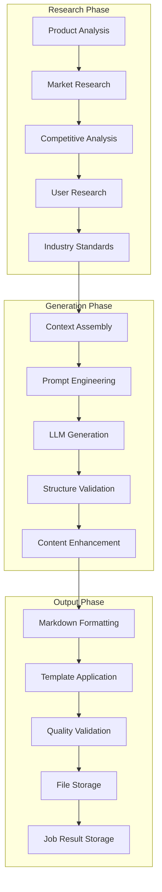
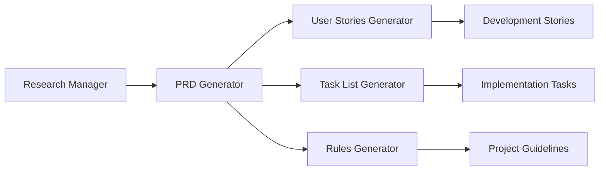

# PRD Generator (`generate-prd`)

## Overview

The PRD Generator creates comprehensive Product Requirements Documents (PRDs) by combining AI-powered analysis with real-world research data. It integrates with the Research Manager to gather market intelligence and competitive insights, producing industry-standard PRDs that inform product development decisions.

**Core Capabilities:**
- **Research-Enhanced Generation**: Integrates with Research Manager for market analysis and competitive landscape
- **Multi-Phase Workflow**: Research → Analysis → Generation → Formatting pipeline
- **Comprehensive Structure**: Industry-standard PRD sections with best practices
- **Asynchronous Processing**: Job-based execution with real-time status tracking
- **Template System**: Configurable PRD templates for different product types
- **Integration Ready**: Seamlessly works with User Stories Generator and Task List Generator
- **Error Resilience**: Graceful handling of research failures with intelligent fallbacks

## Architecture

The PRD Generator implements a sophisticated multi-phase generation pipeline:



## Configuration

### Claude Desktop MCP Client Setup

Add this configuration to your `claude_desktop_config.json` file:

```json
"vibe-coder-mcp": {
  "command": "node",
  "args": ["--max-old-space-size=4096", "/path/to/your/Vibe-Coder-MCP/build/index.js"],
  "cwd": "/path/to/your/Vibe-Coder-MCP",
  "transport": "stdio",
  "env": {
    "LLM_CONFIG_PATH": "/path/to/your/Vibe-Coder-MCP/llm_config.json",
    "LOG_LEVEL": "debug",
    "NODE_ENV": "production",
    "VIBE_CODER_OUTPUT_DIR": "/path/to/your/Vibe-Coder-MCP/VibeCoderOutput",
    "OPENROUTER_API_KEY": "your-openrouter-api-key"
  },
  "disabled": false,
  "autoApprove": [
    "generate-prd",
    "research",
    "generate-user-stories",
    "generate-task-list",
    "get-job-result"
  ]
}
```

### Environment Variables

#### Core Configuration
- **`OPENROUTER_API_KEY`**: Required API key for research integration via OpenRouter
- **`LLM_CONFIG_PATH`**: Path to LLM model configuration file for PRD generation
- **`VIBE_CODER_OUTPUT_DIR`**: Directory where PRD documents are saved
- **`LOG_LEVEL`**: Logging verbosity for PRD generation operations

#### PRD-Specific Settings
- **`PRD_RESEARCH_ENABLED`**: Enable/disable research integration (default: true)
- **`PRD_TEMPLATE_TYPE`**: Default PRD template type (default: 'standard')
- **`PRD_GENERATION_TIMEOUT_MS`**: Generation timeout in milliseconds (default: 60000)
- **`PRD_RESEARCH_DEPTH`**: Research depth level: 'basic', 'standard', 'comprehensive' (default: 'standard')

### LLM Configuration

The PRD Generator uses models defined in `llm_config.json`:

```json
{
  "llm_mapping": {
    "prd_research": "perplexity/sonar-deep-research",
    "prd_generation": "google/gemini-2.5-flash-preview",
    "prd_enhancement": "google/gemini-2.5-flash-preview"
  }
}
```

## Inputs

This tool accepts the following parameters via the MCP call:

| Parameter             | Type        | Description                                     | Required |
| --------------------- | ----------- | ----------------------------------------------- | -------- |
| `productDescription`  | `string`    | Description of the product to create a PRD for  | Yes      |

*(Based on the Zod schema defined in `src/server.ts`)*

## Outputs

* **Primary Output:** A comprehensive Product Requirements Document (PRD) in Markdown format.
* **File Storage:** The generated artifact is saved for historical purposes to the configured output directory (default: `workflow-agent-files/`, override with `VIBE_CODER_OUTPUT_DIR` env var):
  `[output_dir]/prd-generator/[timestamp]-[sanitized-name]-prd.md`
* **MCP Response:** The generated content is returned as text content within the MCP `CallToolResult`.

## Asynchronous Execution

This tool executes asynchronously due to the time required for research and LLM generation.
1.  When you call this tool, it will immediately return a **Job ID**.
2.  The PRD generation process runs in the background.
3.  Use the `get-job-result` tool with the received Job ID to retrieve the final PRD content once the job is complete.

## Workflow

When invoked, this tool performs the following steps:

1. **Input Validation:** The incoming product description parameter is validated.
2. **Research Phase (Pre-Generation):**
   * Formulates three specific queries based on the product description:
     * Market analysis and competitive landscape
     * User needs, demographics, and expectations
     * Industry standards, best practices, and common feature sets
   * Executes these queries in parallel using the configured Perplexity model (`perplexity/sonar-deep-research` via `performResearchQuery`).
   * Aggregates the research results into a structured context block.
3. **Prompt Assembly:** Combines the original product description and the gathered research context into a comprehensive prompt for the main generation model.
4. **Generation Phase:**
   * Calls the `performDirectLlmCall` utility (`src/utils/llmHelper.ts`) with the assembled prompt and the PRD-specific system prompt (`PRD_SYSTEM_PROMPT`).
   * This directly uses the configured LLM (e.g., Gemini) to generate the PRD content as Markdown.
5. **Output Processing & Saving:**
   * Formats the generated Markdown PRD with a title header and timestamp.
   * Saves the PRD document to the `workflow-agent-files/prd-generator/` directory.
6. **Response:** Returns the formatted PRD content via the MCP protocol.

### Workflow Diagram (Mermaid)

```mermaid
flowchart TD
    A[Start Tool: generate-prd] --> B{Input Params Valid?};
    B -- No --> BN[Return Error Response];
    B -- Yes --> C[1. Formulate Research Queries];
    C --> D[2. Call performResearchQuery (Perplexity)];
    D --> E[3. Assemble Main Prompt (Inputs + Research Context)];
    E --> F[4. Call performDirectLlmCall (e.g., Gemini + System Prompt)];
    F --> G[5. Format PRD Document];
    G --> H[6. Save PRD to Output Directory];
    H --> I[7. Return Success Response via MCP];

    D -- Error --> DE[Log Research Error, Continue w/o Context];
    DE --> E;
    F -- Error --> FE[Log Generation Error, Return Error Response];
    H -- Error --> HE[Log Save Error, Continue to Response];
```

## Usage Example

From an MCP client (like Claude Desktop):

```
Create a PRD for a mobile app that helps users track their daily water intake, send reminders, and visualize their hydration progress over time.
```

## System Prompt

The core generation logic uses `performDirectLlmCall` guided by the following system prompt (defined in `index.ts`):

```markdown
# PRD Generator System Prompt Snippet
You are an AI assistant expert at generating comprehensive Product Requirements Documents (PRDs).
Based on the provided product description and research context, generate a detailed PRD.

**Using Research Context:**
* Carefully consider the **Pre-Generation Research Context** (provided by Perplexity) included in the main task prompt.
* Use this research information to inform your output, ensuring it reflects current market trends, user expectations, and industry standards.
* Incorporate relevant insights from the research while keeping the focus on the primary product description.

**PRD Structure:** Include standard sections like:
1.  **Introduction/Overview:** Purpose, Goals (if inferrable).
2.  **Target Audience:** Describe likely users, informed by the research on user demographics.
...
```

## Error Handling

* Handles invalid input parameters.
* Attempts to gracefully handle failures during the research phase (logs errors, proceeds without research context).
* Reports errors during the main generation phase.
* Handles potential errors during file saving (typically logs warning and proceeds).
* Returns specific error messages via MCP response when failures occur.

## Integration

### Tool Ecosystem Integration

The PRD Generator integrates seamlessly with other Vibe Coder tools:



**Integration Benefits:**
- **Research Manager**: Provides market research and competitive analysis for informed PRDs
- **User Stories Generator**: Uses PRD requirements to generate detailed user stories
- **Task List Generator**: Converts PRD features into actionable development tasks
- **Rules Generator**: Creates project rules based on PRD constraints and requirements
- **Workflow Runner**: Can be part of automated product planning workflows

### Research Integration Workflow

The PRD Generator automatically integrates with research capabilities:

1. **Market Analysis**: Researches competitive landscape and market positioning
2. **User Research**: Investigates target audience needs and behaviors
3. **Technical Research**: Explores industry standards and best practices
4. **Feature Research**: Analyzes common feature sets and user expectations

## Performance

### Current Metrics

| Metric | Target | Current Performance |
|--------|--------|-------------------|
| Research Phase | <15s | ~10-12s average |
| Generation Phase | <10s | ~6-8s average |
| Total Processing | <25s | ~16-20s average |
| Document Formatting | <2s | ~1-2s average |
| File Save Operation | <500ms | ~200-300ms average |

### Optimization Features

- **Parallel Research**: Multiple research queries executed concurrently
- **Template Caching**: PRD templates cached for faster generation
- **Content Streaming**: Large PRDs streamed for memory efficiency
- **Research Caching**: Research results cached to avoid duplicate API calls
- **Intelligent Fallbacks**: Graceful degradation when research fails

## PRD Template System

### Standard PRD Structure

```markdown
# Product Requirements Document: [Product Name]

**Generated:** [Timestamp]
**Product:** [Product Description]

## 1. Executive Summary
[High-level product overview and value proposition]

## 2. Product Overview
### 2.1 Product Vision
### 2.2 Product Goals
### 2.3 Success Metrics

## 3. Market Analysis
### 3.1 Market Opportunity
### 3.2 Competitive Landscape
### 3.3 Market Positioning

## 4. Target Audience
### 4.1 Primary Users
### 4.2 User Personas
### 4.3 User Journey

## 5. Product Features
### 5.1 Core Features
### 5.2 Secondary Features
### 5.3 Future Features

## 6. Technical Requirements
### 6.1 Platform Requirements
### 6.2 Performance Requirements
### 6.3 Security Requirements

## 7. User Experience
### 7.1 Design Principles
### 7.2 User Interface Guidelines
### 7.3 Accessibility Requirements

## 8. Business Requirements
### 8.1 Revenue Model
### 8.2 Business Metrics
### 8.3 Compliance Requirements

## 9. Implementation Plan
### 9.1 Development Phases
### 9.2 Timeline
### 9.3 Resource Requirements

## 10. Risk Assessment
### 10.1 Technical Risks
### 10.2 Market Risks
### 10.3 Mitigation Strategies
```

### Template Types

#### Standard Template
- **Use Case**: General products and applications
- **Sections**: All standard PRD sections
- **Research Depth**: Comprehensive market and user research

#### Mobile App Template
- **Use Case**: Mobile applications (iOS/Android)
- **Sections**: Mobile-specific requirements, app store considerations
- **Research Depth**: Mobile market trends, app ecosystem analysis

#### SaaS Template
- **Use Case**: Software-as-a-Service products
- **Sections**: Subscription models, scalability requirements
- **Research Depth**: SaaS market analysis, pricing strategies

#### Enterprise Template
- **Use Case**: Enterprise software solutions
- **Sections**: Enterprise requirements, compliance, security
- **Research Depth**: Enterprise market needs, B2B considerations

## Output Structure

### File Storage Structure

```
VibeCoderOutput/prd-generator/
├── 20240115-120000-water-tracker-app-prd.md
├── 20240115-130000-task-management-saas-prd.md
├── 20240115-140000-enterprise-crm-prd.md
└── templates/
    ├── standard-template.md
    ├── mobile-app-template.md
    ├── saas-template.md
    └── enterprise-template.md
```

### PRD Quality Metrics

Each generated PRD includes quality metrics:

```json
{
  "prdMetrics": {
    "completeness": 0.95,
    "researchIntegration": 0.88,
    "structuralCompliance": 1.0,
    "contentDepth": 0.92,
    "marketRelevance": 0.89
  },
  "sections": {
    "executiveSummary": "complete",
    "marketAnalysis": "research-enhanced",
    "targetAudience": "research-enhanced",
    "productFeatures": "comprehensive",
    "technicalRequirements": "detailed"
  }
}
```

## Troubleshooting

### Common Issues

#### "Research integration failed"
**Cause**: OpenRouter API key missing or research service unavailable
**Solution**: Verify API configuration and enable fallback mode

```bash
# Check API key configuration
grep OPENROUTER_API_KEY .env

# Enable fallback mode in environment
PRD_RESEARCH_ENABLED=false
```

#### "PRD generation timeout"
**Cause**: Generation taking longer than configured timeout
**Solution**: Increase timeout or simplify product description

```json
// In environment variables
"PRD_GENERATION_TIMEOUT_MS": "120000"  // Increase to 2 minutes
```

#### "Template not found"
**Cause**: Specified PRD template type not available
**Solution**: Use standard template or check template configuration

```json
// Use standard template
"PRD_TEMPLATE_TYPE": "standard"

// Available templates: standard, mobile-app, saas, enterprise
```

### Performance Optimization

#### For Faster Generation
- Use basic research depth for simple products
- Disable research integration for internal tools
- Use cached templates for similar products
- Simplify product descriptions to reduce processing time

#### For Better Quality
- Enable comprehensive research depth
- Provide detailed product descriptions
- Use appropriate template types for product category
- Include specific requirements and constraints

## Advanced Features

### Custom PRD Templates
Create custom templates for specific product types:

```markdown
# Custom Template: [Template Name]

## Template Configuration
- **Product Type**: [Specific product category]
- **Industry**: [Target industry]
- **Complexity**: [Simple/Standard/Complex]

## Custom Sections
[Define custom sections specific to product type]

## Research Focus Areas
[Specify research areas relevant to template]
```

### Research Customization
Configure research depth and focus areas:

```json
{
  "researchConfig": {
    "depth": "comprehensive",
    "focusAreas": [
      "market_analysis",
      "competitive_landscape",
      "user_research",
      "technical_standards"
    ],
    "industrySpecific": true,
    "includeMetrics": true
  }
}
```

### PRD Validation
Automated validation ensures PRD quality:

- **Completeness Check**: Validates all required sections are present
- **Content Quality**: Assesses depth and relevance of content
- **Research Integration**: Verifies research findings are incorporated
- **Structure Compliance**: Ensures proper PRD structure and formatting
- **Business Alignment**: Checks alignment with business objectives

### Integration Patterns
Advanced integration with development workflows:

- **Automated Workflows**: Trigger user story and task generation from PRDs
- **Version Control**: Track PRD changes and evolution over time
- **Stakeholder Review**: Generate review-ready PRDs with approval workflows
- **Metrics Tracking**: Monitor PRD effectiveness and implementation success

### Multi-Language Support
Generate PRDs in multiple languages:

- **Localization**: Adapt PRDs for different markets and regions
- **Cultural Adaptation**: Adjust content for cultural preferences
- **Regulatory Compliance**: Include region-specific compliance requirements
- **Market-Specific Research**: Conduct research relevant to target markets
```
