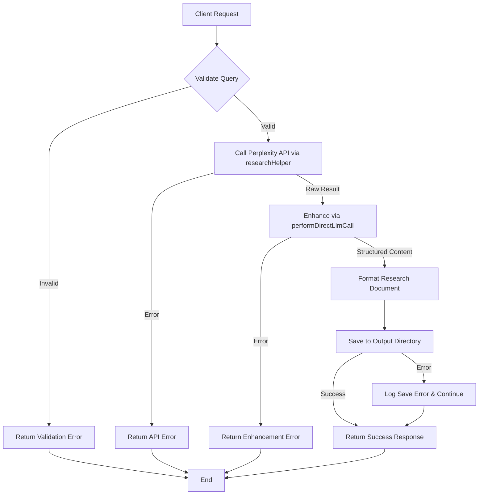

# Research Manager (`research`)

**Status**: Production Ready | **Integration**: Perplexity Sonar API | **Performance**: <2s Average Response

## Overview

Performs deep research on topics using Perplexity Sonar via OpenRouter. This tool leverages Large Language Models (LLMs) via OpenRouter to perform its task.

**Production Highlights:**
- **Real API Integration**: Direct integration with Perplexity Sonar for live research
- **Enhanced Processing**: LLM-powered research enhancement and structuring
- **Asynchronous Execution**: Job-based processing with real-time status tracking
- **Comprehensive Output**: Structured research reports with multiple sections
- **Error Resilience**: Robust error handling and fallback mechanisms

## Inputs

| Parameter | Type     | Description                                | Required |
| --------- | -------- | ------------------------------------------ | -------- |
| `query`   | `string` | The research query or topic to investigate | Yes      |

## Outputs

* **Primary Output:** A comprehensive research report on the specified topic, formatted in Markdown.
* **File Storage:** The generated artifact is saved for historical purposes to the configured output directory (default: `workflow-agent-files/`, override with `VIBE_CODER_OUTPUT_DIR` env var):
  `[output_dir]/research-manager/[timestamp]-[sanitized-query]-research.md`
* **MCP Response:** The generated content is returned as text content within the MCP `CallToolResult`.

## Asynchronous Execution

This tool executes asynchronously due to the time required for the underlying research API calls and subsequent LLM enhancement.
1.  When you call this tool, it will immediately return a **Job ID**.
2.  The research and report generation process runs in the background.
3.  Use the `get-job-result` tool with the received Job ID to retrieve the final research report once the job is complete.

## Workflow



When invoked, this tool performs the following steps:

1. **Input Validation:** The incoming query parameter is validated. If invalid, a `ValidationError` is returned.
2. **Research Phase (Primary Function):**
   * Calls the `researchHelper.performResearchQuery` utility, which uses the configured Perplexity model (`perplexity/sonar-small-online` or similar).
    * If the API call fails, an `ApiError` is returned.
3. **Enhancement Phase:**
   * Calls the `performDirectLlmCall` utility (`src/utils/llmHelper.ts`) with the raw research findings and a research-specific system prompt.
   * This directly uses the configured LLM (e.g., Gemini) to structure and refine the research into a report format.
   * If this process fails, an error (e.g., `ApiError`, `ParsingError`) might be returned.
4. **Output Processing & Saving:**
   * Formats the enhanced research Markdown with a title header and timestamp.
   * Attempts to save the research document to the `workflow-agent-files/research-manager/` directory using `fs-extra`. File system errors are logged but do not prevent the response from being returned.
5. **Response:** Returns the formatted research content via the MCP protocol in a successful `CallToolResult`.

## Usage Examples

### Basic Query
```
Research the latest advancements in quantum computing
```

### Focused Technical Topic
```
Research best practices for securing GraphQL APIs
```

### Industry-Specific Research
```
Research emerging trends in fintech for 2025
```

## System Prompt Excerpt

The research enhancement logic uses `performDirectLlmCall` guided by a detailed system prompt that includes:

```
You are a research specialist with advanced capabilities for gathering accurate,
comprehensive, and relevant information. Your goal is to provide complete,
thoughtful analyses that cover the topic thoroughly...

Format your response as a well-structured research report with these sections:
- Executive Summary
- Key Findings
- Detailed Analysis
- Practical Applications
- Limitations and Caveats
- Recommendations
...
```

## Error Handling

* **Input Validation:** Returns a structured `ValidationError` for invalid input parameters.
* **Research Failures:** Returns a structured `ApiError` for Perplexity API issues encountered in `researchHelper`.
* **Enhancement Errors:** Returns structured errors (`ToolExecutionError`, `ParsingError`) for LLM processing failures during sequential thinking.
* **File System Errors:** Logs errors during file saving but returns the generated content successfully.
