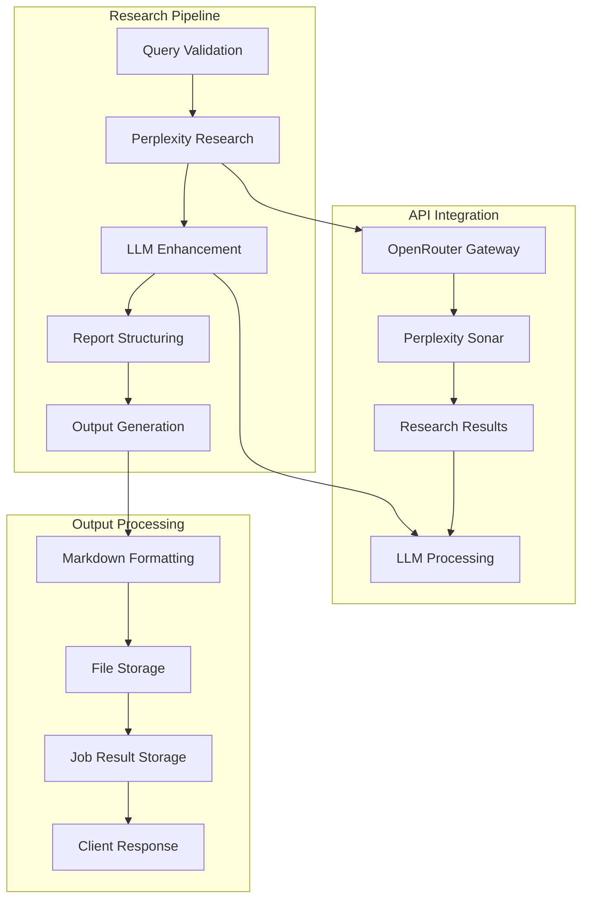
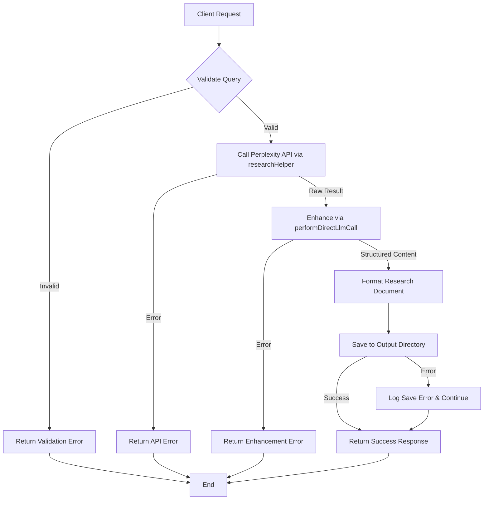
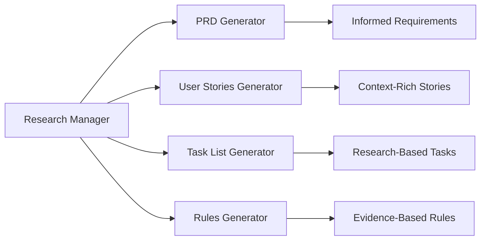

# Research Manager (`research`)

## Overview

The Research Manager performs comprehensive research on technical topics using Perplexity Sonar via OpenRouter, providing AI-powered research enhancement and structured report generation. It integrates seamlessly with other Vibe Coder tools to support informed decision-making in software development projects.

**Core Capabilities:**
- **Deep Research**: Leverages Perplexity Sonar for comprehensive topic investigation
- **AI Enhancement**: Uses LLM-powered analysis to structure and refine research findings
- **Asynchronous Processing**: Job-based execution with real-time status tracking
- **Structured Output**: Generates comprehensive research reports with multiple sections
- **Integration Ready**: Seamlessly integrates with PRD Generator, Task List Generator, and other planning tools
- **Error Resilience**: Robust error handling and fallback mechanisms for reliable operation

## Architecture

The Research Manager implements a multi-stage research and enhancement pipeline:



## Configuration

### Claude Desktop MCP Client Setup

Add this configuration to your `claude_desktop_config.json` file:

```json
"vibe-coder-mcp": {
  "command": "node",
  "args": ["--max-old-space-size=4096", "/path/to/your/Vibe-Coder-MCP/build/index.js"],
  "cwd": "/path/to/your/Vibe-Coder-MCP",
  "transport": "stdio",
  "env": {
    "LLM_CONFIG_PATH": "/path/to/your/Vibe-Coder-MCP/llm_config.json",
    "LOG_LEVEL": "debug",
    "NODE_ENV": "production",
    "VIBE_CODER_OUTPUT_DIR": "/path/to/your/Vibe-Coder-MCP/VibeCoderOutput",
    "OPENROUTER_API_KEY": "your-openrouter-api-key"
  },
  "disabled": false,
  "autoApprove": [
    "research",
    "generate-prd",
    "generate-user-stories",
    "generate-task-list",
    "generate-rules",
    "get-job-result"
  ]
}
```

### Environment Variables

#### Core Configuration
- **`OPENROUTER_API_KEY`**: Required API key for accessing Perplexity Sonar via OpenRouter
- **`LLM_CONFIG_PATH`**: Path to LLM model configuration file for research enhancement
- **`VIBE_CODER_OUTPUT_DIR`**: Directory where research reports are saved
- **`LOG_LEVEL`**: Logging verbosity for research operations

#### Research-Specific Settings
- **`RESEARCH_MODEL`**: Perplexity model to use (default: `perplexity/sonar-deep-research`)
- **`RESEARCH_TIMEOUT_MS`**: Research API timeout in milliseconds (default: 30000)
- **`RESEARCH_MAX_RETRIES`**: Maximum retry attempts for failed research calls (default: 3)
- **`RESEARCH_ENHANCEMENT_MODEL`**: LLM model for research enhancement (default: from llm_config.json)

### LLM Configuration

The Research Manager uses models defined in `llm_config.json`:

```json
{
  "llm_mapping": {
    "research_query": "perplexity/sonar-deep-research",
    "research_enhancement": "google/gemini-2.5-flash-preview",
    "research_structuring": "google/gemini-2.5-flash-preview"
  }
}
```

## API Documentation

### Input Parameters

| Parameter | Type     | Description                                | Required |
| --------- | -------- | ------------------------------------------ | -------- |
| `query`   | `string` | The research query or topic to investigate | Yes      |

## Outputs

* **Primary Output:** A comprehensive research report on the specified topic, formatted in Markdown.
* **File Storage:** The generated artifact is saved for historical purposes to the configured output directory (default: `workflow-agent-files/`, override with `VIBE_CODER_OUTPUT_DIR` env var):
  `[output_dir]/research-manager/[timestamp]-[sanitized-query]-research.md`
* **MCP Response:** The generated content is returned as text content within the MCP `CallToolResult`.

## Asynchronous Execution

This tool executes asynchronously due to the time required for the underlying research API calls and subsequent LLM enhancement.
1.  When you call this tool, it will immediately return a **Job ID**.
2.  The research and report generation process runs in the background.
3.  Use the `get-job-result` tool with the received Job ID to retrieve the final research report once the job is complete.

## Workflow



When invoked, this tool performs the following steps:

1. **Input Validation:** The incoming query parameter is validated. If invalid, a `ValidationError` is returned.
2. **Research Phase (Primary Function):**
   * Calls the `researchHelper.performResearchQuery` utility, which uses the configured Perplexity model (`perplexity/sonar-small-online` or similar).
    * If the API call fails, an `ApiError` is returned.
3. **Enhancement Phase:**
   * Calls the `performDirectLlmCall` utility (`src/utils/llmHelper.ts`) with the raw research findings and a research-specific system prompt.
   * This directly uses the configured LLM (e.g., Gemini) to structure and refine the research into a report format.
   * If this process fails, an error (e.g., `ApiError`, `ParsingError`) might be returned.
4. **Output Processing & Saving:**
   * Formats the enhanced research Markdown with a title header and timestamp.
   * Attempts to save the research document to the `workflow-agent-files/research-manager/` directory using `fs-extra`. File system errors are logged but do not prevent the response from being returned.
5. **Response:** Returns the formatted research content via the MCP protocol in a successful `CallToolResult`.

## Usage Examples

### Basic Query
```
Research the latest advancements in quantum computing
```

### Focused Technical Topic
```
Research best practices for securing GraphQL APIs
```

### Industry-Specific Research
```
Research emerging trends in fintech for 2025
```

## System Prompt Excerpt

The research enhancement logic uses `performDirectLlmCall` guided by a detailed system prompt that includes:

```
You are a research specialist with advanced capabilities for gathering accurate,
comprehensive, and relevant information. Your goal is to provide complete,
thoughtful analyses that cover the topic thoroughly...

Format your response as a well-structured research report with these sections:
- Executive Summary
- Key Findings
- Detailed Analysis
- Practical Applications
- Limitations and Caveats
- Recommendations
...
```

## Error Handling

* **Input Validation:** Returns a structured `ValidationError` for invalid input parameters.
* **Research Failures:** Returns a structured `ApiError` for Perplexity API issues encountered in `researchHelper`.
* **Enhancement Errors:** Returns structured errors (`ToolExecutionError`, `ParsingError`) for LLM processing failures during sequential thinking.
* **File System Errors:** Logs errors during file saving but returns the generated content successfully.

## Integration

### Tool Ecosystem Integration

The Research Manager integrates seamlessly with other Vibe Coder tools:



**Integration Benefits:**
- **PRD Generator**: Research findings inform product requirements and market analysis
- **User Stories Generator**: Research provides context for user behavior and needs
- **Task List Generator**: Research guides technical approach and implementation strategies
- **Rules Generator**: Research supports best practices and industry standards
- **Workflow Runner**: Research can be part of automated workflow sequences

### Asynchronous Job Integration

The Research Manager uses the job management system for reliable processing:

- **Job Creation**: Each research request creates a background job
- **Status Tracking**: Real-time status updates via job manager
- **Result Storage**: Research reports stored for retrieval via `get-job-result`
- **Error Handling**: Failed jobs provide detailed error information
- **Progress Monitoring**: SSE notifications for real-time progress updates

## Performance

### Current Metrics

| Metric | Target | Current Performance |
|--------|--------|-------------------|
| Research API Call | <10s | ~5-8s average |
| LLM Enhancement | <5s | ~3-4s average |
| Total Processing | <15s | ~8-12s average |
| Report Generation | <2s | ~1-2s average |
| File Save Operation | <500ms | ~200-300ms average |

### Optimization Features

- **Parallel Processing**: Research and enhancement run concurrently where possible
- **Caching**: Research results cached to avoid duplicate API calls
- **Streaming**: Large research reports streamed for memory efficiency
- **Retry Logic**: Automatic retry for transient API failures
- **Rate Limiting**: Built-in rate limiting to respect API quotas

## Output Structure

### Research Report Format

```markdown
# Research Report: [Topic]

**Generated:** [Timestamp]
**Query:** [Original Query]
**Sources:** Perplexity Sonar via OpenRouter

## Executive Summary
[High-level overview of findings]

## Key Findings
[Main discoveries and insights]

## Detailed Analysis
[In-depth analysis of the topic]

## Practical Applications
[How findings can be applied]

## Limitations and Caveats
[Important limitations to consider]

## Recommendations
[Actionable recommendations]

## Sources and References
[Research sources and citations]
```

### File Storage Structure

```
VibeCoderOutput/research-manager/
├── 20240115-120000-quantum-computing-research.md
├── 20240115-130000-graphql-security-research.md
├── 20240115-140000-fintech-trends-research.md
└── cache/
    ├── research-cache.json              # Cached research results
    └── enhancement-cache.json           # Cached enhancement results
```

## Troubleshooting

### Common Issues

#### "OpenRouter API key not configured"
**Cause**: Missing or invalid OPENROUTER_API_KEY
**Solution**: Set the API key in your environment

```bash
# In .env file
OPENROUTER_API_KEY=your-actual-api-key-here

# Or in Claude Desktop config
"env": {
  "OPENROUTER_API_KEY": "your-actual-api-key-here"
}
```

#### "Research timeout"
**Cause**: Research query taking too long
**Solution**: Increase timeout or simplify query

```json
// In environment variables
"RESEARCH_TIMEOUT_MS": "60000"  // Increase to 60 seconds
```

#### "Enhancement failed"
**Cause**: LLM enhancement step failed
**Solution**: Check LLM configuration and model availability

```json
// Check llm_config.json
{
  "llm_mapping": {
    "research_enhancement": "google/gemini-2.5-flash-preview"
  }
}
```

### Performance Optimization

#### For Faster Research
- Use more specific queries to reduce processing time
- Enable caching for repeated research topics
- Use faster Perplexity models for simple queries
- Implement query preprocessing to optimize API calls

#### For Better Results
- Provide detailed, specific research queries
- Use domain-specific terminology
- Include context about intended use
- Specify desired depth and scope

## Advanced Features

### Custom Research Models
Configure different Perplexity models for different research types:

```json
{
  "llm_mapping": {
    "research_query_fast": "perplexity/sonar-small-online",
    "research_query_deep": "perplexity/sonar-deep-research",
    "research_query_academic": "perplexity/sonar-huge-online"
  }
}
```

### Research Caching
Intelligent caching system to avoid duplicate research:

- **Query Similarity**: Detects similar queries and reuses results
- **Time-Based Expiry**: Cached results expire based on topic freshness requirements
- **Manual Cache Control**: Ability to force fresh research or use cached results
- **Cache Analytics**: Metrics on cache hit rates and performance improvements

### Research Enhancement Customization
Customize the LLM enhancement process:

- **Custom Prompts**: Define custom system prompts for specific research types
- **Output Formats**: Configure different output formats (academic, business, technical)
- **Enhancement Models**: Use different LLM models for different enhancement needs
- **Quality Control**: Implement quality checks and validation for research outputs
