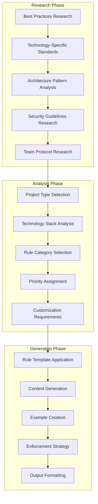

# Rules Generator (`generate-rules`)

## Overview

The Rules Generator creates comprehensive, project-specific development guidelines and coding standards based on product requirements and industry best practices. It integrates with the Research Manager to gather current best practices and generates actionable rules that ensure code quality, consistency, and maintainability across development teams.

**Core Capabilities:**
- **Research-Enhanced Generation**: Integrates with Research Manager for industry best practices and coding standards
- **Comprehensive Rule Categories**: Covers coding standards, architecture guidelines, security practices, and team protocols
- **Project-Specific Customization**: Tailors rules to specific technologies, frameworks, and project requirements
- **Implementation Examples**: Provides concrete examples and code snippets for each rule
- **Team-Ready Output**: Structured guidelines ready for team adoption and enforcement
- **Integration Ready**: Works seamlessly with other Vibe Coder tools for complete project setup
- **Enforcement Guidelines**: Includes suggestions for automated enforcement and code review processes

## Architecture

The Rules Generator implements a comprehensive rule generation and validation pipeline:



## Configuration

### Claude Desktop MCP Client Setup

Add this configuration to your `claude_desktop_config.json` file:

```json
"vibe-coder-mcp": {
  "command": "node",
  "args": ["--max-old-space-size=4096", "/path/to/your/Vibe-Coder-MCP/build/index.js"],
  "cwd": "/path/to/your/Vibe-Coder-MCP",
  "transport": "stdio",
  "env": {
    "LLM_CONFIG_PATH": "/path/to/your/Vibe-Coder-MCP/llm_config.json",
    "LOG_LEVEL": "debug",
    "NODE_ENV": "production",
    "VIBE_CODER_OUTPUT_DIR": "/path/to/your/Vibe-Coder-MCP/VibeCoderOutput",
    "OPENROUTER_API_KEY": "your-openrouter-api-key"
  },
  "disabled": false,
  "autoApprove": [
    "generate-rules",
    "generate-task-list",
    "research",
    "generate-prd",
    "get-job-result"
  ]
}
```

### Environment Variables

#### Core Configuration
- **`OPENROUTER_API_KEY`**: Required API key for research integration via OpenRouter
- **`LLM_CONFIG_PATH`**: Path to LLM model configuration file for rule generation
- **`VIBE_CODER_OUTPUT_DIR`**: Directory where rules documents are saved
- **`LOG_LEVEL`**: Logging verbosity for rules generation operations

#### Rules-Specific Settings
- **`RULES_RESEARCH_ENABLED`**: Enable/disable research integration (default: true)
- **`RULES_CATEGORY_DEPTH`**: Rule category coverage depth (default: 'comprehensive')
- **`RULES_GENERATION_TIMEOUT_MS`**: Generation timeout in milliseconds (default: 60000)
- **`RULES_INCLUDE_EXAMPLES`**: Include code examples in rules (default: true)

### LLM Configuration

The Rules Generator uses models defined in `llm_config.json`:

```json
{
  "llm_mapping": {
    "rules_research": "perplexity/sonar-deep-research",
    "rules_generation": "google/gemini-2.5-flash-preview",
    "rules_examples": "google/gemini-2.5-flash-preview"
  }
}
```

## Inputs

This tool accepts the following parameters via the MCP call:

| Parameter            | Type               | Description                                     | Required |
| -------------------- | ------------------ | ----------------------------------------------- | -------- |
| `productDescription` | `string`           | Description of the product being developed      | Yes      |
| `userStories`        | `string`           | Optional user stories to inform the rules       | No       |
| `ruleCategories`     | `array of strings` | Optional categories of rules to generate        | No       |

*(Based on the Zod schema defined in `src/server.ts`)*

## Outputs

* **Primary Output:** A comprehensive set of development rules in Markdown format.
* **File Storage:** The generated artifact is saved for historical purposes to the configured output directory (default: `VibeCoderOutput/`, override with `VIBE_CODER_OUTPUT_DIR` env var):
  `[output_dir]/rules-generator/[timestamp]-[sanitized-name]-rules.md`
* **MCP Response:** The generated content is returned as text content within the MCP `CallToolResult`.

## Asynchronous Execution

This tool executes asynchronously due to the time required for research and LLM generation.
1.  When you call this tool, it will immediately return a **Job ID**.
2.  The rules generation process runs in the background.
3.  Use the `get-job-result` tool with the received Job ID to retrieve the final rules document once the job is complete.

## Workflow

When invoked, this tool performs the following steps:

1. **Input Validation:** The incoming parameters are validated against requirements.
2. **Research Phase (Pre-Generation):**
   * Formulates three specific queries based on the inputs:
     * Best development practices and coding standards related to the product
     * Specific rules and guidelines for the requested categories (or common categories if none specified)
     * Modern architecture patterns and file organization for the detected product type
   * Executes these queries in parallel using the configured Perplexity model (`perplexity/sonar-deep-research` via `performResearchQuery`).
   * Aggregates the research results into a structured context block.
3. **Prompt Assembly:** Combines the original inputs (product description, user stories, requested rule categories) and the gathered research context into a comprehensive prompt for the main generation model.
4. **Generation Phase:**
   * Calls the `performDirectLlmCall` utility (`src/utils/llmHelper.ts`) with the assembled prompt and the rules-specific system prompt (`RULES_SYSTEM_PROMPT`).
   * This directly uses the configured LLM (e.g., Gemini) to generate the rules content as Markdown.
5. **Output Processing & Saving:**
   * Formats the generated Markdown rules with a title header and timestamp.
   * Saves the rules document to the `workflow-agent-files/rules-generator/` directory.
6. **Response:** Returns the formatted rules content via the MCP protocol.

### Workflow Diagram (Mermaid)

```mermaid
flowchart TD
    A[Start Tool: generate-rules] --> B{Input Params Valid?};
    B -- No --> BN[Return Error Response];
    B -- Yes --> C[1. Formulate Research Queries];
    C --> D[2. Call performResearchQuery (Perplexity)];
    D --> E[3. Assemble Main Prompt (Inputs + Research Context)];
    E --> F[4. Call performDirectLlmCall (e.g., Gemini + System Prompt)];
    F --> G[5. Format Rules Document];
    G --> H[6. Save Rules to Output Directory];
    H --> I[7. Return Success Response via MCP];

    D -- Error --> DE[Log Research Error, Continue w/o Context];
    DE --> E;
    F -- Error --> FE[Log Generation Error, Return Error Response];
    H -- Error --> HE[Log Save Error, Continue to Response];
```

## Usage Example

From an MCP client (like Claude Desktop):

```
Generate development rules for a React Native mobile app that helps users track their fitness activities and nutrition. Focus on code style, architecture patterns, and performance considerations.
```

## System Prompt

The core generation logic uses `performDirectLlmCall` guided by the following system prompt (defined in `index.ts`):

```markdown
# Rules Generator System Prompt Snippet
You are an AI assistant expert at generating development rules for software projects.
Based on the provided product description, user stories (if any), and research context, generate a set of development rules.

## Using Research Context
* Carefully consider the **Pre-Generation Research Context** (provided by Perplexity) included in the main task prompt.
* This research contains valuable insights on best practices, common rule categories, and architecture patterns.
* Use these insights to inform your rules while keeping the focus on the primary product requirements.
...

## Rule Format
```markdown
# Rule: [Rule Name]

## Description
[Clear description of the rule]
...
```

## Error Handling

* Handles invalid input parameters.
* Attempts to gracefully handle failures during the research phase (logs errors, proceeds without research context).
* Reports errors during the main generation phase.
* Handles potential errors during file saving (typically logs warning and proceeds).
* Returns specific error messages via MCP response when failures occur.

## Rule Categories

### Standard Rule Categories

#### Code Style & Formatting
- **Naming Conventions**: Variables, functions, classes, files
- **Code Structure**: Indentation, spacing, line length
- **Comments & Documentation**: Inline comments, JSDoc, README standards
- **Import/Export**: Module organization and dependency management

#### Architecture & Design
- **Project Structure**: Directory organization, file naming
- **Design Patterns**: Recommended patterns for the technology stack
- **Component Architecture**: Component design and composition
- **API Design**: REST/GraphQL standards, error handling

#### Security & Performance
- **Security Best Practices**: Authentication, authorization, data validation
- **Performance Guidelines**: Optimization techniques, caching strategies
- **Error Handling**: Exception management, logging standards
- **Testing Requirements**: Unit, integration, and e2e testing standards

#### Team Collaboration
- **Git Workflow**: Branching strategy, commit message format
- **Code Review**: Review process, approval requirements
- **Documentation**: Technical documentation standards
- **Communication**: Team communication protocols

## Integration

### Tool Ecosystem Integration

The Rules Generator works with other Vibe Coder tools to create comprehensive project guidelines:

- **Task List Generator**: Rules inform task implementation standards
- **User Stories Generator**: Rules guide acceptance criteria definition
- **PRD Generator**: Rules support technical requirement specification
- **Workflow Runner**: Rules can be part of automated project setup

## Performance

### Current Metrics

| Metric | Target | Current Performance |
|--------|--------|-------------------|
| Research Phase | <15s | ~10-12s average |
| Rule Generation | <10s | ~6-8s average |
| Total Processing | <25s | ~16-20s average |
| Document Formatting | <2s | ~1-2s average |

## Output Structure

### Rules Document Format

```markdown
# Development Rules: [Product Name]

## Code Style Rules
### Rule: Naming Conventions
**Category:** Code Style
**Priority:** High
**Enforcement:** Automated (ESLint/Prettier)

**Description:** Use descriptive, camelCase names for variables and functions.

**Examples:**
```javascript
// ✅ Good
const userAccountBalance = 1000;
function calculateTotalPrice() { }

// ❌ Bad
const uab = 1000;
function calc() { }
```

**Enforcement Strategy:**
- ESLint rule: camelcase
- Pre-commit hooks
- Code review checklist
```

## Troubleshooting

### Common Issues

#### "Rule generation incomplete"
**Cause**: Insufficient product description or unclear requirements
**Solution**: Provide detailed product description with technology stack

#### "Rules too generic"
**Cause**: Missing technology-specific context
**Solution**: Include specific frameworks and tools in product description

## Advanced Features

### Custom Rule Categories
Define project-specific rule categories:

```json
{
  "ruleCategories": [
    "accessibility",
    "mobile_performance",
    "offline_functionality",
    "data_privacy"
  ]
}
```

### Enforcement Integration
- **Automated Tools**: ESLint, Prettier, SonarQube integration
- **CI/CD Integration**: Automated rule checking in build pipelines
- **Code Review**: Rule-based review checklists
- **Team Training**: Rule explanation and training materials
