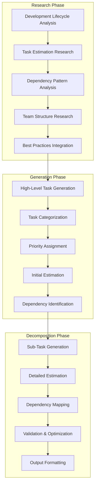
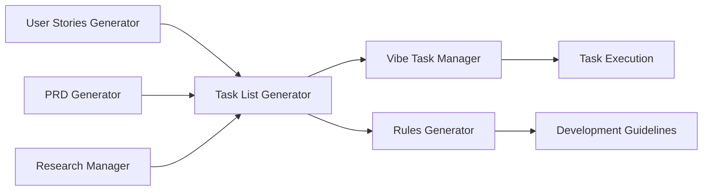
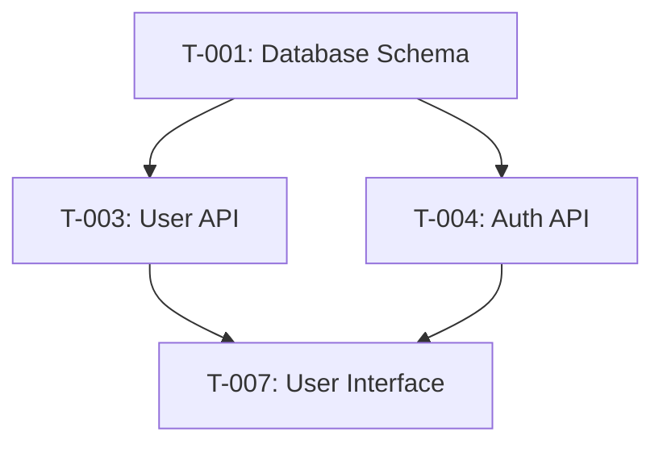

# Task List Generator (`generate-task-list`)

## Overview

The Task List Generator creates comprehensive, hierarchical development task lists with dependencies, priorities, and time estimations. It transforms user stories and product requirements into actionable development tasks, integrating research-backed best practices for project planning and execution.

**Core Capabilities:**
- **Research-Enhanced Generation**: Integrates with Research Manager for development lifecycle and task estimation best practices
- **Hierarchical Task Decomposition**: High-level tasks with detailed sub-task breakdown
- **Dependency Management**: Automatic identification and mapping of task dependencies
- **Estimation Intelligence**: AI-powered time and effort estimation for tasks
- **Multi-Phase Workflow**: Research → Generation → Decomposition → Validation
- **Project Management Ready**: Compatible with popular project management tools and methodologies
- **Integration Ready**: Seamlessly works with User Stories Generator and Vibe Task Manager

## Architecture

The Task List Generator implements a sophisticated multi-phase decomposition pipeline:



## Configuration

### Claude Desktop MCP Client Setup

Add this configuration to your `claude_desktop_config.json` file:

```json
"vibe-coder-mcp": {
  "command": "node",
  "args": ["--max-old-space-size=4096", "/path/to/your/Vibe-Coder-MCP/build/index.js"],
  "cwd": "/path/to/your/Vibe-Coder-MCP",
  "transport": "stdio",
  "env": {
    "LLM_CONFIG_PATH": "/path/to/your/Vibe-Coder-MCP/llm_config.json",
    "LOG_LEVEL": "debug",
    "NODE_ENV": "production",
    "VIBE_CODER_OUTPUT_DIR": "/path/to/your/Vibe-Coder-MCP/VibeCoderOutput",
    "OPENROUTER_API_KEY": "your-openrouter-api-key"
  },
  "disabled": false,
  "autoApprove": [
    "generate-task-list",
    "generate-user-stories",
    "research",
    "create-task",
    "get-job-result"
  ]
}
```

### Environment Variables

#### Core Configuration
- **`OPENROUTER_API_KEY`**: Required API key for research integration via OpenRouter
- **`LLM_CONFIG_PATH`**: Path to LLM model configuration file for task generation
- **`VIBE_CODER_OUTPUT_DIR`**: Directory where task lists are saved
- **`LOG_LEVEL`**: Logging verbosity for task generation operations

#### Task List-Specific Settings
- **`TASK_LIST_RESEARCH_ENABLED`**: Enable/disable research integration (default: true)
- **`TASK_LIST_DECOMPOSITION_DEPTH`**: Sub-task decomposition depth (default: 3)
- **`TASK_LIST_GENERATION_TIMEOUT_MS`**: Generation timeout in milliseconds (default: 90000)
- **`TASK_LIST_ESTIMATION_METHOD`**: Estimation method: 'fibonacci', 'hours', 'points' (default: 'hours')

### LLM Configuration

The Task List Generator uses models defined in `llm_config.json`:

```json
{
  "llm_mapping": {
    "task_list_research": "perplexity/sonar-deep-research",
    "task_list_generation": "google/gemini-2.5-flash-preview",
    "task_decomposition": "google/gemini-2.5-flash-preview"
  }
}
```

## Inputs

This tool accepts the following parameters via the MCP call:

| Parameter            | Type        | Description                                     | Required |
| -------------------- | ----------- | ----------------------------------------------- | -------- |
| `productDescription` | `string`    | Description of the product                      | Yes      |
| `userStories`        | `string`    | User stories to use for task list generation    | Yes      |

*(Based on the Zod schema defined in `src/server.ts`)*

## Outputs

* **Primary Output:** A comprehensive development task list in Markdown format, hierarchically organized with dependencies, priorities, and estimations.
* **File Storage:** The generated artifact is saved for historical purposes to the configured output directory (default: `VibeCoderOutput/`, override with `VIBE_CODER_OUTPUT_DIR` env var):
  `[output_dir]/task-list-generator/[timestamp]-[sanitized-name]-task-list.md`
* **MCP Response:** The generated content is returned as text content within the MCP `CallToolResult`.

## Asynchronous Execution

This tool executes asynchronously due to the time required for research, initial task generation, and sub-task decomposition via multiple LLM calls.
1.  When you call this tool, it will immediately return a **Job ID**.
2.  The task list generation process runs in the background.
3.  Use the `get-job-result` tool with the received Job ID to retrieve the final task list once the job is complete.

## Workflow

When invoked, this tool performs the following steps:

1. **Input Validation:** The incoming parameters (product description and user stories) are validated.
2. **Research Phase (Pre-Generation):**
   * Formulates three specific queries based on the inputs:
     * Software development lifecycle tasks and milestones for the specific product
     * Task estimation and dependency management best practices
     * Development team structures and work breakdown for similar projects
   * Executes these queries in parallel using the configured Perplexity model (`perplexity/sonar-deep-research` via `performResearchQuery`).
   * Aggregates the research results into a structured context block.
3. **Prompt Assembly:** Combines the original inputs (product description and user stories) and the gathered research context into a comprehensive prompt for the main generation model.
4. **Generation Phase (High-Level Tasks):**
   * Calls the `performDirectLlmCall` utility (`src/utils/llmHelper.ts`) with the assembled prompt and the task list-specific system prompt (`TASK_LIST_SYSTEM_PROMPT`).
   * This directly uses the configured LLM (e.g., Gemini) to generate the initial high-level task list as Markdown.
   * Includes robust parsing logic (`parseHighLevelTasks` and `extractFallbackTasks`) to handle potential formatting variations in the LLM output.
5. **Decomposition Phase (Sub-Tasks):**
   * For each successfully parsed high-level task, calls `performDirectLlmCall` again with a specific prompt to decompose it into detailed sub-tasks, including estimations and dependencies.
6. **Output Processing & Saving:**
   * Combines the high-level tasks and their decomposed sub-tasks into a final, formatted Markdown document with a title header and timestamp.
   * Saves the task list document to the `workflow-agent-files/task-list-generator/` directory.
6. **Response:** Returns the formatted task list content via the MCP protocol.

### Workflow Diagram (Mermaid)

```mermaid
flowchart TD
    A[Start Tool: generate-task-list] --> B{Input Params Valid?};
    B -- No --> BN[Return Error Response];
    B -- Yes --> C[1. Formulate Research Queries];
    C --> D[2. Call performResearchQuery (Perplexity)];
    D --> E[3. Assemble Main Prompt (Inputs + Research Context)];
    E --> F[4. Call performDirectLlmCall (High-Level Tasks)];
    F --> Parse{5. Parse High-Level Tasks};
    Parse -->|Error| Fallback[5b. Use Fallback Parser];
    Parse -->|Success| Decomp[6. Loop: Decompose Each Task];
    Fallback --> Decomp;
    Decomp -- For Each Task --> SubTask[6a. Call performDirectLlmCall (Sub-Tasks)];
    SubTask --> Decomp;
    Decomp -- All Done --> Combine[7. Combine & Format Document];
    Combine --> H[8. Save Task List to Output Directory];
    H --> I[7. Return Success Response via MCP];

    D -- Error --> DE[Log Research Error, Continue w/o Context];
    DE --> E;
    F -- Error --> FE[Log Generation Error, Return Error Response];
    H -- Error --> HE[Log Save Error, Continue to Response];
```

## Usage Example

From an MCP client (like Claude Desktop):

```
Generate a task list for developing a mobile app that helps users track their daily water intake. User stories have already been created and include features for tracking intake, setting reminders, and viewing hydration statistics.
```

## System Prompt

The core generation logic uses `performDirectLlmCall` guided by the following system prompt (defined in `index.ts`) for the initial high-level task generation:

```markdown
# Task List Generator System Prompt Snippet
You are an AI assistant expert at generating development task lists for software projects.
Based on the provided product description, user stories, and research context, generate a detailed task list.

## Using Research Context
* Carefully consider the **Pre-Generation Research Context** (provided by Perplexity) included in the main task prompt.
* This research contains valuable insights on development lifecycle, task estimation, and team structure.
* Use these insights to inform your task list while keeping the focus on the primary product requirements.
* Pay special attention to the "Development Lifecycle & Milestones" and "Task Estimation & Dependencies" sections...

## Task Template
Each task should include:
- **Task ID**: A unique identifier (T-001, T-002, etc.)
- **Task Title**: Clear, action-oriented title starting with a verb
- **Description**: Explanation of what needs to be done
...
```

## Error Handling

* Handles invalid input parameters.
* Attempts to gracefully handle failures during the research phase (logs errors, proceeds without research context).
* Reports errors during the main generation phase.
* Handles potential errors during file saving (typically logs warning and proceeds).
* Returns specific error messages via MCP response when failures occur.

## Integration

### Tool Ecosystem Integration

The Task List Generator integrates seamlessly with other Vibe Coder tools:



**Integration Benefits:**
- **User Stories Generator**: Converts user stories into actionable development tasks
- **PRD Generator**: Uses PRD requirements to inform task planning and prioritization
- **Research Manager**: Leverages development best practices for task estimation and dependencies
- **Vibe Task Manager**: Seamlessly imports generated tasks for project execution
- **Rules Generator**: Creates task-specific development guidelines and standards
- **Workflow Runner**: Can be part of automated project planning workflows

### Vibe Task Manager Integration

The Task List Generator produces output directly compatible with the Vibe Task Manager:

- **Automatic Import**: Generated tasks can be automatically imported into project management
- **Hierarchy Preservation**: Maintains task hierarchy and dependency relationships
- **Status Tracking**: Tasks include status fields for progress monitoring
- **Estimation Integration**: Time estimates feed into project planning and resource allocation

## Task Structure and Templates

### Standard Task Format

```markdown
## Task: [T-XXX] [Task Title]

**Category:** [Frontend/Backend/Database/DevOps/Testing]
**Priority:** [High/Medium/Low]
**Estimated Time:** [X hours/days]
**Dependencies:** [T-001, T-002]
**Assigned To:** [Team/Role]

### Description
[Detailed description of what needs to be accomplished]

### Acceptance Criteria
- [ ] [Specific, measurable criterion]
- [ ] [Specific, measurable criterion]
- [ ] [Specific, measurable criterion]

### Sub-Tasks
#### T-XXX.1: [Sub-task Title]
- **Estimated Time:** [X hours]
- **Description:** [Detailed sub-task description]
- **Dependencies:** [Other sub-tasks]

#### T-XXX.2: [Sub-task Title]
- **Estimated Time:** [X hours]
- **Description:** [Detailed sub-task description]
- **Dependencies:** [Other sub-tasks]

### Technical Notes
[Implementation notes, architectural considerations, or technical constraints]

### Definition of Done
- [ ] Code implemented and reviewed
- [ ] Unit tests written and passing
- [ ] Integration tests passing
- [ ] Documentation updated
- [ ] Code deployed to staging
```

### Task Categories

#### Frontend Tasks
- **Scope**: User interface and user experience implementation
- **Examples**: Component development, styling, responsive design
- **Dependencies**: Often depend on backend API tasks

#### Backend Tasks
- **Scope**: Server-side logic, APIs, and data processing
- **Examples**: API endpoints, business logic, data validation
- **Dependencies**: Often depend on database schema tasks

#### Database Tasks
- **Scope**: Data modeling, schema design, and database operations
- **Examples**: Schema creation, migrations, indexing
- **Dependencies**: Usually foundational tasks with few dependencies

#### DevOps Tasks
- **Scope**: Infrastructure, deployment, and operational concerns
- **Examples**: CI/CD setup, monitoring, security configuration
- **Dependencies**: Often parallel to development tasks

#### Testing Tasks
- **Scope**: Quality assurance and testing implementation
- **Examples**: Test automation, performance testing, security testing
- **Dependencies**: Usually depend on implementation tasks

## Performance

### Current Metrics

| Metric | Target | Current Performance |
|--------|--------|-------------------|
| Research Phase | <15s | ~10-12s average |
| High-Level Generation | <10s | ~6-8s average |
| Task Decomposition | <20s | ~15-18s average |
| Total Processing | <45s | ~31-38s average |
| File Save Operation | <500ms | ~200-300ms average |

### Optimization Features

- **Parallel Research**: Multiple research queries executed concurrently
- **Batch Decomposition**: Multiple tasks decomposed in parallel
- **Template Caching**: Task templates cached for faster generation
- **Dependency Optimization**: Intelligent dependency analysis and optimization
- **Estimation Intelligence**: AI-powered estimation based on historical data

## Estimation Methods

### Time-Based Estimation (Default)
- **Unit**: Hours and days
- **Granularity**: 0.5-hour increments
- **Range**: 0.5 hours to 40 hours per task
- **Use Case**: Traditional project management, client billing

### Story Points Estimation
- **Unit**: Fibonacci sequence (1, 2, 3, 5, 8, 13, 21)
- **Granularity**: Relative complexity scoring
- **Range**: 1 point (trivial) to 21 points (epic)
- **Use Case**: Agile development, sprint planning

### T-Shirt Sizing
- **Unit**: XS, S, M, L, XL, XXL
- **Granularity**: Rough complexity categories
- **Range**: XS (< 1 hour) to XXL (> 1 week)
- **Use Case**: High-level planning, early estimation

## Output Structure

### Task List Document Format

```markdown
# Development Task List: [Product Name]

**Generated:** [Timestamp]
**Product:** [Product Description]
**Total Tasks:** [Count]
**Estimated Effort:** [Total hours/points]

## Project Overview
[High-level project summary and key objectives]

## Task Summary
- **Total Tasks:** [Count]
- **High Priority:** [Count] ([X%])
- **Medium Priority:** [Count] ([X%])
- **Low Priority:** [Count] ([X%])
- **Total Estimated Time:** [X hours/days]

## Development Phases

### Phase 1: Foundation ([X tasks], [X hours])
**Objective:** [Phase description]
**Dependencies:** [External dependencies]

#### T-001: [Task Title]
[Full task format as shown above]

#### T-002: [Task Title]
[Full task format as shown above]

### Phase 2: Core Features ([X tasks], [X hours])
**Objective:** [Phase description]
**Dependencies:** [Phase 1 completion]

[Similar structure]

### Phase 3: Integration & Testing ([X tasks], [X hours])
**Objective:** [Phase description]
**Dependencies:** [Phase 2 completion]

[Similar structure]

## Critical Path Analysis
### Critical Tasks (Must complete on schedule)
- T-001: [Task Title] ([X hours])
- T-005: [Task Title] ([X hours])
- T-012: [Task Title] ([X hours])

### Parallel Tracks
#### Track A: Frontend Development
- T-003, T-007, T-011 (can run in parallel)

#### Track B: Backend Development
- T-004, T-008, T-012 (can run in parallel)

## Risk Assessment
### High-Risk Tasks
- **T-XXX**: [Risk description and mitigation strategy]
- **T-XXX**: [Risk description and mitigation strategy]

### Dependencies Map


## Troubleshooting

### Common Issues

#### "Task decomposition failed"
**Cause**: Complex user stories or insufficient context
**Solution**: Simplify user stories or provide more detailed product description

```bash
# Reduce decomposition depth for complex projects
TASK_LIST_DECOMPOSITION_DEPTH=2

# Enable comprehensive research for better context
TASK_LIST_RESEARCH_ENABLED=true
```

#### "Estimation inconsistencies"
**Cause**: Mixed estimation methods or unclear task scope
**Solution**: Use consistent estimation method and clarify task boundaries

```json
// Use consistent estimation method
"TASK_LIST_ESTIMATION_METHOD": "hours"  // or "points" or "tshirt"
```

#### "Missing dependencies"
**Cause**: Incomplete dependency analysis or complex project structure
**Solution**: Enable comprehensive research and manual dependency review

```json
// Enable detailed dependency analysis
"TASK_LIST_RESEARCH_ENABLED": "true"
"TASK_LIST_DECOMPOSITION_DEPTH": "3"
```

### Performance Optimization

#### For Faster Generation
- Reduce decomposition depth for simple projects
- Use basic research depth for well-understood domains
- Limit task count for initial iterations
- Use cached templates for similar projects

#### For Better Quality
- Enable comprehensive research depth
- Provide detailed user stories with acceptance criteria
- Include technical constraints and requirements
- Specify team structure and skill levels

## Advanced Features

### Custom Task Templates
Create custom templates for specific development methodologies:

```markdown
# Custom Task Template: [Methodology Name]

## Template Configuration
- **Methodology**: [Agile/Waterfall/DevOps/Custom]
- **Task Granularity**: [High/Medium/Low]
- **Estimation Method**: [Hours/Points/T-Shirt]

## Custom Fields
- **Risk Level**: [High/Medium/Low]
- **Skill Level Required**: [Junior/Mid/Senior]
- **Team Assignment**: [Frontend/Backend/DevOps/QA]

## Task Structure
[Define custom task structure and fields]
```

### Dependency Analysis
Advanced dependency management and optimization:

```json
{
  "dependencyConfig": {
    "analysisDepth": "comprehensive",
    "includeImplicitDependencies": true,
    "optimizeCriticalPath": true,
    "parallelizationSuggestions": true
  }
}
```

### Integration Patterns
Advanced integration with development workflows:

- **Automated Project Setup**: Generate tasks directly in project management tools
- **Sprint Planning**: Organize tasks into sprint-ready backlogs
- **Resource Allocation**: Match tasks to team member skills and availability
- **Progress Tracking**: Monitor task completion and update estimates

### Multi-Team Coordination
Support for complex, multi-team projects:

- **Team-Specific Tasks**: Generate tasks tailored to specific team capabilities
- **Cross-Team Dependencies**: Identify and manage dependencies between teams
- **Skill-Based Assignment**: Match tasks to team member expertise
- **Communication Points**: Identify required coordination and handoff points

### Estimation Intelligence
AI-powered estimation improvements:

- **Historical Data**: Learn from past project completion times
- **Complexity Analysis**: Assess task complexity based on requirements
- **Risk Adjustment**: Adjust estimates based on identified risks
- **Team Velocity**: Factor in team-specific productivity metrics
