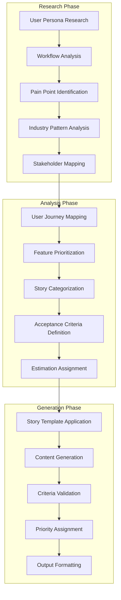
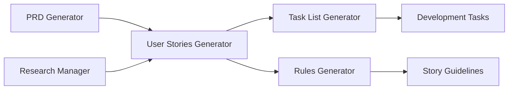

# User Stories Generator (`generate-user-stories`)

## Overview

The User Stories Generator creates comprehensive, research-backed user stories with detailed acceptance criteria for agile development teams. It integrates with the Research Manager to understand user behaviors and industry patterns, producing actionable user stories that drive product development.

**Core Capabilities:**
- **Research-Enhanced Generation**: Integrates with Research Manager for user behavior analysis and industry patterns
- **Comprehensive User Story Creation**: Generates detailed user stories with acceptance criteria and priority levels
- **Multi-Persona Support**: Creates stories for different user types and stakeholder groups
- **Agile-Ready Output**: Standard user story format compatible with popular project management tools
- **Acceptance Criteria Generation**: Detailed, testable acceptance criteria for each story
- **Priority and Estimation**: Includes story prioritization and complexity estimation
- **Integration Ready**: Seamlessly works with PRD Generator and Task List Generator

## Architecture

The User Stories Generator implements a sophisticated user-centric generation pipeline:



## Configuration

### Claude Desktop MCP Client Setup

Add this configuration to your `claude_desktop_config.json` file:

```json
"vibe-coder-mcp": {
  "command": "node",
  "args": ["--max-old-space-size=4096", "/path/to/your/Vibe-Coder-MCP/build/index.js"],
  "cwd": "/path/to/your/Vibe-Coder-MCP",
  "transport": "stdio",
  "env": {
    "LLM_CONFIG_PATH": "/path/to/your/Vibe-Coder-MCP/llm_config.json",
    "LOG_LEVEL": "debug",
    "NODE_ENV": "production",
    "VIBE_CODER_OUTPUT_DIR": "/path/to/your/Vibe-Coder-MCP/VibeCoderOutput",
    "OPENROUTER_API_KEY": "your-openrouter-api-key"
  },
  "disabled": false,
  "autoApprove": [
    "generate-user-stories",
    "generate-prd",
    "research",
    "generate-task-list",
    "get-job-result"
  ]
}
```

### Environment Variables

#### Core Configuration
- **`OPENROUTER_API_KEY`**: Required API key for research integration via OpenRouter
- **`LLM_CONFIG_PATH`**: Path to LLM model configuration file for story generation
- **`VIBE_CODER_OUTPUT_DIR`**: Directory where user stories documents are saved
- **`LOG_LEVEL`**: Logging verbosity for user stories generation operations

#### User Stories-Specific Settings
- **`USER_STORIES_RESEARCH_ENABLED`**: Enable/disable research integration (default: true)
- **`USER_STORIES_TEMPLATE_TYPE`**: Default story template type (default: 'agile')
- **`USER_STORIES_GENERATION_TIMEOUT_MS`**: Generation timeout in milliseconds (default: 60000)
- **`USER_STORIES_PERSONA_COUNT`**: Number of user personas to generate (default: 3-5)

### LLM Configuration

The User Stories Generator uses models defined in `llm_config.json`:

```json
{
  "llm_mapping": {
    "user_stories_research": "perplexity/sonar-deep-research",
    "user_stories_generation": "google/gemini-2.5-flash-preview",
    "acceptance_criteria_generation": "google/gemini-2.5-flash-preview"
  }
}
```

## Inputs

This tool accepts the following parameters via the MCP call:

| Parameter            | Type        | Description                                       | Required |
| -------------------- | ----------- | ------------------------------------------------- | -------- |
| `productDescription` | `string`    | Description of the product to create user stories for | Yes    |

*(Based on the Zod schema defined in `src/server.ts`)*

## Outputs

* **Primary Output:** A comprehensive set of user stories in Markdown format, hierarchically organized with acceptance criteria.
* **File Storage:** The generated artifact is saved for historical purposes to the configured output directory (default: `VibeCoderOutput/`, override with `VIBE_CODER_OUTPUT_DIR` env var):
  `[output_dir]/user-stories-generator/[timestamp]-[sanitized-name]-user-stories.md`
* **MCP Response:** The generated content is returned as text content within the MCP `CallToolResult`.

## Asynchronous Execution

This tool executes asynchronously due to the time required for research and LLM generation.
1.  When you call this tool, it will immediately return a **Job ID**.
2.  The user stories generation process runs in the background.
3.  Use the `get-job-result` tool with the received Job ID to retrieve the final user stories document once the job is complete.

## Workflow

When invoked, this tool performs the following steps:

1. **Input Validation:** The incoming product description parameter is validated.
2. **Research Phase (Pre-Generation):**
   * Formulates three specific queries based on the product description:
     * User personas and stakeholders
     * Common user workflows and use cases
     * User experience expectations and pain points
   * Executes these queries in parallel using the configured Perplexity model (`perplexity/sonar-deep-research` via `performResearchQuery`).
   * Aggregates the research results into a structured context block.
3. **Prompt Assembly:** Combines the original product description and the gathered research context into a comprehensive prompt for the main generation model.
4. **Generation Phase:**
   * Calls the `performDirectLlmCall` utility (`src/utils/llmHelper.ts`) with the assembled prompt and the user stories-specific system prompt (`USER_STORIES_SYSTEM_PROMPT`).
   * This directly uses the configured LLM (e.g., Gemini) to generate the user stories content as Markdown.
5. **Output Processing & Saving:**
   * Formats the generated Markdown user stories with a title header and timestamp.
   * Saves the user stories document to the `workflow-agent-files/user-stories-generator/` directory.
6. **Response:** Returns the formatted user stories content via the MCP protocol.

### Workflow Diagram (Mermaid)

```mermaid
flowchart TD
    A[Start Tool: generate-user-stories] --> B{Input Params Valid?};
    B -- No --> BN[Return Error Response];
    B -- Yes --> C[1. Formulate Research Queries];
    C --> D[2. Call performResearchQuery (Perplexity)];
    D --> E[3. Assemble Main Prompt (Inputs + Research Context)];
    E --> F[4. Call performDirectLlmCall (e.g., Gemini + System Prompt)];
    F --> G[5. Format User Stories Document];
    G --> H[6. Save User Stories to Output Directory];
    H --> I[7. Return Success Response via MCP];

    D -- Error --> DE[Log Research Error, Continue w/o Context];
    DE --> E;
    F -- Error --> FE[Log Generation Error, Return Error Response];
    H -- Error --> HE[Log Save Error, Continue to Response];
```

## Usage Example

From an MCP client (like Claude Desktop):

```
Generate user stories for a mobile app that helps users track their daily water intake, remind them to drink water, and visualize their hydration progress over time.
```

## System Prompt

The core generation logic uses `performDirectLlmCall` guided by the following system prompt (defined in `index.ts`):

```markdown
# User Stories Generator System Prompt Snippet
You are an AI assistant expert at generating comprehensive and well-structured user stories for software development projects.
Based on the provided product description and research context, generate detailed user stories.

## Using Research Context
* Carefully consider the **Pre-Generation Research Context** (provided by Perplexity) included in the main task prompt.
* This research contains valuable insights on user personas, workflows, and expectations.
* Use these insights to inform your user stories while keeping the focus on the primary product requirements.
* Pay special attention to the "User Personas & Stakeholders" and "User Workflows & Use Cases" sections in the research.
...

## User Story Template
| Field             | Description                                          |
| ----------------- | ---------------------------------------------------- |
| User Story ID     | A unique identifier (e.g., US-100, US-100.1)         |
| Title             | A concise summary of the user story                  |
| As a              | The user role benefiting from this functionality...  |
...
```

## Error Handling

* Handles invalid input parameters.
* Attempts to gracefully handle failures during the research phase (logs errors, proceeds without research context).
* Reports errors during the main generation phase.
* Handles potential errors during file saving (typically logs warning and proceeds).
* Returns specific error messages via MCP response when failures occur.

## Integration

### Tool Ecosystem Integration

The User Stories Generator integrates seamlessly with other Vibe Coder tools:



**Integration Benefits:**
- **PRD Generator**: Uses PRD requirements to generate aligned user stories
- **Research Manager**: Leverages user research for persona-driven story creation
- **Task List Generator**: Converts user stories into actionable development tasks
- **Rules Generator**: Creates story-specific guidelines and acceptance criteria standards
- **Workflow Runner**: Can be part of automated agile planning workflows

### Agile Development Integration

The User Stories Generator produces output compatible with popular agile tools:

- **Jira Integration**: Stories formatted for direct import into Jira
- **Azure DevOps**: Compatible with Azure DevOps work item structure
- **GitHub Issues**: Can be converted to GitHub issue templates
- **Trello/Asana**: Adaptable to card-based project management tools

## User Story Template System

### Standard User Story Format

```markdown
## User Story: [US-XXX] [Title]

**As a** [user role]
**I want** [functionality]
**So that** [benefit/value]

### Acceptance Criteria
- [ ] **Given** [context] **When** [action] **Then** [outcome]
- [ ] **Given** [context] **When** [action] **Then** [outcome]
- [ ] **Given** [context] **When** [action] **Then** [outcome]

### Story Details
- **Priority:** High/Medium/Low
- **Story Points:** [1-13 Fibonacci scale]
- **Epic:** [Epic name/ID]
- **Sprint:** [Target sprint]
- **Dependencies:** [Related stories]

### Definition of Done
- [ ] Code implemented and reviewed
- [ ] Unit tests written and passing
- [ ] Integration tests passing
- [ ] Documentation updated
- [ ] Acceptance criteria validated
```

### Story Categories

#### Epic Stories
- **Scope**: Large features spanning multiple sprints
- **Format**: High-level user goals with sub-stories
- **Example**: "As a user, I want a complete authentication system"

#### Feature Stories
- **Scope**: Specific functionality within an epic
- **Format**: Detailed user interactions
- **Example**: "As a user, I want to log in with email and password"

#### Technical Stories
- **Scope**: Infrastructure and technical requirements
- **Format**: Developer-focused improvements
- **Example**: "As a developer, I want API rate limiting to prevent abuse"

#### Bug Stories
- **Scope**: Issue resolution and fixes
- **Format**: Problem-solution oriented
- **Example**: "As a user, I want login errors to display clearly"

## Performance

### Current Metrics

| Metric | Target | Current Performance |
|--------|--------|-------------------|
| Research Phase | <15s | ~10-12s average |
| Story Generation | <10s | ~6-8s average |
| Total Processing | <25s | ~16-20s average |
| Story Formatting | <2s | ~1-2s average |
| File Save Operation | <500ms | ~200-300ms average |

### Optimization Features

- **Parallel Research**: Multiple research queries executed concurrently
- **Template Caching**: Story templates cached for faster generation
- **Persona Reuse**: User personas cached across similar products
- **Batch Processing**: Multiple stories generated in single LLM call
- **Smart Prioritization**: AI-driven story priority assignment

## Output Structure

### User Stories Document Format

```markdown
# User Stories: [Product Name]

**Generated:** [Timestamp]
**Product:** [Product Description]
**Total Stories:** [Count]

## Executive Summary
[Overview of user stories and key personas]

## User Personas
### Primary Persona: [Name]
- **Role:** [User role]
- **Goals:** [Primary goals]
- **Pain Points:** [Key challenges]
- **Tech Savviness:** [Level]

### Secondary Persona: [Name]
[Similar structure]

## Epic Stories

### Epic 1: [Epic Name]
**Description:** [Epic overview]
**Stories:** [Story count]
**Estimated Effort:** [Story points total]

#### US-001: [Story Title]
[Full story format as shown above]

#### US-002: [Story Title]
[Full story format as shown above]

### Epic 2: [Epic Name]
[Similar structure]

## Story Backlog Summary
- **Total Stories:** [Count]
- **Total Story Points:** [Sum]
- **High Priority:** [Count]
- **Medium Priority:** [Count]
- **Low Priority:** [Count]

## Implementation Roadmap
### Sprint 1 (Stories: [Count], Points: [Sum])
- US-001: [Title] (Priority: High, Points: 5)
- US-002: [Title] (Priority: High, Points: 3)

### Sprint 2 (Stories: [Count], Points: [Sum])
[Similar structure]
```

### File Storage Structure

```
VibeCoderOutput/user-stories-generator/
├── 20240115-120000-water-tracker-app-user-stories.md
├── 20240115-130000-task-management-saas-user-stories.md
├── 20240115-140000-enterprise-crm-user-stories.md
└── templates/
    ├── agile-template.md
    ├── epic-template.md
    ├── feature-template.md
    └── technical-template.md
```

## Troubleshooting

### Common Issues

#### "Research integration failed"
**Cause**: OpenRouter API key missing or research service unavailable
**Solution**: Verify API configuration and enable fallback mode

```bash
# Check API key configuration
grep OPENROUTER_API_KEY .env

# Enable fallback mode in environment
USER_STORIES_RESEARCH_ENABLED=false
```

#### "Story generation timeout"
**Cause**: Generation taking longer than configured timeout
**Solution**: Increase timeout or simplify product description

```json
// In environment variables
"USER_STORIES_GENERATION_TIMEOUT_MS": "120000"  // Increase to 2 minutes
```

#### "Insufficient story detail"
**Cause**: Generated stories lack detailed acceptance criteria
**Solution**: Provide more detailed product description or enable comprehensive research

```json
// Enable comprehensive research
"USER_STORIES_RESEARCH_ENABLED": "true"
"USER_STORIES_PERSONA_COUNT": "5"  // Increase persona count
```

### Performance Optimization

#### For Faster Generation
- Use basic research depth for simple products
- Reduce persona count for faster processing
- Use cached templates for similar products
- Simplify product descriptions to reduce processing time

#### For Better Quality
- Enable comprehensive research depth
- Provide detailed product descriptions with user context
- Include specific user roles and scenarios
- Specify business goals and success metrics

## Advanced Features

### Custom Story Templates
Create custom templates for specific project types:

```markdown
# Custom Story Template: [Template Name]

## Template Configuration
- **Project Type**: [Agile/Kanban/Scrum]
- **Story Format**: [Standard/Technical/Epic]
- **Acceptance Criteria Style**: [Given-When-Then/Checklist/Narrative]

## Custom Fields
- **Business Value**: [High/Medium/Low]
- **Risk Level**: [High/Medium/Low]
- **Technical Complexity**: [1-5 scale]

## Story Structure
[Define custom story structure]
```

### Persona-Driven Generation
Advanced persona management for targeted story creation:

```json
{
  "personaConfig": {
    "primaryPersonas": 3,
    "secondaryPersonas": 2,
    "includeEdgeCases": true,
    "personaDepth": "comprehensive",
    "includeAccessibility": true
  }
}
```

### Story Validation
Automated validation ensures story quality:

- **Completeness Check**: Validates all required story elements are present
- **Acceptance Criteria Quality**: Assesses testability and clarity of criteria
- **INVEST Principles**: Validates stories follow Independent, Negotiable, Valuable, Estimable, Small, Testable principles
- **Business Value Alignment**: Ensures stories align with business objectives
- **Technical Feasibility**: Checks technical implementation feasibility

### Integration Patterns
Advanced integration with development workflows:

- **Automated Sprint Planning**: Generate sprint-ready story backlogs
- **Story Estimation**: AI-powered story point estimation
- **Dependency Mapping**: Automatic identification of story dependencies
- **Release Planning**: Group stories into logical release cycles

### Multi-Framework Support
Generate stories for different agile frameworks:

- **Scrum**: Sprint-focused stories with clear acceptance criteria
- **Kanban**: Flow-optimized stories with WIP considerations
- **SAFe**: Enterprise-scale stories with PI planning alignment
- **Custom**: Adaptable to organization-specific frameworks

### Story Analytics
Advanced analytics for story effectiveness:

- **Completion Rate Tracking**: Monitor story completion success rates
- **Estimation Accuracy**: Track story point estimation accuracy
- **Cycle Time Analysis**: Measure story development cycle times
- **Quality Metrics**: Assess story quality and defect rates

### Accessibility Integration
Built-in accessibility considerations:

- **WCAG Compliance**: Stories include accessibility acceptance criteria
- **Inclusive Design**: Personas include users with disabilities
- **Assistive Technology**: Stories consider screen readers and other tools
- **Universal Design**: Stories promote inclusive user experiences
