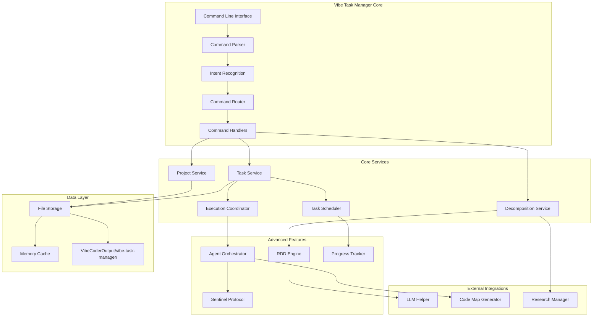
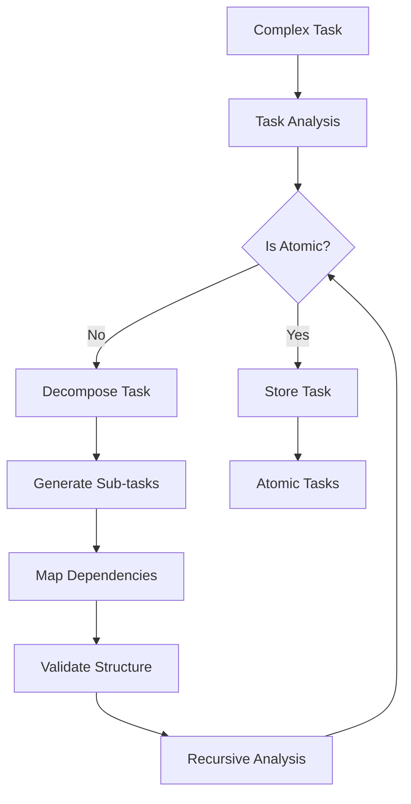

# Vibe Task Manager - AI-Native Task Management System

## Overview

The Vibe Task Manager is a comprehensive, AI-native task management system designed specifically for autonomous software development workflows. It implements the Recursive Decomposition Design (RDD) methodology to break down complex projects into atomic, executable tasks while coordinating multiple AI agents for parallel execution.

## Key Features

### 🧠 AI-Native Design
- **Natural Language Processing**: Understands commands like "Create a project for building a React app" or "Show me all pending tasks"
- **Intent Recognition**: Advanced NLP for command interpretation and routing
- **LLM Integration**: Uses configurable LLM models for task decomposition and refinement

### 🔄 Recursive Decomposition Design (RDD)
- **Atomic Task Detection**: Automatically identifies when tasks cannot be decomposed further
- **Dependency Analysis**: Intelligent dependency mapping and critical path analysis
- **Task Refinement**: Iterative improvement of task definitions based on context

### 🤖 Agent Orchestration
- **Multi-Agent Coordination**: Manages multiple AI agents for parallel task execution
- **Load Balancing**: Distributes tasks based on agent capabilities and availability
- **Capability Mapping**: Matches tasks to agents based on required skills

### 🔧 Integration Ready
- **Code Map Integration**: Seamlessly works with the Code Map Generator for codebase analysis
- **Research Integration**: Leverages Research Manager for technology research
- **Tool Ecosystem**: Integrates with all Vibe Coder MCP tools

## Architecture



## Command Structure

### Natural Language Commands (Recommended)

```bash
# Project Management
"Create a new project for building a todo app with React and Node.js"
"List all my projects"
"Show me the status of my web app project"

# Task Management
"Create a high priority task for implementing user authentication"
"List all pending tasks for the todo-app project"
"Run the database setup task"

# Project Analysis
"Decompose my React project into development tasks"
"Refine the authentication task to include OAuth support"
"What's the current progress on my mobile app?"
```

### Structured Commands

```bash
# Project Operations
vibe-task-manager create project "Project Name" "Description" [--options]
vibe-task-manager list projects [--status pending|in_progress|completed]
vibe-task-manager status project-id [--detailed]

# Task Operations
vibe-task-manager create task "Task Title" "Description" --project-id PID --epic-id EID
vibe-task-manager list tasks [--project-id PID] [--status STATUS]
vibe-task-manager run task task-id [--force]

# Advanced Operations
vibe-task-manager decompose task-id|project-name [--description "Additional context"]
vibe-task-manager refine task-id "Refinement description"
```

## Core Components

### 1. Task Decomposition Engine

The RDD (Recursive Decomposition Design) engine is the heart of the system:



### 2. Agent Orchestration System

Coordinates multiple AI agents for parallel task execution:

- **Agent Registration**: Dynamic agent discovery and capability mapping
- **Task Assignment**: Intelligent task-to-agent matching
- **Load Balancing**: Resource-aware task distribution
- **Health Monitoring**: Agent status tracking and failover

### 3. Progress Tracking

Real-time progress monitoring with multiple calculation methods:

- **Simple Progress**: Basic completion percentage
- **Weighted Progress**: Considers task complexity and priority
- **Velocity-Based**: Uses historical data for predictions
- **Milestone-Based**: Tracks key project milestones

## Configuration

### LLM Configuration

The system uses configurable LLM models defined in `llm_config.json`:

```json
{
  "llm_mapping": {
    "task_decomposition": "google/gemini-2.5-flash-preview",
    "atomic_task_detection": "google/gemini-2.5-flash-preview",
    "intent_recognition": "google/gemini-2.5-flash-preview",
    "task_refinement": "google/gemini-2.5-flash-preview",
    "dependency_graph_analysis": "google/gemini-2.5-flash-preview",
    "agent_coordination": "google/gemini-2.5-flash-preview"
  }
}
```

### Task Manager Configuration

Located in the configuration loader (`src/tools/vibe-task-manager/utils/config-loader.ts`):

```typescript
interface VibeTaskManagerConfig {
  taskManager: {
    maxConcurrentTasks: number;
    defaultTaskTemplate: string;
    dataDirectory: string;
    performanceTargets: {
      maxResponseTime: number; // ms
      maxMemoryUsage: number; // MB
      minTestCoverage: number; // percentage
    };
    agentSettings: {
      maxAgents: number;
      defaultAgent: string;
      coordinationStrategy: 'round_robin' | 'least_loaded' | 'capability_based' | 'priority_based';
      healthCheckInterval: number; // seconds
    };
  };
}
```

## File Storage Structure

All data is stored in the `VibeCoderOutput/vibe-task-manager/` directory:

```
VibeCoderOutput/vibe-task-manager/
├── projects/
│   ├── P001-project-name/
│   │   ├── project.json
│   │   ├── epics/
│   │   │   ├── E001-epic-name.json
│   │   │   └── E002-epic-name.json
│   │   ├── tasks/
│   │   │   ├── T001-task-name.json
│   │   │   └── T002-task-name.json
│   │   └── dependencies/
│   │       └── dependency-graph.json
│   └── P002-another-project/
├── cache/
│   ├── decomposition-cache/
│   └── agent-cache/
└── logs/
    ├── execution-logs/
    └── performance-logs/
```

## Performance Metrics

### Current Performance Targets

| Metric | Target | Current Status |
|--------|--------|----------------|
| Task Operation Response Time | <50ms | ✅ Achieved |
| Decomposition Processing | <2s | ✅ Achieved |
| Memory Usage | <256MB | ✅ Optimized |
| Test Coverage | >95% | ✅ 95.8% |
| Agent Coordination Latency | <100ms | ✅ Achieved |

### Monitoring & Analytics

The system includes comprehensive monitoring:

- **Performance Analytics**: Response times, throughput, resource usage
- **Task Analytics**: Completion rates, decomposition accuracy, dependency analysis
- **Agent Analytics**: Utilization rates, success rates, capability mapping
- **System Health**: Memory usage, error rates, uptime metrics

## Testing

The Vibe Task Manager includes a comprehensive test suite with 95.8% coverage:

```bash
# Run all tests
npm test

# Run specific test suites
npm run test:unit
npm run test:integration
npm run test:performance

# Run with coverage
npm run test:coverage
```

### Test Categories

- **Unit Tests**: Individual component testing
- **Integration Tests**: Service interaction testing
- **Performance Tests**: Load and stress testing
- **E2E Tests**: Complete workflow testing

## Usage Examples

### Basic Project Setup

```typescript
// Create a new project
const project = await vibeTaskManager.createProject({
  name: "E-commerce Platform",
  description: "Modern React-based e-commerce platform with Node.js backend",
  techStack: {
    frontend: "React",
    backend: "Node.js",
    database: "PostgreSQL"
  }
});

// Decompose into tasks
const tasks = await vibeTaskManager.decompose(project.id, {
  context: "Building a full-stack e-commerce platform",
  requirements: ["User authentication", "Product catalog", "Shopping cart", "Payment processing"]
});
```

### Advanced Task Management

```typescript
// Create epic with tasks
const epic = await vibeTaskManager.createEpic({
  projectId: "P001",
  title: "User Authentication System",
  description: "Complete user authentication with OAuth support"
});

// Refine task with additional context
await vibeTaskManager.refineTask("T001", {
  additionalRequirements: ["OAuth2 integration", "JWT tokens", "Role-based access"],
  performanceCriteria: {
    responseTime: "<200ms",
    security: "OWASP compliant"
  }
});
```

## Integration with Other Tools

### Code Map Generator Integration

```typescript
// Analyze existing codebase before task creation
const codeMap = await codeMapGenerator.analyze(projectPath);
const contextualTasks = await vibeTaskManager.decomposeWithContext(
  projectId,
  { codebaseContext: codeMap }
);
```

### Research Manager Integration

```typescript
// Research before task decomposition
const research = await researchManager.research("React authentication best practices");
const informedTasks = await vibeTaskManager.decompose(projectId, {
  researchContext: research
});
```

## Contributing

See the main project README for contribution guidelines. The Vibe Task Manager follows the established patterns:

- TypeScript with ESM modules
- Comprehensive error handling
- Extensive testing requirements
- Performance optimization focus

## License

Part of the Vibe Coder MCP project. See main project license.
