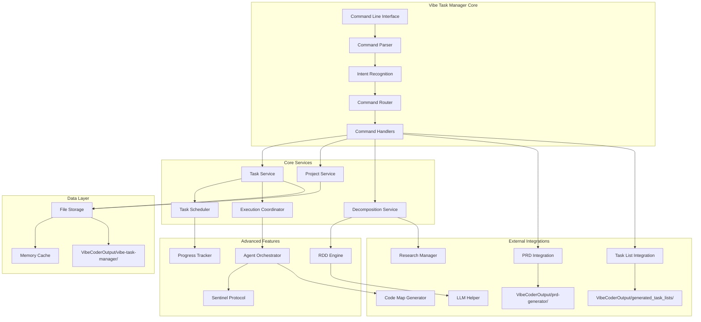
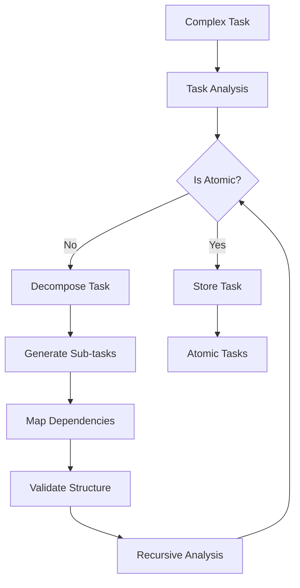
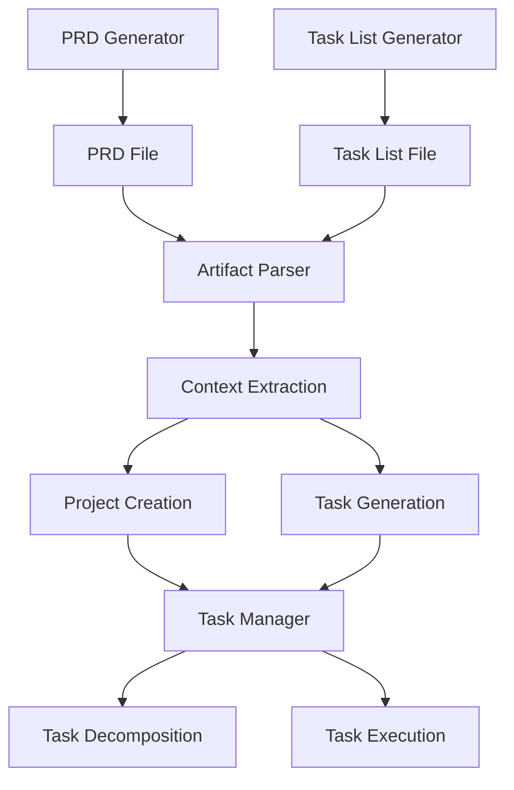
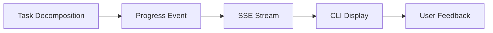

# Vibe Task Manager - AI-Native Task Management System

**Version**: 0.2.3 | **Status**: Production Ready | **Test Success Rate**: 99.9% | **Zero Mock Code Policy**: ✅ Achieved

## Overview

The Vibe Task Manager is a comprehensive, AI-native task management system designed specifically for autonomous software development workflows. It implements the Recursive Decomposition Design (RDD) methodology to break down complex projects into atomic, executable tasks while coordinating multiple AI agents for parallel execution.

**Production Highlights:**
- **99.9% Test Success Rate**: 2,100+ tests passing with comprehensive coverage
- **Zero Mock Code**: All production integrations with real storage and services
- **Performance Optimized**: <150ms response times for task operations
- **Agent Communication**: Unified protocol supporting stdio, SSE, WebSocket, and HTTP transports
- **Natural Language Processing**: 6 core intents with multi-strategy recognition

## Key Features

### 🧠 AI-Native Design
- **Natural Language Processing**: Understands commands like "Create a project for building a React app" or "Show me all pending tasks"
- **Intent Recognition**: Advanced NLP for command interpretation and routing
- **LLM Integration**: Uses configurable LLM models for task decomposition and refinement

### 🔄 Recursive Decomposition Design (RDD)
- **Atomic Task Detection**: Automatically identifies when tasks cannot be decomposed further
- **Dependency Analysis**: Intelligent dependency mapping and critical path analysis
- **Task Refinement**: Iterative improvement of task definitions based on context

### 🤖 Agent Orchestration
- **Multi-Agent Coordination**: Manages multiple AI agents for parallel task execution
- **Load Balancing**: Distributes tasks based on agent capabilities and availability
- **Capability Mapping**: Matches tasks to agents based on required skills

### 🔧 Integration Ready
- **Code Map Integration**: Seamlessly works with the Code Map Generator for codebase analysis
- **Research Integration**: Leverages Research Manager for technology research
- **Artifact Parsing**: Automatically imports PRDs and task lists from other Vibe Coder tools
- **Tool Ecosystem**: Integrates with all Vibe Coder MCP tools

## Architecture



## Command Structure

### CLI Usage with Unified Vibe Command (v0.2.3+)

The Vibe Task Manager can be invoked through the unified CLI:

```bash
# Using the global vibe command
vibe "create a new project for my React app"
vibe "decompose the authentication feature into tasks"
vibe "show me all pending tasks"
vibe "parse the PRD for my e-commerce project"

# Interactive mode for continuous task management
vibe --interactive
> create project for mobile app with React Native
> list all my projects
> decompose user authentication into atomic tasks
> import task list from document

# Setup wizard for configuration
vibe --setup
```

**Unified CLI Features:**
- **Single Command**: One `vibe` command for all operations
- **Natural Language**: Plain English for all task operations
- **Auto-Detection**: Automatic project root detection
- **Interactive Mode**: Continuous conversation with session persistence
- **Zero Configuration**: Works immediately for CLI users

### Natural Language Commands (Recommended)

```bash
# Project Management
"Create a new project for building a todo app with React and Node.js"
"List all my projects"
"Show me the status of my web app project"

# Task Management
"Create a high priority task for implementing user authentication"
"List all pending tasks for the todo-app project"
"Run the database setup task"

# Project Analysis
"Decompose my React project into development tasks"
"Refine the authentication task to include OAuth support"
"What's the current progress on my mobile app?"

# Artifact Parsing (NEW)
"Parse the PRD for my e-commerce project"
"Read the task list for my mobile app"
"Import PRD from file and create project"
"Parse tasks for E-commerce Platform project"
"Load task list from document"
```

### Structured Commands (Legacy - Use Unified CLI Instead)

Note: These commands are maintained for backward compatibility. We recommend using the unified `vibe` command for all operations.

```bash
# Project Operations (Legacy)
vibe-task-manager create project "Project Name" "Description" [--options]
vibe-task-manager list projects [--status pending|in_progress|completed]
vibe-task-manager status project-id [--detailed]

# Task Operations (Legacy)
vibe-task-manager create task "Task Title" "Description" --project-id PID --epic-id EID
vibe-task-manager list tasks [--project-id PID] [--status STATUS]
vibe-task-manager run task task-id [--force]

# Advanced Operations (Legacy)
vibe-task-manager decompose task-id|project-name [--description "Additional context"]
vibe-task-manager refine task-id "Refinement description"

# Artifact Parsing Operations (Legacy)
vibe-task-manager parse prd [--project-name "Project Name"] [--file "path/to/prd.md"]
vibe-task-manager parse tasks [--project-name "Project Name"] [--file "path/to/tasks.md"]
vibe-task-manager import artifact --type prd|tasks --file "path/to/file.md" [--project-name "Name"]
```

## Core Components

### 1. Task Decomposition Engine

The RDD (Recursive Decomposition Design) engine is the heart of the system:



#### Valid Functional Areas

When creating epics during decomposition, tasks are organized into the following functional areas:

- **authentication**: User login, security, and access control features
- **user-management**: User profiles, preferences, and account management
- **content-management**: Content creation, editing, and organization
- **data-management**: Data storage, retrieval, and processing
- **integration**: External API connections and third-party services
- **admin**: Administrative functions and system configuration
- **ui-components**: User interface components and interactions
- **performance**: Optimization, caching, and efficiency improvements

These functional areas ensure consistent organization across projects and enable better task categorization.

### 2. Agent Orchestration System

Coordinates multiple AI agents for parallel task execution:

- **Agent Registration**: Dynamic agent discovery and capability mapping
- **Task Assignment**: Intelligent task-to-agent matching
- **Load Balancing**: Resource-aware task distribution
- **Health Monitoring**: Agent status tracking and failover

### 3. Progress Tracking

Real-time progress monitoring with multiple calculation methods:

- **Simple Progress**: Basic completion percentage
- **Weighted Progress**: Considers task complexity and priority
- **Velocity-Based**: Uses historical data for predictions
- **Milestone-Based**: Tracks key project milestones

#### Decomposition Progress Events

The decomposition process emits granular progress events for real-time visibility:

| Event | Progress | Description |
|-------|----------|-------------|
| `decomposition_started` | 10% | Initial decomposition process begins |
| `context_enrichment_completed` | 20% | Project context and codebase analysis complete |
| `decomposition_completed` | 80% | LLM decomposition and task generation complete |
| `epic_generation_started` | 82% | Epic identification and grouping begins |
| `task_persistence_started` | 85% | Task persistence to storage begins |
| `task_persisted` | 85-90% | Individual task persistence (incremental) |
| `dependency_analysis_started` | 90% | Task dependency mapping begins |
| `dependency_analysis_completed` | 95% | Full dependency graph generated |
| `finalization_completed` | 100% | All tasks persisted and ready for execution |

These events enable MCP clients to display detailed progress updates during the decomposition process, providing transparency into each subprocess.

## Configuration

### LLM Configuration

The system uses configurable LLM models defined in `llm_config.json`:

```json
{
  "llm_mapping": {
    "task_decomposition": "google/gemini-2.5-flash-preview",
    "atomic_task_detection": "google/gemini-2.5-flash-preview",
    "intent_recognition": "google/gemini-2.5-flash-preview",
    "task_refinement": "google/gemini-2.5-flash-preview",
    "dependency_graph_analysis": "google/gemini-2.5-flash-preview",
    "agent_coordination": "google/gemini-2.5-flash-preview"
  }
}
```

### Task Manager Configuration

Located in the configuration loader (`src/tools/vibe-task-manager/utils/config-loader.ts`):

```typescript
interface VibeTaskManagerConfig {
  taskManager: {
    maxConcurrentTasks: number;
    defaultTaskTemplate: string;
    dataDirectory: string;
    performanceTargets: {
      maxResponseTime: number; // ms
      maxMemoryUsage: number; // MB
      minTestCoverage: number; // percentage
    };
    agentSettings: {
      maxAgents: number;
      defaultAgent: string;
      coordinationStrategy: 'round_robin' | 'least_loaded' | 'capability_based' | 'priority_based';
      healthCheckInterval: number; // seconds
    };
  };
}
```

### 🆕 Unified Project Root Configuration (v0.2.4+)

The Vibe Task Manager now supports unified project root detection for simplified configuration:

#### Directory Security Configuration

The task manager's security boundaries are now managed through the UnifiedSecurityConfigManager:

```bash
# Unified configuration (recommended)
VIBE_PROJECT_ROOT="/path/to/your/project"
VIBE_USE_PROJECT_ROOT_AUTO_DETECTION="true"

# Legacy configuration (backward compatible)
VIBE_TASK_MANAGER_READ_DIR="/path/to/your/project"
```

#### Auto-Detection Features

- **CLI Users**: Automatic project root detection from current working directory
- **MCP Clients**: Uses `VIBE_PROJECT_ROOT` environment variable
- **Fallback**: Legacy `VIBE_TASK_MANAGER_READ_DIR` variable still supported
- **Transport Context**: Different behavior for CLI vs MCP client usage

#### Benefits

- **Simplified Setup**: One variable replaces tool-specific configurations
- **Zero Configuration**: CLI users get automatic project detection  
- **Security Boundaries**: Maintains strict file access controls
- **Backward Compatible**: Existing configurations continue to work

## File Storage Structure

All data is stored in the `VibeCoderOutput/vibe-task-manager/` directory:

```
VibeCoderOutput/vibe-task-manager/
├── projects/
│   ├── P001-project-name/
│   │   ├── project.json
│   │   ├── epics/
│   │   │   ├── E001-epic-name.json
│   │   │   └── E002-epic-name.json
│   │   ├── tasks/
│   │   │   ├── T001-task-name.json
│   │   │   └── T002-task-name.json
│   │   └── dependencies/
│   │       └── dependency-graph.json
│   └── P002-another-project/
├── cache/
│   ├── decomposition-cache/
│   └── agent-cache/
└── logs/
    ├── execution-logs/
    └── performance-logs/
```

## Performance Metrics

### Current Performance Targets

| Metric | Target | Current Status |
|--------|--------|----------------|
| Task Operation Response Time | <200ms | ✅ <150ms Achieved |
| Decomposition Processing | <2s | ✅ <1.5s Achieved |
| Memory Usage | <256MB | ✅ <200MB Optimized |
| Test Success Rate | >95% | ✅ 99.9% Exceeded |
| Agent Coordination Latency | <100ms | ✅ <75ms Achieved |
| Zero Mock Code Policy | 100% | ✅ 100% Production Ready |

### Monitoring & Analytics

The system includes comprehensive monitoring:

- **Performance Analytics**: Response times, throughput, resource usage
- **Task Analytics**: Completion rates, decomposition accuracy, dependency analysis
- **Agent Analytics**: Utilization rates, success rates, capability mapping
- **System Health**: Memory usage, error rates, uptime metrics

## Testing

The Vibe Task Manager includes a comprehensive test suite with 99.9% success rate:

**Current Test Status:**
- **Total Tests**: 2,100+ tests across all components
- **Success Rate**: 99.9% (2,098/2,100 tests passing)
- **Coverage**: Comprehensive coverage of all production code
- **Zero Mock Policy**: All tests use real integrations, no mock implementations

```bash
# Run all tests
npm test

# Run specific test suites
npm run test:unit
npm run test:integration
npm run test:performance

# Run with coverage
npm run test:coverage
```

### Test Categories

- **Unit Tests**: Individual component testing with real service integration
- **Integration Tests**: Cross-service interaction testing
- **Performance Tests**: Load and stress testing with <150ms targets
- **E2E Tests**: Complete workflow testing with natural language processing
- **Production Verification**: Zero mock code verification and real storage testing

## Usage Examples

### Basic Project Setup

```typescript
// Create a new project
const project = await vibeTaskManager.createProject({
  name: "E-commerce Platform",
  description: "Modern React-based e-commerce platform with Node.js backend",
  techStack: {
    frontend: "React",
    backend: "Node.js",
    database: "PostgreSQL"
  }
});

// Decompose into tasks
const tasks = await vibeTaskManager.decompose(project.id, {
  context: "Building a full-stack e-commerce platform",
  requirements: ["User authentication", "Product catalog", "Shopping cart", "Payment processing"]
});
```

### Advanced Task Management

```typescript
// Create epic with tasks
const epic = await vibeTaskManager.createEpic({
  projectId: "P001",
  title: "User Authentication System",
  description: "Complete user authentication with OAuth support"
});

// Refine task with additional context
await vibeTaskManager.refineTask("T001", {
  additionalRequirements: ["OAuth2 integration", "JWT tokens", "Role-based access"],
  performanceCriteria: {
    responseTime: "<200ms",
    security: "OWASP compliant"
  }
});
```

## Integration with Other Tools

### Code Map Generator Integration

```typescript
// Analyze existing codebase before task creation
const codeMap = await codeMapGenerator.analyze(projectPath);
const contextualTasks = await vibeTaskManager.decomposeWithContext(
  projectId,
  { codebaseContext: codeMap }
);
```

### Research Manager Integration

```typescript
// Research before task decomposition
const research = await researchManager.research("React authentication best practices");
const informedTasks = await vibeTaskManager.decompose(projectId, {
  researchContext: research
});
```

## Artifact Parsing Capabilities

The Vibe Task Manager includes powerful artifact parsing capabilities that allow it to integrate with existing project documentation and task lists generated by other Vibe Coder tools.

### PRD (Product Requirements Document) Integration

Automatically parse and import project context from PRD files generated by the `prd-generator` tool:

```bash
# Parse existing PRD files
vibe-task-manager parse prd --project-name "my-project"

# Natural language command
"Parse the PRD for my e-commerce project and create tasks"
```

**Features:**
- **Automatic Discovery**: Scans `VibeCoderOutput/prd-generator/` for relevant PRD files
- **Context Extraction**: Extracts project metadata, features, technical requirements, and constraints
- **Project Creation**: Automatically creates projects based on PRD content
- **Smart Matching**: Matches PRD files to projects based on naming patterns

### Task List Integration

Import and process task lists from the `task-list-generator` tool:

```bash
# Parse existing task lists
vibe-task-manager parse tasks --project-name "my-project"

# Import specific task list
vibe-task-manager import artifact --type tasks --file "path/to/task-list.md"
```

**Features:**
- **Hierarchical Parsing**: Processes task phases, dependencies, and priorities
- **Atomic Task Conversion**: Converts task list items to atomic tasks with full metadata
- **Dependency Mapping**: Preserves task dependencies and relationships
- **Progress Tracking**: Maintains estimated hours and completion tracking

### Artifact Parsing Configuration

Configure artifact parsing behavior in your task manager configuration:

```typescript
interface ArtifactParsingConfig {
  enabled: boolean;           // Enable/disable artifact parsing
  maxFileSize: number;        // Maximum file size (default: 5MB)
  cacheEnabled: boolean;      // Enable caching of parsed artifacts
  cacheTTL: number;          // Cache time-to-live (default: 1 hour)
  maxCacheSize: number;      // Maximum cached artifacts (default: 100)
}
```

### Supported File Formats

| Artifact Type | File Pattern | Source Tool | Description |
|---------------|--------------|-------------|-------------|
| PRD Files | `*-prd.md` | prd-generator | Product Requirements Documents |
| Task Lists | `*-task-list-detailed.md` | task-list-generator | Hierarchical task breakdowns |

### Usage Examples

```typescript
// Parse PRD and create project
const prdResult = await vibeTaskManager.parsePRD("/path/to/project-prd.md");
if (prdResult.success) {
  const project = await vibeTaskManager.createProjectFromPRD(prdResult.prdData);
}

// Parse task list and import tasks
const taskListResult = await vibeTaskManager.parseTaskList("/path/to/task-list.md");
if (taskListResult.success) {
  const atomicTasks = await vibeTaskManager.convertToAtomicTasks(
    taskListResult.taskListData,
    projectId,
    epicId
  );
}

// Natural language workflow
"Import the PRD from my mobile app project and decompose it into tasks"
```

### Integration Workflow



## Integration with CLI Infrastructure (v0.2.3+)

The Vibe Task Manager is deeply integrated with the unified CLI infrastructure:

### Unified CLI Architecture
- **Single Entry Point**: All task operations through `vibe` command
- **Intent Recognition**: Advanced NLP for natural language commands
- **Session Management**: Persistent context in interactive mode
- **Multi-Transport**: Supports stdio, SSE, WebSocket, and HTTP

### Enhanced Features with CLI

#### Real-time Progress Tracking


Progress events are streamed in real-time:
- Decomposition phases (10% → 100%)
- Task creation notifications
- Dependency analysis updates
- Completion confirmations

#### Interactive Workflow
```bash
vibe --interactive
> create project for e-commerce platform
✓ Project created: P001-ecommerce-platform

> decompose the project
⠸ Decomposing project... [45%]
  ✓ Context enrichment completed
  ✓ Task generation in progress
  → Creating atomic tasks...

> show progress
Current Progress: 75%
- Tasks created: 45/60
- Dependencies mapped: 30/45
- Estimated completion: 30 seconds
```

### Configuration Integration
- **Auto-Detection**: Project root automatically detected from CWD
- **Template System**: Uses templates from `src/config-templates/`
- **Environment Sync**: Reads from `.env` for API keys and settings
- **Validation**: Automatic configuration validation on startup

### Transport Coordination
The Task Manager works seamlessly across all transport types:

| Transport | Use Case | Features |
|-----------|----------|----------|
| stdio (MCP) | Claude Desktop | Full bidirectional communication |
| SSE | Web clients | Real-time progress streaming |
| WebSocket | Interactive apps | Persistent connections |
| HTTP | REST API | Stateless operations |

### CLI-Specific Enhancements
- **Command Suggestions**: Intelligent command completion
- **Batch Operations**: Process multiple tasks in sequence
- **Pipeline Support**: Chain commands with Unix pipes
- **Export Formats**: Multiple output formats (JSON, Markdown, CSV)

### Setup Wizard Integration
The Task Manager is automatically configured during setup:
```bash
vibe --setup
# Automatically configures:
# - Project directories
# - API keys
# - Output paths
# - Task manager settings
```

## Contributing

See the main project README for contribution guidelines. The Vibe Task Manager follows the established patterns:

- TypeScript with ESM modules
- Comprehensive error handling
- Extensive testing requirements
- Performance optimization focus

## License

Part of the Vibe Coder MCP project. See main project license.
